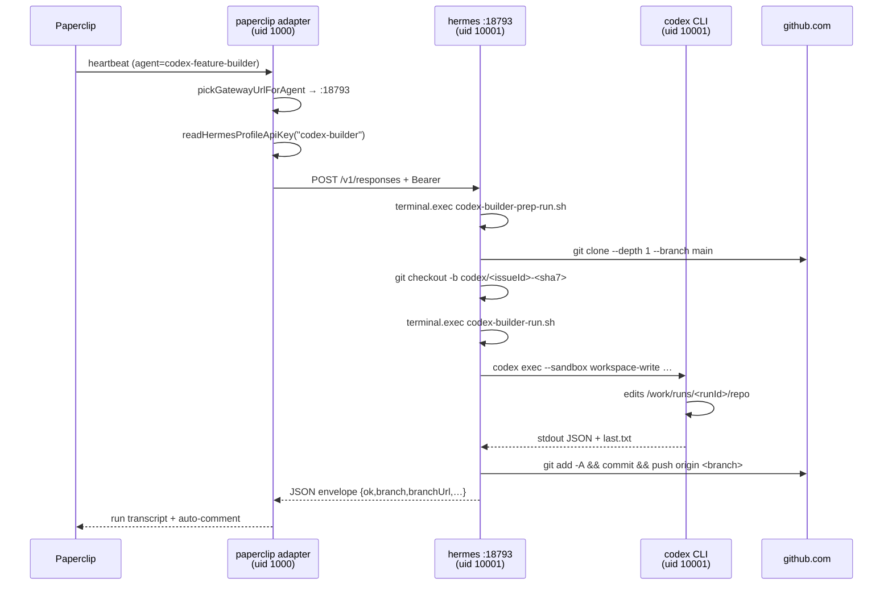

The `codex-builder` profile is the fourth Hermes gateway on every alfred-black
tenant. Unlike `main` / `workers` / `heavy` — which are general-purpose
profiles loaded with the same six MCP servers — `codex-builder` is a sealed
compartment whose only job is to drive the OpenAI Codex CLI against engineering
issues filed in Paperclip. It has no MCP, no Composio surface, no vault read,
no `AAS_API_KEY`, and a per-uid iptables egress allowlist that REJECTs every
outbound destination outside a fixed set of code-supply hosts. It is launched
**only** when `ENABLE_CODEX_BUILDER=1` (idle by default fleet-wide) and is
addressed only by the paperclip adapter, only for agents named
`codex-feature-builder`.

The design lives at `/Users/ssd/dev/alfred/docs/codex-builder-runtime.md`; this
page is the user-facing architecture writeup. Day-to-day ops are in
`/Users/ssd/dev/alfred/docs/codex-builder-operator-guide.md`.

## The sealed compartment (three rings of isolation)

The boundary that makes this profile "sealed" is not one fence but three —
designed so that a compromise of any one layer is still caught by the other two.

### Ring 1 — uid 10001 + setpriv chain

`main`, `workers`, and `heavy` all run as uid `10000:10000`. `codex-builder`
runs as **`10001:10001`**, a dedicated uid with no group membership in common
with the other three. The supervisor's launch line uses the kernel's `setpriv`
wrapper to drop both privileges and the inherited environment before exec'ing
the gateway *(packages/hermes/docker/supervisor.sh:471-481)*:

```sh
setpriv --reuid=10001 --regid=10001 --clear-groups --reset-env \
  env PATH=… HOME=… HERMES_HOME=… \
  bash -c 'cd … && set -a && . .env && set +a && \
           exec hermes -p codex-builder gateway run --replace'
```

`--reset-env` is the load-bearing flag — without it, every `environment:` value
on the hermes service (OPENROUTER_API_KEY, ANTHROPIC_API_KEY, AAS_API_KEY,
COMPOSIO_*, the paperclip board key, etc.) would silently land in the
codex-builder gateway's process environment. The chain wipes the inherited
env, re-establishes the irreducible minimum (`PATH`, `HOME`, `HERMES_HOME`,
`TERM`), then source-and-exports the profile's positive-allowlist `.env` on
top. A future env key added to the docker-compose `environment:` block cannot
accidentally leak through.

`HERMES_HOME` passthrough is required and not optional: without it the gateway
falls back to `~/.hermes` (which doesn't contain the profile dir) and fails
with `Error: Profile 'codex-builder' does not exist`
*(supervisor.sh:465-468)*.

### Ring 2 — iptables OUTPUT chain, scoped to uid 10001

A boot-time script installs an iptables OUTPUT chain that REJECTs every packet
owned by uid `10001` except those targeting a pinned allowlist
*(packages/hermes/docker/setup-egress-jail.sh)*. The hermes service gets
`cap_add: [NET_ADMIN]` — the only alfred-black container that does — to
permit the chain mutation. The script is run by the supervisor *before* the
gateway launches; if `iptables` returns non-zero the supervisor refuses to
launch the codex-builder process and the other three profiles stay up
*(supervisor.sh:425-445)*.

The chain installs four kinds of rule:

| Rule | Purpose |
|---|---|
| `-m conntrack --ctstate ESTABLISHED,RELATED -j ACCEPT` | Stateful fast-path. Response packets to already-open connections (e.g. paperclip → `:18793` inbound, gateway's SYN-ACK back) bypass the catchall REJECT. Without this the codex-builder listener on `:18793` cannot reply to compose-network callers — they see a TCP handshake timeout *(setup-egress-jail.sh:150-162)*. |
| `-d 127.0.0.0/8 -j ACCEPT` | Loopback. Hermes' intra-process IPC + `/health` from inside the container. |
| `-p udp --dport 53 -j ACCEPT` + `-p tcp --dport 53 -j ACCEPT` | DNS. The codex CLI, git, npm, pip all resolve names. |
| `-d <allowlist-IP>/32 --dport 443/22 -j ACCEPT` | Per-host allowlist (see the next subsection). HTTPS and git-over-SSH only; plain HTTP egress is never permitted. |
| `-j REJECT --reject-with icmp-net-prohibited` | Catchall. The ICMP variant means the codex CLI sees a clean "Network is unreachable" rather than a silent timeout, which makes failures legible in the per-run audit log. |

Uid `10000` (main / workers / heavy) is **untouched** — those gateways keep the
fully-open egress they have today. The rules are tagged with an iptables
`--comment CODEX_BUILDER`, so on supervisor restart the script deletes its own
prior rules and re-installs (idempotent across reboots and image bumps).

### Ring 3 — filesystem ACLs on the profile subtree and on /work

The init container's entrypoint runs an explicit `chown` + `chmod` pass for the
codex-builder profile dir and the `/work` named volume
*(packages/hermes/init/entrypoint.sh:560-629)*:

| Path | Owner | Mode | Why |
|---|---|---|---|
| `/hermes-state/profiles/codex-builder/` (top-level) | `10001:10001` | `0711` | Traverse-only for non-owners; lets uid 1000 (paperclip) reach the one file it needs (`.env`) without being able to `ls` the dir or stumble onto `auth.json` / `.codex/` |
| `/hermes-state/profiles/codex-builder/.env` | `10001:10001` | `0644` | Paperclip's adapter (uid 1000 in a sibling container) reads `API_SERVER_KEY` from here. The `.env` deliberately carries no provider secrets — those live in `.codex/auth.json` |
| `/hermes-state/profiles/codex-builder/.codex/` | `10001:10001` | `0700` | The codex CLI's OAuth credentials. Even the paperclip uid that can read `.env` cannot reach this dir |
| Every other file under the profile dir | `10001:10001` | `0600` | Sealed by default. `find ... -type f -exec chmod 0600` runs at every init boot |
| `/work` (named volume `hermes_codex_work`) | `10001:10001` | `0700` | Per-run workspace tree. Mounted only in the hermes service — not paperclip, not ctrl-api, not web |
| `/vault/`, `/alfred-data/` (existing mounts) | `10000:10000` | `0700` | Unchanged. uid 10001 has no read bit; the negative spot-checks in §8.6 of the design verify `cat /vault/SOUL.md` returns `Permission denied` |

The `0711` choice on the profile-dir top is deliberate — a `0700` setting (the
obvious "sealed" mode) blocked the paperclip adapter at uid 1000 from reading
the `.env` and every dispatch 401'd silently. The PR that resolved this drift
(see Status, below) memorializes the tradeoff: traverse-bit + per-file ACLs is
a tighter guarantee than directory-bit alone, because the only readable file
in the subtree is the one whose contents carry no secrets *(entrypoint.sh:584-610)*.

## Per-run lifecycle

A builder run is a closed loop with no persistent state. Paperclip dispatches,
the codex-builder gateway runs a fresh clone-build-push cycle, the workspace is
left for forensics until GC reaps it after seven days.



The workspace lives under `/work/runs/<runId>/`:

```
/work/runs/<runId>/
  prompt.md       ← spec text, agent writes this verbatim from the issue body
  repo/           ← fresh git clone, depth 1, branch main
  last.txt        ← codex --output-last-message destination
  audit.json      ← run audit (timestamps, branch, push outcome, exit codes)
```

The wrapper scripts that drive this loop are
`packages/hermes/docker/codex-builder-prep-run.sh` (workspace setup + clone)
and `packages/hermes/docker/codex-builder-run.sh` (codex exec + commit + push +
audit). Both are baked into `/usr/local/bin` of the hermes image. The agent's
SOUL.md drives the call order *(packages/hermes/SOUL.codex-builder.md:42-100)*.

The codex CLI invocation pins:

```sh
codex exec -C /work/runs/<runId>/repo \
  --sandbox workspace-write \
  --dangerously-bypass-approvals-and-sandbox \
  --ephemeral \
  --json \
  --output-last-message /work/runs/<runId>/last.txt \
  "$(cat /work/runs/<runId>/prompt.md)"
```

The `--dangerously-bypass-approvals-and-sandbox` flag is codex 0.135's supported
non-interactive path; per the CLI help it is "intended solely for running in
environments that are externally sandboxed", which is what the three rings
above provide. The inner `--sandbox workspace-write` is still active as a
second fence against writes outside `/work/runs/<runId>/repo` — the bypass
flag only short-circuits the approval prompts the CLI would otherwise raise
*(SOUL.codex-builder.md:78-84)*.

## Two auth files (NOT interconvertible)

The profile dir holds **two** `auth.json` files that look superficially similar
but encode different OAuth shapes:

| File | Shape | Reader | Purpose |
|---|---|---|---|
| `/hermes-state/profiles/codex-builder/auth.json` | Hermes-shape (2-token: `access_token` + `refresh_token`) | Hermes gateway (the supervising LLM that decides which terminal commands to run) | LLM provider auth for the gateway's own `/v1/responses` calls — same shape `main`, `workers`, `heavy` use |
| `/hermes-state/profiles/codex-builder/.codex/auth.json` | codex-CLI-shape (4-token: `id_token` + `access_token` + `refresh_token` + `account_id`) | codex CLI binary itself | The CLI's ChatGPT Plus/Pro session used by `codex exec` |

Both authenticate against ChatGPT, but with different token sets — they are
not interconvertible. Mirroring the Hermes-shape file into `~/.codex/auth.json`
looks correct at a glance, but `codex doctor` reports:

```
✗ auth   stored credentials are incomplete
```

Sir's call (memorialized in the supervisor's auth-mirror block,
*supervisor.sh:162-171*): the Hermes-shape side is **shared across `main` and
`codex-builder`**. When `main/auth.json` exists, the supervisor mirrors it to
both `codex-builder/auth.json` and `codex-builder/.codex/auth.json` at every
boot. The latter is then **overwritten** by a one-time per-tenant
`codex login --device-auth` run inside the profile, which populates the
4-token CLI shape *(operator guide §"Codex CLI authentication")*. Running
`hermes -p main auth login` does **not** satisfy the CLI; the device-auth
ritual is the only way to mint a valid `.codex/auth.json`. Both are required.

The auth mirror is gated on `ENABLE_CODEX_BUILDER=1` and on the profile dir
existing — a tenant with the flag off never gets `main`'s `auth.json` copied
into a codex-builder dir that the gateway will never read.

## The egress allowlist

Built-in hosts hardcoded in `setup-egress-jail.sh:82-94`:

| Host | Port(s) | Purpose |
|---|---|---|
| `api.openai.com` | 443 | codex CLI's LLM calls |
| `auth.openai.com` | 443 | `codex login --device-auth` flow |
| `platform.openai.com` | 443 | codex login follow-up |
| `chatgpt.com` | 443 | ChatGPT session refresh |
| `registry.npmjs.org` | 443 | `npm ci` during codex test runs |
| `pypi.org` + `files.pythonhosted.org` | 443 | `pip install` during codex test runs |
| `crates.io` + `static.crates.io` | 443 | `cargo build` during codex test runs |
| GitHub `git` CIDR set | 443 + 22 | `git clone` + `git push` — fetched from `https://api.github.com/meta` at boot, hardcoded fallback CIDRs if unreachable |

`auth.openai.com` and `platform.openai.com` only landed after the first live
attempt at `codex login --device-auth` blocked on egress (PR #116) — the same
fix corrects the operator guide's prior claim that running `hermes auth login`
would also authenticate the codex CLI. It doesn't; the schemas are different.

Operators can extend the allowlist per-tenant without rebuilding the image by
appending hostnames to
`/hermes-state/profiles/codex-builder/network-allowlist.txt`
*(setup-egress-jail.sh:112-121)*. The init container lays down a default file
with comment headers; supervisor restart re-reads it and adds ACCEPT rules for
the new hosts (resolved via `dig` at boot).

The stateful fast-path added in PR #117 (`-m conntrack --ctstate
ESTABLISHED,RELATED -j ACCEPT`, installed as rule 1) means response packets
to docker-compose siblings — paperclip dispatching into `:18793`, then the
gateway's SYN-ACK back — pass without an explicit allowlist entry. The pattern
matches the standard stateful-firewall convention: NEW connections still hit
the per-host allowlist; only existing connections' responses get the express
lane *(setup-egress-jail.sh:150-162)*.

## Triggering a run (the paperclip adapter)

The only caller of `:18793` is the paperclip-hermes adapter running inside the
paperclip sidecar container. Routing is name-based, scoped to a single agent
*(packages/paperclip/adapter/src/shared/constants.ts:36-38)*:

```typescript
export const CODEX_BUILDER_AGENT_NAMES: ReadonlySet<string> = new Set([
  "codex-feature-builder",
]);
```

The dispatch path runs `pickGatewayUrlForAgent` on every heartbeat
*(packages/paperclip/adapter/src/server/execute.ts:65-88)*:

```typescript
export function pickGatewayUrlForAgent(
  agent: AdapterAgent | null | undefined,
  config: Record<string, unknown>,
): { gatewayUrl: string; profile: HermesProfileName } {
  const explicit = asString(config.hermesGatewayUrl);
  if (explicit) return { gatewayUrl: explicit, profile: "main" };

  const name = (agent?.name ?? "").trim().toLowerCase();
  if (CODEX_BUILDER_AGENT_NAMES.has(name)) {
    return {
      gatewayUrl: HERMES_CODEX_BUILDER_GATEWAY_URL,
      profile: "codex-builder",
    };
  }

  const envOverride = process.env.HERMES_GATEWAY_URL;
  if (envOverride) return { gatewayUrl: envOverride, profile: "main" };
  return { gatewayUrl: DEFAULT_HERMES_GATEWAY_URL, profile: "main" };
}
```

The function returns both the URL and the profile name. The profile name is
load-bearing — it threads down to `readHermesProfileApiKey(profile)`
*(packages/paperclip/adapter/src/server/hermes-http.ts)*, which reads
`API_SERVER_KEY` from the corresponding `/hermes-state/profiles/<profile>/.env`.
main's key and codex-builder's key are independently rendered by the init
container; using main's key against `:18793` returns 401, and vice versa.

To trigger a run, a principal files an issue in Paperclip and assigns it to
the `codex-feature-builder` agent. Paperclip's heartbeat cycle picks up the
ready issue, dispatches through the adapter, which routes to `:18793`. The
session key is derived from `agent.id` (`paperclip-<agentId>`) so every issue
for the same agent shares one Hermes session
*(execute.ts:resolveSessionKey)*.

The `codex-feature-builder` persona block is in
`packages/hermes/SOUL.codex-builder.md` — the agent's capabilities, the
forbidden actions, and the five-step procedure (mint runId → prep → write
spec → drive codex → return JSON envelope).

## Status (2026-05-29)

The runtime is built and deployed live on `home.alfred.black` with
`ENABLE_CODEX_BUILDER=1`. The codex CLI 0.135 is installed in the hermes
image (PR #100). The profile renders fleet-wide and the gateway launches
correctly under uid 10001 on home (PRs #101, #102). The paperclip adapter
routes `codex-feature-builder` heartbeats to `:18793` and reads the per-profile
key (PR #103). The egress jail and FS isolation are durably merged
(PRs #104, #106, #107, #108). The supervisor passes `HERMES_HOME` through the
`setpriv --reset-env` boundary so the gateway can find its profile dir
(PR #108). Per-run wrappers + persona ship (PR #105). Codex 0.135 flag fixes
and GitHub CIDR egress landed in PR #115; the `auth.openai.com` +
`platform.openai.com` allowlist additions and the operator-guide correction
(Hermes auth.json ≠ codex CLI auth.json — different OAuth schemas) landed in
PR #116. The stateful fast-path that lets paperclip-to-:18793 responses
return landed in PR #117. The profile-dir `0711` + `.env 0644` chmod that
lets the paperclip adapter uid 1000 read `API_SERVER_KEY` durably landed
in PR #118.

**The first end-to-end smoke is currently blocked** by what looks like a
paperclip-side adapter wrapper that injects the compose-env
`HERMES_API_SERVER_KEY` (64-char) over the per-profile-file `API_SERVER_KEY`
(43-char) returned by `readHermesProfileApiKey("codex-builder")`. The
gateway accepts the latter and rejects the former, so every dispatch currently
401s even though the routing, the egress jail, the FS layout, the codex CLI
auth, and the deploy key are all correctly in place. Tracked at
`ssdavidai/alfred#119`; paused pending Sir's next pass. The runtime is wired
but the first dispatch is one wrapper-injection bug away from green.

## References

- Design doc: `/Users/ssd/dev/alfred/docs/codex-builder-runtime.md`
- Operator guide: `/Users/ssd/dev/alfred/docs/codex-builder-operator-guide.md`
- Hermes supervisor (4th `start_proc` + auth mirror): `/Users/ssd/dev/alfred/packages/hermes/docker/supervisor.sh`
- iptables egress jail: `/Users/ssd/dev/alfred/packages/hermes/docker/setup-egress-jail.sh`
- Init container FS hardening: `/Users/ssd/dev/alfred/packages/hermes/init/entrypoint.sh` (codex-builder block, lines 555-629)
- Per-run wrappers: `/Users/ssd/dev/alfred/packages/hermes/docker/codex-builder-prep-run.sh`, `/Users/ssd/dev/alfred/packages/hermes/docker/codex-builder-run.sh`
- Agent persona: `/Users/ssd/dev/alfred/packages/hermes/SOUL.codex-builder.md`
- Adapter routing: `/Users/ssd/dev/alfred/packages/paperclip/adapter/src/server/execute.ts`, `/Users/ssd/dev/alfred/packages/paperclip/adapter/src/shared/constants.ts`, `/Users/ssd/dev/alfred/packages/paperclip/adapter/src/server/hermes-http.ts`
- Codex CLI install: `/Users/ssd/dev/alfred/packages/hermes/Dockerfile` (lines 86-118)
