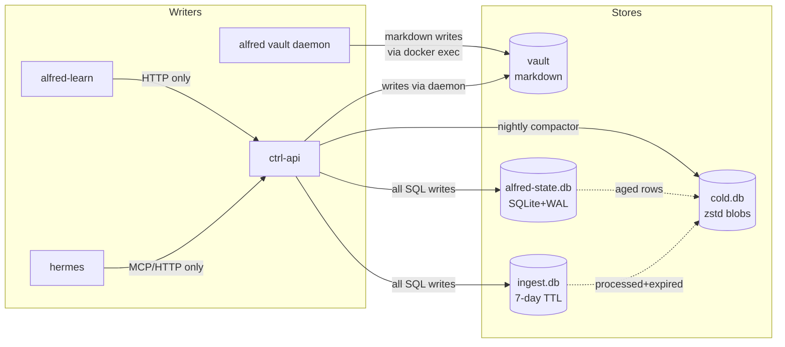

> The vault is the principal's published output, not the system's database.

Alfred Black persists data in **four stores**, each with a different lifecycle, a different access pattern, and a single writer. The split is intentional: markdown is the wrong shape for a high-write firehose, and SQLite is the wrong shape for something the principal is meant to open in Obsidian and edit by hand.

## The four stores

| # | Store | Backing | Sole writer | Purpose |
|---|---|---|---|---|
| 1 | **vault** | Markdown on `vault_data` volume | ctrl-api (via the alfred daemon) | The principal's published surface — what they read and edit |
| 2 | **alfred-state.db** | SQLite + WAL + sqlite-vec | ctrl-api | Working memory — signals, observations, audit, links, embeddings |
| 3 | **ingest.db** | SQLite (7-day TTL) | ctrl-api | Raw inbound stream events |
| 4 | **cold.db** | SQLite with zstd-compressed blobs | ctrl-api | Forensic long-tail (>90 days for signals/observations, >365 days for audit/links) |

The operational store is called `alfred-state.db` (not `state.db`) to avoid colliding with Hermes' own gateway-session store at `$HERMES_HOME/state.db`.



## Single-writer discipline

ctrl-api is the **only** process with a write handle to `alfred-state.db`, `ingest.db`, and `cold.db`. `alfred-learn`, Hermes, and the alfred daemon all write through ctrl-api HTTP endpoints — never to the SQLite files directly *(packages/learn/CLAUDE.md "Key Constraints")*. Other services may open the files read-only.

The vault is written exclusively through the `alfred` daemon container, which ctrl-api invokes via `docker exec` with a per-path mutex serialising concurrent writes *(packages/ctrl/src/api/routes/vault.ts:120-136)*. Every write also updates `state.db`'s `vault_index` table on the event loop via `setImmediate`, off the API critical path *(vault.ts:72-85)*.

This eliminates SQLite multi-process write contention and makes drift between `vault_index` and the actual filesystem structurally impossible.

## Store 1 — the vault

The vault is mounted at `/vault` inside ctrl-api and the alfred daemon, backed by the `vault_data` named Docker volume *(docker-compose.yaml:267)*. The init container scaffolds the directory tree at first boot — one subdirectory per record type plus `_templates/`, `inbox/`, and the `SOUL.md`/`RULES.md` singletons *(packages/hermes/init/entrypoint.sh:44-64)*.

### The 12 canonical record types

```
matter  task  note  person  org  place  asset  chore  instinct  decision  briefing  daybook
```

The list is frozen in code as `CANONICAL_RECORD_TYPES` *(packages/ctrl/src/db/promotionContract.ts:29-43)*. Each record lives at `<type>/<slug>.md` with YAML frontmatter and a markdown body. Closed records may move to `<type>/_closed/` but stay under the same canonical root.

<Note>
The standalone `alfred-vault` Python package (the daemon) recognises 20+ legacy entity types for development and migration use, but ctrl-api's promotion contract enforces only these twelve in production writes.
</Note>

### Singletons and operator paths

Six top-level paths bypass the canonical-type check but are still allowed inside the vault *(promotionContract.ts:52, 66-72, 149-178)*:

- `SOUL.md` — the Alfred persona (consolidated to `$HERMES_HOME/SOUL.md` at supervisor boot)
- `RULES.md` — the principal's standing instructions (editable on `/household`)
- `_templates/` — seed scaffolds
- `_archive/`, `_migrated*/`, `_rescue/`, `_raw/`, `_migrate/` — bulk operator surfaces
- `needs_attention/` — the Desk queue (still markdown until storage cutover #28)
- `inbox/` — the orphan-task fallback

## Store 2 — alfred-state.db

The operational store, opened in WAL mode at boot *(packages/ctrl/src/api/routes/state.ts:59)*. Concurrent readers never block the writer. Schema is one set of tables defined in `schema.sql` plus numbered migrations that run transactionally at startup *(packages/ctrl/src/db/migrations/)*.

Key tables *(packages/ctrl/src/db/schema.sql)*:

- **`signal`** — demoted signals (id, ts, kind, source, headline, salience, status, payload_json). TTL 90 days.
- **`observation`** — intuition-engine observations (subject, kind, decision_ref, instinct_ref, confidence, processed_at). TTL 90 days.
- **`routing_decision`** — machine routing decisions (signal_id, tier, chosen_path, agent, discretion, outcome). TTL 90 days.
- **`audit`** — the action ledger: signal-action, steward-action, desk-action, state-change, vault_write. TTL 365 days.
- **`link`** — cross-record graph edges (src_ref, dst_ref, rel, weight). TTL 365 days.
- **`vault_index`** — read index over the vault (path, record_type, title, status, frontmatter_json, mtime). Maintained on every vault write.
- **`embedding`** — sqlite-vec `vec0` virtual table (768-dim vectors), with a companion `embedding_meta` table for non-vector metadata. Created at boot only if the `sqlite-vec` extension loads; degrades gracefully otherwise *(state.ts:74-98)*.

## Store 3 — ingest.db

A separate SQLite file with one hot table — `stream_event` — for raw inbound payloads from webhooks and Composio polls. Splitting it out of `state.db` avoids firehose write-lock contention on the operational store *(packages/ctrl/src/api/routes/ingest.ts:1-9)*.

Hard 7-day TTL, configurable via `INGEST_TTL_DAYS`. A background sweep runs every 6 hours, deleting events older than the TTL **only if they've been marked processed**; unprocessed laggards are retained and alerted *(ingest.ts:21, 60-107)*.

## Store 4 — cold.db

Rolled from the hot tables after their per-table TTL by a nightly compactor *(packages/ctrl/src/db/cold.ts:1-89)*. Each archive table — `archive_signal`, `archive_observation`, `archive_routing_decision`, `archive_audit`, `archive_link` — keeps the id, ts, and a few indexed filter columns uncompressed, then stores the full row as a zstd-compressed blob (zstd available on Node ≥22.15; gzip fallback otherwise).

Reads on `/api/v1/admin/audit` and friends transparently merge hot + cold; the principal never needs to know where a record lives.

## The promotion contract

> A record exists in the vault only if the principal has a reason to read or edit it. Everything else is SQLite.

This is enforced in code, not by convention. Every vault write route calls `assertCanonicalVaultPath(vaultRelPath)` before touching the filesystem *(packages/ctrl/src/api/routes/vault.ts:899)*. The function normalises the path, guards against traversal, and either returns the canonical record type or throws `PromotionContractError` *(packages/ctrl/src/db/promotionContract.ts:149-178)*.

`PromotionContractError` extends `ApiError`, so ctrl-api's error handler maps it to **HTTP 422** with a structured body that includes a `destination` field — a free hint telling the caller where the record *should* have gone *(promotionContract.ts:101-119)*.

### Demoted types — what goes where

Records that aren't part of the canonical 12 are routed to specific tables in `state.db` or `ingest.db` *(promotionContract.ts:75-99)*:

| Demoted type | Goes to |
|---|---|
| `signal-action`, `steward-action`, `desk-action`, `state-change`, `needs_attention_action`, `event` | `state.db.audit` via `POST /api/v1/state/audit` |
| `signal` | `state.db.signal` via `POST /api/v1/state/signals` |
| `observation`, `pattern_proposal`, `decision_pattern`, `synthesis`, `contradiction`, `assumption`, `constraint` | `state.db.observation` via `POST /api/v1/state/observations` |
| `stream_event`, `streams` | `ingest.db.stream_event` via `POST /api/v1/ingest/events` |

When ctrl-api rejects a non-canonical write, the response includes the exact destination endpoint:

```json
{
  "error": "Record type \"signal\" is not a canonical vault type.",
  "recordType": "signal",
  "destination": "alfred-state.db signal table (POST /api/v1/state/signals)"
}
```

## Adding a new persisted thing

When you need to persist a record, ask:

1. Does the principal read or edit it directly in Obsidian or the dashboard? → It's a canonical vault type. Write via `POST /api/v1/vault/records` or `PATCH /api/v1/vault/records/<path>`.
2. Does the UI render a derived view (audit feed, signal queue, observation index)? → It's a `state.db` table. Pick the right surface — `audit`, `signal`, `observation`, or `link`.
3. Is it a raw inbound webhook payload? → `ingest.db.stream_event` via `POST /api/v1/ingest/events`.
4. Neither? → Probably ephemeral. State.db has tables for legacy provisioning that can be repurposed; otherwise file an issue.

<Warning>
**Never add a new vault directory to "make a thing easier."** It bypasses the promotion contract; the next migration to compact storage will lose the data, and the daemon's validator may reject the records on the next index rebuild.
</Warning>
