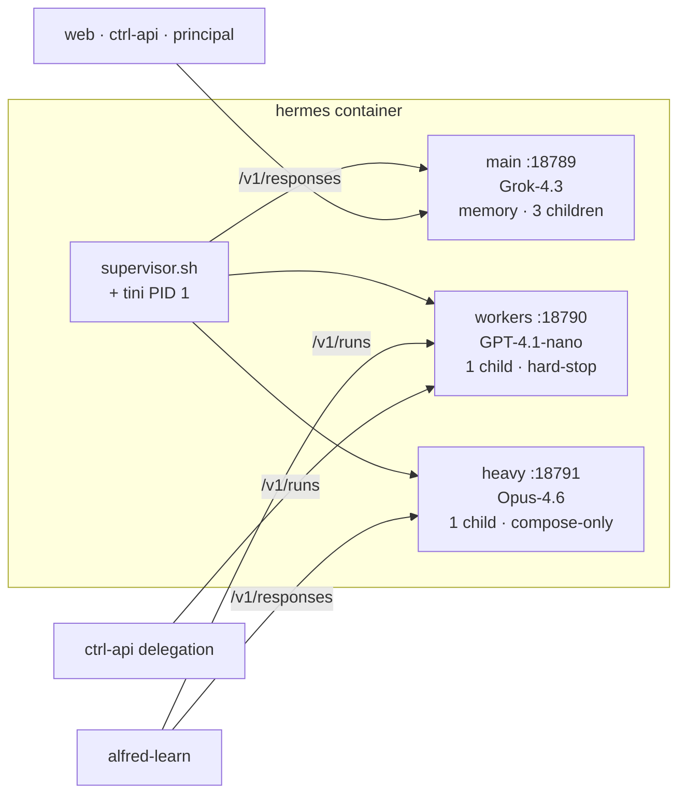

Alfred Black's AI runtime is **Hermes Agent** (`NousResearch/hermes-agent`), packaged into a single Docker image that supervises three independent gateway processes. The split exists because user-facing chat, background workers, and Opus-class reasoning have wildly different concurrency, memory, and cost profiles — running them in one process would mean either undersizing the chat or over-spending on the workers.

## Three profiles, three ports

A `supervisor.sh` wrapper launches three Hermes Gateway processes inside the same container, each pointing at its own profile directory under `$HERMES_HOME/profiles/` *(packages/hermes/docker/supervisor.sh:1-342)*:

| Profile | Port | Default model | Memory | Concurrency | Purpose |
|---|---|---|---|---|---|
| **main** | `:18789` | `x-ai/grok-4.3` | enabled | 3 concurrent children | User-facing chat, messaging, scheduled tasks |
| **workers** | `:18790` | `openai/gpt-4.1-nano` | disabled | 1 concurrent child | Background agents (clerk, curator, janitor, distiller, ephemeral runs) |
| **heavy** | `:18791` | `anthropic/claude-opus-4-6` | disabled | 1 concurrent child | Opus-class reasoning for onboarding and Reflection |

Models are defaults — every value is overridable via `HERMES_MAIN_MODEL`, `HERMES_WORKERS_MODEL`, `HERMES_HEAVY_MODEL` in `.env` *(packages/hermes/render_hermes.py:338-340)*. All three route through OpenRouter (`provider: openrouter`, `base_url: https://openrouter.ai/api/v1`) so a single `OPENROUTER_API_KEY` covers the whole runtime; `ANTHROPIC_API_KEY` and `OPENAI_API_KEY` are optional fallbacks.

The heavy profile is **not exposed to the host** — only the compose network can reach it, because Opus calls are expensive and shouldn't be reachable from outside the VM *(Dockerfile EXPOSE 18789 18790)*.

## The OpenAI Responses API

Hermes speaks the **OpenAI Responses API natively** — there is no shim *(packages/hermes/docker/supervisor.sh:284-304)*:

- `POST http://hermes:18789/v1/responses` — main (synchronous chat)
- `POST http://hermes:18790/v1/runs` — workers (ephemeral background runs)
- `POST http://hermes:18791/v1/responses` — heavy

Every call carries `Authorization: Bearer ${HERMES_API_SERVER_KEY}`. The bearer is a single 32-byte URL-safe random value generated by the `init` container at first boot and written to `/alfred-data/.gateway-token` *(packages/hermes/init/entrypoint.sh:327-352)*. `render_hermes.py` reads that file and bakes it into each profile's `.env` as `API_SERVER_KEY`. Same token for all three profiles — callers authenticate once.

Healthchecks hit `GET /health` on main and workers (no auth); model and tool introspection use `GET /v1/models` and `GET /v1/tools` (bearer required) *(supervisor.sh:222-264)*.

## The six MCP servers per profile

Every profile registers the same set of Model Context Protocol servers in its `config.yaml` *(packages/hermes/hermes-config.yaml.njk:285-354)*:

| Name | Transport | Surface |
|---|---|---|
| **`alfred-ctrl`** | HTTP (proxied via `ctrl-server.mjs`) | The ctrl-api itself — 60+ routes for vault, decisions, audit, integrations, chores |
| **`alfred`** | stdio (Node) | Vault read/write + agent delegation + workflow orchestration |
| **`sure`** | stdio (Node) | Sure personal-finance — 116 tools |
| **`plane`** | stdio (Node) | Plane project management (v2 catalogue) |
| **`vaultwarden`** | stdio (Node) | Vaultwarden secrets — list/search/get/CRUD + `vault_refresh` |
| **`execute`** | stdio (Node) | Composio surface — every connected third-party app via one `execute` primitive |

That's **6 MCP servers per profile** in the current rendered config — 1 HTTP proxy + 5 stdio apps.

<Note>
A sixth stdio app, **`hermes`**, lives in the MCP server bundle to surface the Hermes runtime itself (scheduling, run delegation, model selection) — useful for the voice agent. It exists in `packages/mcp-server/src/tools/hermes.ts` and the catalogue registry, but is not wired into the profile `config.yaml` template by default. When enabled, each profile will register 7 MCP servers *(packages/mcp-server/src/tools/registry.ts:11-43)*.
</Note>

The five stdio apps all live in one compiled Node bundle at `/opt/mcp-stdio/dist/bin/stdio-app.js`, dispatched by app id *(packages/hermes/Dockerfile:138-141)*. The init container `rsync`s the bundle into each profile's `mcp-stdio/` directory at first boot. Per-profile MCP timeout is 120s; connect timeout 60s.

## The supervisor's role

`supervisor.sh` is a 342-line bash script that does a surprising amount of work at boot:

1. **Sticky-default profile** — `hermes profile use main` so a bare `hermes chat` lands on the principal-facing profile *(supervisor.sh:126)*.
2. **Auth propagation** — if `profiles/main/auth.json` exists, mirror it to `workers/auth.json` and `heavy/auth.json` when they're missing or smaller (size heuristic guards against partial copies). One OAuth identity for the whole runtime, idempotent across restarts *(lines 128-153)*.
3. **SOUL.md consolidation** — Hermes reads global persona from `$HERMES_HOME/SOUL.md` (not per-profile copies). Supervisor copies `profiles/main/SOUL.md` → `$HERMES_HOME/SOUL.md` when the destination is missing, smaller, or contains the stock Nous identity marker. Hand-edited SOULs that aren't smaller or stock are preserved *(lines 155-281)*.
4. **Three gateway processes** — launches `hermes -p main gateway run --replace`, `hermes -p workers gateway run --replace`, `hermes -p heavy gateway run --replace` in that order. The `--replace` flag clears any stale process lock from a hard crash *(lines 284-304)*.
5. **LCM verification probe** — background subprocess probes main's `/health`, then queries `/v1/tools` looking for `lcm_*` tools. Logs an OK or a WARNING; doesn't fail the supervisor if LCM didn't load *(lines 222-264)*.
6. **Restart-loop guard** — up to 20 restarts within the supervisor's lifetime before fatal exit. `HERMES_RESTART_DELAY` defaults to 5 seconds *(lines 36, 327)*.

`tini` is PID 1, reaping the MCP stdio child zombies *(Dockerfile line 201)*.

## Plugins (main profile only)

The main profile loads two plugins that workers and heavy don't:

**`hermes-lcm`** is the long-context memory plugin (lossless context reload across session resets). The image bakes it at `/opt/hermes-lcm` from a pinned SHA *(Dockerfile line 111-113)*. Supervisor copies it into `profiles/main/plugins/hermes-lcm/` at every boot; the verification probe in step 5 above checks that `lcm_*` tools showed up on `/v1/tools` *(supervisor.sh lines 188-264)*.

**`one-alfred`** is the continuity plugin. It registers three lifecycle hooks — `pre_gateway_dispatch`, `pre_llm_call`, `post_llm_call` — that inject the Alfred journal (the cross-channel continuity layer ensuring SMS, email, voice, and chat share one principal-Alfred history) *(packages/hermes/plugins/one-alfred)*. It's COPY'd in at build time and refreshed by supervisor when the source mtime is newer *(supervisor.sh lines 210-220)*.

## What's not used

The **Hermes web dashboard** is not deployed. The upstream pip wheel ships neither the React source nor a pre-built `web_dist/`; running the dashboard backend yields `{"error":"Frontend not built"}` for every request. Use the in-container CLI instead:

- `hermes config` — view/edit profile config.yaml
- `hermes profile use <name>` — change sticky default
- `hermes auth` — OAuth flow management
- `hermes plugins list` — verify plugin load
- `hermes model <id>` — switch model on the fly

Reach them with `docker exec -it $(docker ps -qf name=hermes) hermes …`.

## Resource ceiling

The container is capped at **6 GB RAM** with a 2048-PID limit *(docker-compose.yaml:252-318)*. Node heap is sized to 3072 MB via `NODE_OPTIONS=--max-old-space-size=3072` — leaving headroom for the three Python gateway processes and their child MCP processes. `tmpfs /tmp` is 256 MB. Capabilities are dropped to `DAC_OVERRIDE` only.

A typical idle main profile sits around 800–1200 MB. Under sustained Opus-class load on heavy plus a couple of concurrent main chats, you can saturate the 6 GB ceiling — increase the limit or move the heavy profile to a sibling container if that becomes a problem.
