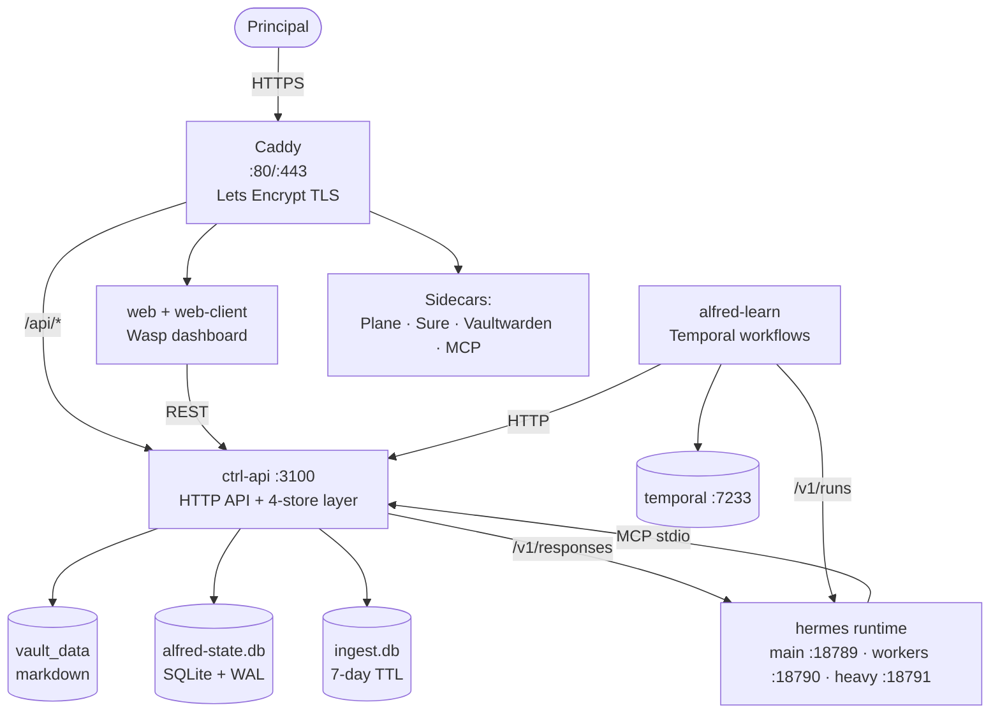

Alfred Black is the single-VM reframing of the original Alfred SaaS platform. One git repo, one `.env` file, one `docker compose up`. There is no fleet provisioning, no per-tenant database, no shared control plane — every install is the principal's own machine, end to end.

The system has three load-bearing layers: a **runtime** (the AI), an **intelligence loop** (the workflows that observe, propose, and learn), and a **storage substrate** (the four-store split that separates the principal's published surface from the machine's working memory). Around them sit a handful of UI surfaces (`web`, Caddy, the sidecar apps) and the operational glue (`init`, `ctrl-api`, the vault daemon).

## The picture

Caddy terminates TLS on the host and reverse-proxies seven hostnames — apex, `api`, `plane`, `sure`, `vault`, `mcp`, `sms`, `voice` — to internal services *(caddy/Caddyfile)*. The dashboard SPA (`web-client`, nginx) lives at the apex; the Wasp server (`web`) handles auth and operations at `api.{$DOMAIN}` *(docker-compose.yaml:80-137)*.

## The runtime — Hermes

The AI runs in a single container called `hermes` that supervises three independent profiles. Each profile is a separate Hermes Gateway process with its own port, model, config, and SQLite session store *(packages/hermes/docker/supervisor.sh:1-342)*:

- **main** at `:18789` — user-facing chat. Default model `x-ai/grok-4.3`; memory enabled, full messaging toolset *(packages/hermes/hermes-config.yaml.njk:54, 124-127)*.
- **workers** at `:18790` — background agents (clerk, curator, janitor, distiller, ephemeral runs). Default `openai/gpt-4.1-nano`; memory disabled, hard tool-loop limits *(hermes-config.yaml.njk:63, 135-138, 205-217)*.
- **heavy** at `:18791` — Opus-class reasoning for onboarding and Reflection. Default `anthropic/claude-opus-4-6`; compose-network only (not exposed to the host) *(packages/hermes/Dockerfile:192, supervisor.sh:287)*.

All three speak the **OpenAI Responses API natively** (`POST /v1/responses` on main and heavy, `POST /v1/runs` on workers). One bearer token in `/alfred-data/.gateway-token` authenticates the whole runtime; the `init` container generates it once at first boot *(packages/hermes/init/entrypoint.sh:327-352)*.

## The intelligence loop — alfred-learn

`alfred-learn` is a Python worker connected to a single-node Temporal cluster *(docker-compose.yaml:164-215, 451-540)*. It registers **30+ workflows** *(packages/learn/src/worker.py:1153)* that drive everything Alfred does autonomously: the signal pipeline (extract → route → decide → reflect), the briefing schedules, nightly narrative roll-up, chore promotion, task-closure watching, decay watching. Every LLM call goes through Hermes' workers profile; every storage write goes through ctrl-api HTTP. The worker never writes to disk directly *(packages/learn/CLAUDE.md "Key Constraints")*.

## The storage substrate — four stores

The vault is the principal's **published output**, not the system's database. Alfred Black persists data in four stores, with ctrl-api as the sole writer to the three databases:

| Store | Backing | Holds |
|---|---|---|
| **vault** | Markdown on `vault_data` | The principal's published 12 canonical record types |
| **alfred-state.db** | SQLite + WAL + sqlite-vec | Signals, observations, audit, links, embeddings |
| **ingest.db** | SQLite (7-day TTL) | Raw inbound stream events |
| **cold.db** | SQLite + zstd blobs | Forensic long-tail (>90 days) |

The promotion contract (`assertCanonicalVaultPath`) enforces this at the API gate: writing a non-canonical record type to the vault returns HTTP 422 with a `destination` field pointing at the right store *(packages/ctrl/src/db/promotionContract.ts:101-178)*. See [The four-store model](/architecture/four-store-model) for the full split.

## Around the edges

The dashboard is two containers: `web` (Wasp server, auth + operations) and `web-client` (nginx static SPA). UI changes need both rebuilt *(docker-compose.yaml:80-137)*. The vault daemon (`alfred`) handles markdown validation and indexing as a separate process — ctrl-api delegates writes to it via `docker exec` and a per-path mutex *(packages/ctrl/src/api/routes/vault.ts:120-136)*.

Four **sidecar apps** ship in the default profile — Plane (project management, ~11 sub-containers), Sure (personal finance, 3 sub-containers), Vaultwarden (secrets), and the MCP HTTP server for Claude Custom Connectors. The optional `--profile vexa` adds a 9-service meeting-transcription stack. See [Sidecars](/architecture/sidecars) for the full graph.

## What's on each page

- [The four-store model](/architecture/four-store-model) — the promotion contract, what lives where.
- [The signal pipeline](/architecture/signal-pipeline) — how an inbound event becomes a learned instinct.
- [State machines](/architecture/state-machines) — matters, tasks, decisions, signals, chores, instincts.
- [The Hermes runtime](/architecture/hermes-runtime) — the three profiles, the MCP registrations.
- [Sidecars](/architecture/sidecars) — Plane, Sure, Vaultwarden, Vexa.
