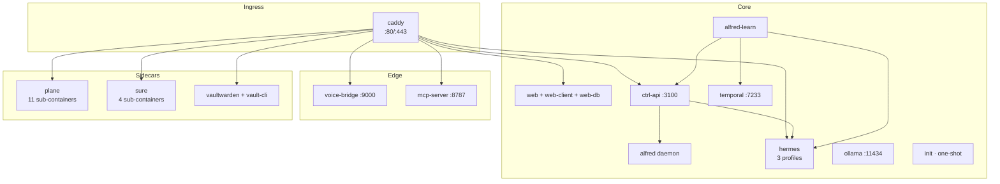

"Sidecars" is principal-facing UI shorthand for the four user-visible integrated apps. The real compose graph runs ~35 services across ~24 named volumes — most of which are sub-containers of the sidecars themselves. This page documents both lenses: the **sidecars** the principal sees as separate surfaces, and the **core services** that make Alfred Black itself work.

## Two categories

**Sidecars** are first-class apps with their own UI hostnames, their own databases, and their own data lifecycles. The principal interacts with them as distinct products integrated through Alfred:

- **Plane** — project management (`plane.{$DOMAIN}`)
- **Sure** — personal finance (`sure.{$DOMAIN}`)
- **Vaultwarden** — secrets manager (`vault.{$DOMAIN}`)
- **MCP server** — Claude Custom Connectors gateway (`mcp.{$DOMAIN}`)

**Core services** are the infrastructure that makes Alfred work — the dashboard, the runtime, the workflow engine, the bootstrap glue. They aren't sidecars even though they're separate containers.

| Tier | Service | Purpose |
|---|---|---|
| Ingress | `caddy` | TLS termination + reverse proxy for 7 hostnames *(caddy/Caddyfile)* |
| Dashboard | `web`, `web-client`, `web-db` | Wasp server (auth + operations) + nginx SPA + Postgres |
| API | `ctrl-api` | The tenant API + 4-store layer on `:3100` |
| Vault | `alfred` | The vault daemon (curator, janitor, distiller, surveyor) |
| Intelligence | `alfred-learn`, `temporal` | 30+ Temporal workflows + the workflow engine |
| Runtime | `hermes`, `ollama` | The 3-profile AI runtime + the local embedding server |
| Bootstrap | `init`, `vault-signup`, `vault-cli` | One-shot setup containers |
| Edge | `voice-bridge`, `mcp-server` | Twilio realtime audio + HTTP MCP for Claude |

## The compose graph

## Plane (project management)

Eleven containers: `plane-db` (Postgres 15.7), `plane-redis` (Valkey 7.2), `plane-mq` (RabbitMQ 3.13), `plane-minio` (S3-compatible object store), `plane-migrator` (one-shot DB migrations), `plane-api` (Django backend), `plane-worker` (Celery), `plane-beat` (Celery beat scheduler), `plane-web` (Next.js SPA), `plane-space` (public boards), `plane-admin` (admin UI), `plane-live` (WebSocket collaboration), `plane-proxy` (internal Caddy), and `plane-init` (one-shot owner-account bootstrap) *(docker-compose.yaml:745-1217)*.

The internal `plane-proxy` runs without TLS — alfred-black's outer Caddy terminates TLS and routes `plane.{$DOMAIN}` to it. `plane-init` uses Django ORM directly to bootstrap the owner User and InstanceAdmin because Plane's HTTP signup is CSRF-locked. Idempotent — no-op if `is_setup_done` is already true.

Memory ceilings: `plane-api` 2 GB, `plane-worker` 2 GB, the smaller services 128–512 MB.

## Sure (personal finance)

Four containers: `sure-db` (Postgres 16), `sure-redis` (Valkey 7.2), `sure-web` (Rails on `:3000`), `sure-worker` (Sidekiq), and `sure-init` (one-shot API-key seed) *(docker-compose.yaml:1072-1245)*. The `sure-init` short-circuits if `/alfred-data/.sure-api-key` already exists.

ctrl-api proxies CRUD to Sure via the Rails runner pattern (the `sure` MCP stdio app exposes 116 tools surfaced to Hermes). `SURE_API_KEY` is generated by `bootstrap.sh` and seeded into the Sure database at first boot.

## Vaultwarden (secrets)

The `vaultwarden` container itself plus two one-shot helpers:

- **`vault-signup`** — registers the owner account on the running Vaultwarden via the `bw` CLI. Idempotent — skips if login succeeds *(docker-compose.yaml:683-715)*.
- **`vault-cli`** — long-running `bw serve` session that keeps the vault unlocked. Listens on `:8087` (internal), proxied by ctrl-api so the dashboard never sees the master password *(lines 720-742)*.

Signups are enabled (`SIGNUPS_ALLOWED=true`) so the owner can register the first account; subsequent invitations are managed through the dashboard.

## MCP server (Claude Custom Connectors)

`mcp-server` is the HTTP-transport MCP server that lets `claude.ai` connect to this Alfred install as a Custom Connector *(docker-compose.yaml:623-640)*. It's distinct from the stdio MCP apps Hermes loads internally — same tool catalogue, different transport.

Runs on `:8787`, advertised at `https://mcp.{$DOMAIN}`. OAuth-aware: a connector grant has an `appId` (one of `alfred|sure|plane|vaultwarden|execute|hermes`), and the server registers only that app's tools per connection — so a token bound to `sure` cannot enumerate Plane tools *(packages/mcp-server/src/tools/registry.ts)*.

## Vexa (optional — meeting transcription)

Run with `docker compose --profile vexa up -d`. Adds nine containers *(docker-compose.yaml:1251-1489)*:

- **Datastore**: `vexa-redis`, `vexa-postgres` (17), `vexa-minio` (recording storage), `vexa-minio-init` (one-shot bucket setup)
- **APIs**: `vexa-admin-api` (admin backend), `vexa-runtime-api` (spawns Vexa-bot child containers via docker.sock RW), `vexa-meeting-api` (recording + transcript ingest)
- **Edge**: `vexa-api-gateway` (entrypoint for all Vexa HTTP traffic), `vexa-dashboard` (Next.js UI on `vexa.{$DOMAIN}`)

`vexa-runtime-api` mounts the Docker socket read-write to spawn meeting-bot containers as siblings — that's not `cap_drop ALL`'d because the upstream image is unaudited. If you don't need automated meeting capture, leave the profile off; Vexa adds ~7 GB to your memory ceiling.

The transcription backend is configurable via `VEXA_TRANSCRIPTION_URL` and `VEXA_TRANSCRIPTION_TOKEN` (Groq Whisper by default). `OWNER_EMAIL` is load-bearing for matching the principal to meeting attendees.

## Resource ceiling

Default profile sits around **~37 GB memory ceiling** when fully loaded; adding `--profile vexa` pushes it to ~44 GB. The minimum VM spec is 32 GB RAM (with active swapping under load), recommended 48 GB, and Vexa wants 56–64 GB *(deploy/CUTOVER.md)*. Disk: 80+ GB, more if you anticipate large vault histories or many recorded meetings.
