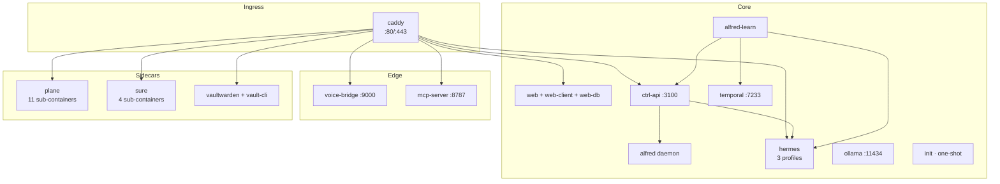

"Sidecars" is principal-facing UI shorthand for the four user-visible integrated apps. The real compose graph runs ~35 services across ~24 named volumes — most of which are sub-containers of the sidecars themselves. This page documents both lenses: the **sidecars** the principal sees as separate surfaces, and the **core services** that make Alfred Black itself work.

## Two categories

**Sidecars** are first-class apps with their own UI hostnames, their own databases, and their own data lifecycles. The principal interacts with them as distinct products integrated through Alfred:

- **Plane** — project management (`plane.{$DOMAIN}`)
- **Sure** — personal finance (`sure.{$DOMAIN}`)
- **Vaultwarden** — secrets manager (`vault.{$DOMAIN}`)
- **Paperclip** — board API + agent registry where Alfred appears as a managed employee (`paperclip.{$DOMAIN}`)
- **MCP server** — Claude Custom Connectors gateway (`mcp.{$DOMAIN}`)

**Core services** are the infrastructure that makes Alfred work — the dashboard, the runtime, the workflow engine, the bootstrap glue. They aren't sidecars even though they're separate containers.

| Tier | Service | Purpose |
|---|---|---|
| Ingress | `caddy` | TLS termination + reverse proxy for 7 hostnames *(caddy/Caddyfile)* |
| Dashboard | `web`, `web-client`, `web-db` | Wasp server (auth + operations) + nginx SPA + Postgres |
| API | `ctrl-api` | The tenant API + 4-store layer on `:3100` |
| Vault | `alfred` | The vault daemon (curator, janitor, distiller, surveyor) |
| Intelligence | `alfred-learn`, `temporal` | 30+ Temporal workflows + the workflow engine |
| Runtime | `hermes`, `ollama` | The 3-profile AI runtime + the local embedding server |
| Bootstrap | `init`, `vault-signup`, `vault-cli` | One-shot setup containers |
| Edge | `voice-bridge`, `mcp-server`, `paperclip` | Twilio realtime audio + HTTP MCP for Claude + the Paperclip sidecar serving `paperclip.{$DOMAIN}` (single container with embedded Postgres) |

## The compose graph

## Plane (project management)

Eleven containers: `plane-db` (Postgres 15.7), `plane-redis` (Valkey 7.2), `plane-mq` (RabbitMQ 3.13), `plane-minio` (S3-compatible object store), `plane-migrator` (one-shot DB migrations), `plane-api` (Django backend), `plane-worker` (Celery), `plane-beat` (Celery beat scheduler), `plane-web` (Next.js SPA), `plane-space` (public boards), `plane-admin` (admin UI), `plane-live` (WebSocket collaboration), `plane-proxy` (internal Caddy), and `plane-init` (one-shot owner-account bootstrap) *(docker-compose.yaml:745-1217)*.

The internal `plane-proxy` runs without TLS — alfred-black's outer Caddy terminates TLS and routes `plane.{$DOMAIN}` to it. `plane-init` uses Django ORM directly to bootstrap the owner User and InstanceAdmin because Plane's HTTP signup is CSRF-locked. Idempotent — no-op if `is_setup_done` is already true.

Memory ceilings: `plane-api` 2 GB, `plane-worker` 2 GB, the smaller services 128–512 MB.

## Sure (personal finance)

Four containers: `sure-db` (Postgres 16), `sure-redis` (Valkey 7.2), `sure-web` (Rails on `:3000`), `sure-worker` (Sidekiq), and `sure-init` (one-shot API-key seed) *(docker-compose.yaml:1072-1245)*. The `sure-init` short-circuits if `/alfred-data/.sure-api-key` already exists.

ctrl-api proxies CRUD to Sure via the Rails runner pattern (the `sure` MCP stdio app exposes 116 tools surfaced to Hermes). `SURE_API_KEY` is generated by `bootstrap.sh` and seeded into the Sure database at first boot.

## Vaultwarden (secrets)

The `vaultwarden` container itself plus two one-shot helpers:

- **`vault-signup`** — registers the owner account on the running Vaultwarden via the `bw` CLI. Idempotent — skips if login succeeds *(docker-compose.yaml:683-715)*.
- **`vault-cli`** — long-running `bw serve` session that keeps the vault unlocked. Listens on `:8087` (internal), proxied by ctrl-api so the dashboard never sees the master password *(lines 720-742)*.

Signups are enabled (`SIGNUPS_ALLOWED=true`) so the owner can register the first account; subsequent invitations are managed through the dashboard.

## MCP server (Claude Custom Connectors)

`mcp-server` is the HTTP-transport MCP server that lets `claude.ai` connect to this Alfred install as a Custom Connector *(docker-compose.yaml:623-640)*. It's distinct from the stdio MCP apps Hermes loads internally — same tool catalogue, different transport.

Runs on `:8787`, advertised at `https://mcp.{$DOMAIN}`. OAuth-aware: a connector grant has an `appId` (one of `alfred|sure|plane|vaultwarden|execute|hermes`), and the server registers only that app's tools per connection — so a token bound to `sure` cannot enumerate Plane tools *(packages/mcp-server/src/tools/registry.ts)*.

## voice-bridge (Twilio ↔ OpenAI Realtime)

`voice-bridge` is the Twilio Media Streams ↔ OpenAI Realtime API shim, served at `voice.{$DOMAIN}` on internal port `:9000` *(packages/voice-bridge/src/config.ts:15)*. It speaks Twilio mulaw on the inbound socket and the OpenAI Realtime WebSocket on the outbound side, with ctrl-api as the read-only state surface and Hermes as the tool dispatch path.

The release substantially matured the call path:

- **Default model is `gpt-realtime-2`**, set via `OPENAI_REALTIME_MODEL` with `gpt-realtime-2` as the fallback in `packages/voice-bridge/src/config.ts:46`. The bump from `gpt-realtime-1.5` was driven by better non-American-accent stability under the Received-Pronunciation butler persona.
- **`server_vad` turn detection** replaces `semantic_vad` *(packages/voice-bridge/src/openai-realtime.ts:182-211)*. The `semantic_vad` mode was eating `input_audio_buffer.speech_started` events under realistic Twilio jitter, so barge-in never triggered `response.cancel`. `server_vad` with `interrupt_response: true` makes the realtime server auto-cancel the in-flight response when the caller starts talking.
- **Twilio playback-clear on barge-in.** The bridge fires `sendTwilioClear()` against the Twilio WS the instant OpenAI emits `input_audio_buffer.speech_started`, draining the playback buffer so the caller's interruption is heard immediately rather than queued behind already-pushed audio *(packages/voice-bridge/src/voice-call.ts:271-284)*.
- **`session.updated` ACK gate.** `OpenAIRealtimeClient.connect()` now resolves on `session.updated` rather than `session.created`, so the RP butler persona, `server_vad`, and `interrupt_response: true` are actually applied before any audio flows. A 5 s timeout fails the connect explicitly if OpenAI never echoes back. `appendAudio()` and `triggerGreeting()` refuse to fire before the ACK lands *(packages/voice-bridge/src/openai-realtime.ts:54-353)*.
- **Curated MCP tool catalog.** OpenAI Realtime has a documented `session.instructions + tools` ceiling of ~16,384 tokens. The pre-curation surface (157 MCP tools across 6 servers + the 17 KB persona) overshot it by ~2.5×, silently truncating tool defs. `VOICE_ALLOWED_MCP_TOOLS` is a tight allowlist of 22 entries (alfred read/write + hermes scheduling + execute list-connections) keeping the prefix comfortably under the ceiling *(packages/voice-bridge/src/mcp-clients.ts:253-279)*. The `self` ctrl-api tool and `composio_execute` remain available as catch-alls.
- **`self` allowlist widened on the ctrl-api side.** The voice-bridge scoped Bearer (`VOICE_BRIDGE_INTERNAL_TOKEN`) is now path-allowlisted to a read-only catalogue covering briefings, vault context/search/list/records, decisions, matters, chores, workflows, schedules, state/signals/observations, admin needs-attention, and learning surfaces. Two sets implement it: `VOICE_BRIDGE_ALLOWLIST` for exact-match routes and `VOICE_BRIDGE_PATTERN_ALLOWLIST` for `:id`-style parameterised routes (anchored regexes — no prefix inheritance) *(packages/ctrl/src/api/auth.ts:67-161)*. Writes are intentionally omitted; the realtime agent reaches mutation through MCP (`alfred__act_on_decision`, `alfred__notify_principal`, `alfred__create_vault_record`, etc.) so a compromise of voice-bridge bounds blast radius to read.
- **`composio_execute` proxies through ctrl-api.** The realtime agent's built-in `composio_execute` tool now routes through ctrl-api at `POST /api/v1/integrations/execute` rather than calling Composio directly, preserving the one-Alfred / one-token boundary *(packages/voice-bridge/src/tools.ts:53-100, packages/ctrl/src/api/auth.ts:72-76)*.

A `VOICE_BRIDGE_DEBUG=1` env opens a verbose-log breadcrumb on the realtime socket — used during the 2026-05-28 home-call investigation that surfaced the ACK-gate and `self`-allowlist gaps.

## voice-bridge ESPHome + Wyoming listeners

Beyond the Twilio leg, `voice-bridge` runs **two** listeners for HA Voice
satellites:

- **ESPHome Native API server on `:6053`** — the binary HA-internal
  protocol the satellites speak (varint length prefix + protobuf
  payload). Makes `voice-bridge` an HA Voice "speaker" the satellite
  can pair with directly, bypassing HA's own assist pipeline for the
  latency win *(packages/voice-bridge/src/esphome-server.ts,
  esphome-protocol.ts)*.
- **Wyoming fallback** — `packages/voice-bridge/src/wyoming-server.ts`,
  for satellites that won't pair direct against ESPHome and need the
  Wyoming addon as an intermediary.

PR #141 enables the listener (`ESPHOME_ENABLED=1` in the compose `.env`)
and combines with Tailscale Serve to expose it tailnet-only. PR4 of
issue #112 (#152) wires the live HA Voice pipeline through it with
Wyoming as the fallback.

A read-only `files` surface (`list/stat/read_text/search`, PR #142)
sits inside the realtime agent so mid-call the principal can say "read
me the PDF the accountant sent" and Alfred reaches [Store 5](/surfaces/files).

## Vexa — retired (PR #126)

Vexa was a nine-container `profiles: ["vexa"]` stack from a 2025-era
self-hosted meeting bot. PR #126 (2026-05-29) retired it: zero live
tenants had the profile up since the single-VM cutover, and there was no
historical transcript corpus. The replacement is
[Recall.ai](/integrations/recall) — hosted SaaS, no extra containers,
configured entirely from `/channels`, plus an in-meeting voice surface
Vexa never had. See [Vexa (retired)](/integrations/vexa) for the
historical record.

## Tailscale (optional sidecar)

Run with `docker compose --profile tailscale up -d`. Adds one container
(`tailscale/tailscale:stable`) plus a `tailscale_data` named volume that
holds `tailscaled.state` so the node key survives `docker compose pull`.
Off by default; bring it up from the `/channels` Tailscale card via the
auth-URL flow — no API key paste.

The sidecar additionally hosts:

- `tailscale cert <domain>` for Let's Encrypt certs issued through the
  Tailscale control plane (no port 80 needed). Issued certs land in
  `caddy/tailscale-certs/`.
- `tailscale serve` for tailnet-only routes (the dashboard reachable
  only inside the tailnet).
- `tailscale funnel` for public routes (used sparingly).

Full writeup: [Tailscale](/integrations/tailscale).

## Resource ceiling

Default profile sits around **~37 GB memory ceiling** when fully loaded.
Tailscale and ESPHome listeners add a few MB each — negligible. The
minimum VM spec is 32 GB RAM (with active swapping under load),
recommended 48 GB *(deploy/CUTOVER.md)*. Disk: 80+ GB, more if you
anticipate large vault histories or a heavy Files Store 5 (PDFs, audio
archive).

The retired Vexa ceiling was +7 GB; that's gone. Recall.ai shifts the
meeting-bot footprint to a third party for ~$0.50/hr of bot time +
$0.15/hr transcription, with a tenant-side monthly hours cap that
auto-flips the auto-join policy to `off` at 100 %.
