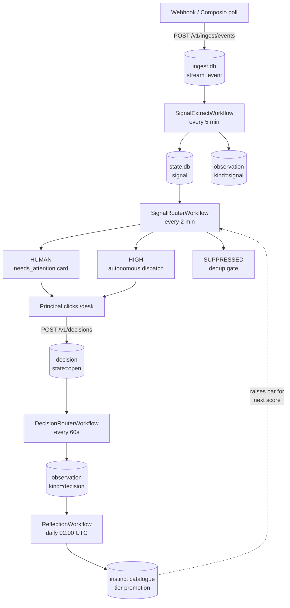

The signal pipeline is the closed loop that lets Alfred learn from what the principal does. Every inbound event — an email, a calendar invite, a payment notification, a Plane status change — flows through the same five stages: **ingest, extract, route, decide, reflect**. The loop closes when the principal's click on the Desk becomes an `observation` that next week's Reflection feeds back into the instinct catalogue.

If observations aren't landing in `state.db`, the system isn't learning — and that's a bug to fix urgently, not a "we'll iterate" item.

## The picture

## Stage 1 — ingest

Webhooks and Composio polls land on `POST /api/v1/ingest/events`, which inserts a row into `ingest.db.stream_event` *(packages/ctrl/src/api/routes/ingest.ts:16-17)*. The row carries `id, ts, stream, channel, external_id, kind, payload_json, processed_at, processed_by, created_at`. A separate `EventProcessorWorkflow` fans out media-ingestion events but drops raw content into the principal's inbox by default — the curator handles classification, not a pre-LLM router *(packages/learn/CLAUDE.md "6 Workflows")*.

The ingest store has a hard 7-day TTL; the sweep runs every 6 hours, deletes processed rows older than the TTL, and retains unprocessed laggards as an alert signal.

## Stage 2 — signal extraction

`SignalExtractWorkflow` runs every 5 minutes and is gated at registration on `STEWARD_SIGNAL_EXTRACT_ENABLED` — if the flag is absent the schedule is never created *(packages/learn/src/workflows/signals.py:6)*.

For each unprocessed `stream_event` the workflow calls `extract_signal_from_event` *(packages/learn/src/activities/signals.py)*:

1. Pre-filter the event for noise: short body, blocklist domains, age >14 days, garbage markers.
2. Call the **clerk** (the workers-profile LLM) to extract `{target_path, target_confidence, effect, effect_confidence, mutation_proposal}`.
3. Resolve the target to a matter or task path, or accept "no target".
4. If `effect ∈ {action, mutation}` and there's no target, optionally auto-create a task via `create_task_from_signal` (mode-gated by `auto_task_create_mode`; idempotent cache at `/alfred-data/state/steward/signal-task-creation.json`).
5. Persist the signal as a row in `state.db.signal` with `status=unrouted`.
6. Call `extract_observation_from_signal` to write a `kind=signal` observation, with the matched instinct stamped on it *(packages/learn/src/activities/signal_observations.py)*.
7. Mark the source `stream_event.signal_extracted_at`.

<Note>
The signal-extract observation hook is wrapped in `workflow.patched("signal_extract_obs_v1")` for any subsequent additions. Adding a new `execute_activity` call to a deployed workflow without a patch marker breaks Temporal replay determinism *(packages/learn/CLAUDE.md)*.
</Note>

## Stage 3 — signal routing

`SignalRouterWorkflow` runs every 2 minutes, also gated at registration *(packages/learn/src/workflows/signal_router.py:6)*. For each `status=unrouted` signal it dispatches to one of three paths.

For `effect=mutation` it calls `apply_signal_mutation`, which feeds the proposal through the `apply_state_change` writer after a confidence gate *(signal_mutations.py)*.

For `effect=action` it calls `route_signal_action` *(signal_actions.py)*:

1. Load all non-deprecated instincts (the matcher accepts `status ∉ {deprecated, disabled}` — filtering on `status=active` would starve the matcher, because most instincts live in `unconfirmed`).
2. Score each instinct against the signal via `_score_keyword_overlap` — weighted: 0.30 domain + 0.30 keywords + 0.15 input_type + 0.15 attachment + 0.10 tags. Matching uses **substring + tokenised** comparison (not set-intersection on single-word tokens), so multi-word patterns match correctly *(packages/learn/src/matching/scorer.py)*.
3. Match-threshold is **0.05** (low on purpose — the discretion gate downstream is the real filter).
4. Compute combined confidence = `min(target_confidence, effect_confidence)`.
5. Apply the **discretion gate**: per-instinct `discretion_threshold` (default 0.95). Combined-confidence ≥ threshold AND `signal_action_mode = live` → HIGH path. Otherwise → HUMAN path.

The three branches:

- **HIGH (autonomous)** — `dispatch_action_to_agent` spawns an ephemeral subagent on the workers profile (`POST hermes:18790/v1/runs`). The agent's outcome is recorded as a follow-up signal with `source_type=agent_outcome`. The dispatched signal terminates as `status=routed_agent`.
- **HUMAN** — `write_needs_attention_record` persists a `needs_attention/<ts>-<id>.md` card. The Desk page reads it and renders the click options.
- **SUPPRESSED** — the P0-2 deduplication gate has fired; the signal terminates as `routed_suppressed`.

Signals are terminal once routed; only `unrouted → dispatching → routed_agent` is reachable in the live state machine.

## Stage 4 — decision

A click on `/desk` posts to `POST /api/v1/decisions` *(packages/ctrl/src/api/routes/decisions.ts)*. The route synchronously flips the source card and **always mints the decision with `state=open`** — even for Done, Defer, Noise, and Take-mine where there's nothing left to do.

Why? Because `state=completed` decisions don't enter the DecisionRouter, which means they don't generate the `kind=decision` observation, which means the loop never closes. Forcing `state=open` keeps every click visible to the learning layer.

The synchronous flip sets `side_effects.synchronous_flip = true` on the decision, which downstream guards use to skip re-firing the side effect.

A second write path — the `/admin/needs-attention/:id/{done,dispatch,skip}` surface — also mints a mirror decision via `mintDecisionMirror`, **unless** the body carries `decision_origin` (which DecisionRouter sets when *it* calls `/dispatch`). This guard prevents the recursive loop where DecisionRouter→/dispatch→mintDecisionMirror→DecisionRouter again *(packages/ctrl/src/api/routes/attention.ts)*.

## Stage 5 — decision routing

`DecisionRouterWorkflow` runs every 60 seconds with `overlap=skip`. Three passes per tick:

- **Pass 1** — for each `state=open` decision, call `route_decision`.
- **Pass 1.5** — `recover_stuck_dispatching` sweeps `state=dispatching` rows older than 10 minutes back to `executing` (if the agent dispatched) or `open` (if not).
- **Pass 2** — for each `state=reversed` decision, call `reverse_decision`.
- **Pass 3** — for each `state=executing` decision, call `check_decision_outcomes` and finalise to `completed` when the source signal shows an outcome.

### The six synchronous_flip guards

Inside `route_decision`, the side-effect logic is wrapped in six `if not synchronous_flip:` guards *(packages/learn/src/activities/decision_router.py:389, 502, 621, 824, 831, 908, 931)*. They cover, in order:

1. **target_is_needs_attention** — only flip a needs_attention card if the decision genuinely targets one.
2. **is_alive_needs_attention** — only act if the card is still pending.
3. **source_signal_is_intact** — only re-arm a signal that still exists.
4. **source_signal_still_unrouted** — idempotent re-entry check for delegate.
5. **target_task_still_open** — only flip a task whose state hasn't already advanced.
6. **matching_outcome_not_already_on_task** — prevent double-linking the same outcome.

The guards exist because the Desk-click route already performed the user-visible flip synchronously. Running the side effect a second time would either no-op or — in the delegate/recursive-mirror case — fire the agent every minute forever.

### Why `extract_observation_from_decision` has no guard

After the guarded side-effect block, `route_decision` calls `extract_observation_from_decision(decision)` unconditionally *(decision_router.py:988-1008)*. There is no `synchronous_flip` check around it.

This is **deliberate**. Observation writes are pure (no side effects on user state), idempotent at the observation level (each decision-id maps to one observation record), and load-bearing for learning: every click on the Desk **must** produce an observation, or the Reflection workflow has nothing to feed Opus. Gating observation writes on the synchronous-flip path would silently starve the intuition engine.

The observation is best-effort: failures log a warning but don't roll back the decision routing.

## Stage 6 — reflection

`ReflectionWorkflow` runs daily at 02:00 UTC *(packages/learn/src/workflows/reflection.py)*. It:

1. Fetches unprocessed observations (`processed_at` null), distiller learnings from completed tasks (last 24h), and janitor flags.
2. Calls **`clerk_reflect`** — an Opus call on the heavy profile that proposes changes to the instinct catalogue (new instincts, edits to confidence/tier, deprecations).
3. Runs `validate_proposals` (pure Python, structural check).
4. For each accepted proposal, calls `apply_instinct_change` — the **sole writer** of `observation_count`, `confidence_score`, and `tier` on instinct records *(packages/learn/SPEC.md)*.
5. Marks the observations processed and rebuilds the intuition index.
6. Writes a daily `reflection_report` for the principal to read on the Decisions page.

Instinct tiers are `Asking → Confirming → Acting`. The matcher does not filter on `tier`; the discretion gate at signal-routing time is the real safety belt. A high `discretion_threshold` on an `unconfirmed` instinct simply forces it to the HUMAN path until enough observations accumulate to lower the bar.

## The mode flags

Three settings control how aggressively each stage acts. All three default to `"live"` *(packages/ctrl/src/api/routes/settings.ts:57-72; packages/learn/src/activities/state_mutator.py:211)*; flipped to `"shadow"` the stage records what it would have done but doesn't act.

| Flag | Controls | Env override |
|---|---|---|
| `signal_action_mode` | Whether SignalRouter dispatches autonomously when discretion clears the bar | `STEWARD_SIGNAL_ACTION_LIVE_MODE` |
| `state_mutator_mode` | Whether `apply_state_change_v2` patches matter/task frontmatter | `STEWARD_LIVE_MODE` |
| `auto_task_create_mode` | Whether signals auto-create tasks | `STEWARD_SIGNAL_AUTOCREATE_TASKS` |

Resolution precedence: env var (operator override) → `/alfred-data/settings.json` (UI toggle on `/settings#agent`) → registered default *(settings.ts:135-150)*.
