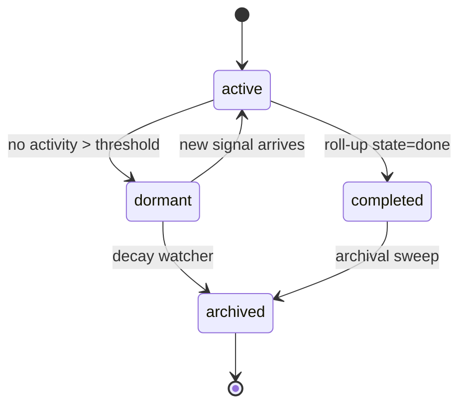
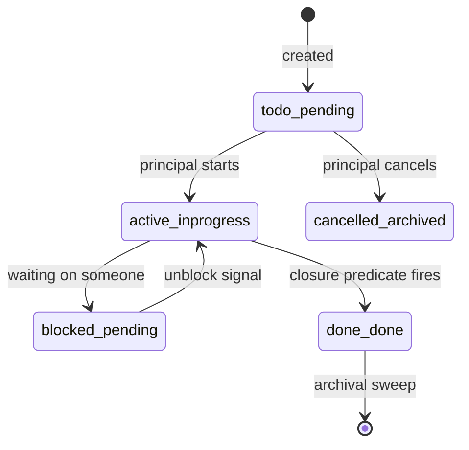
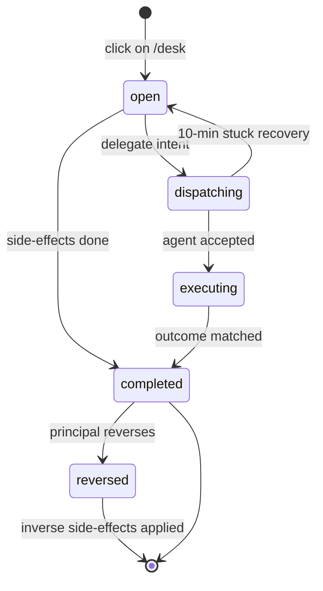
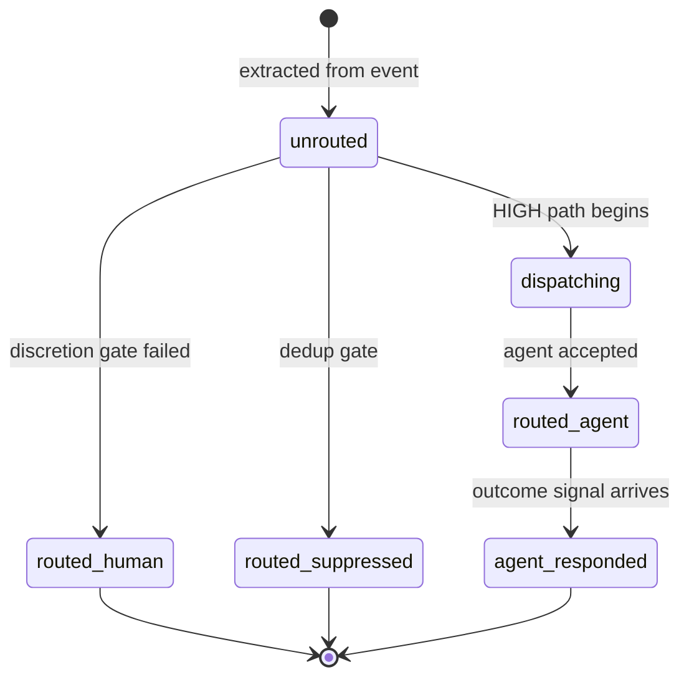
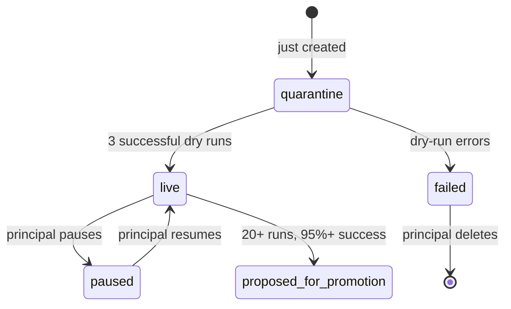
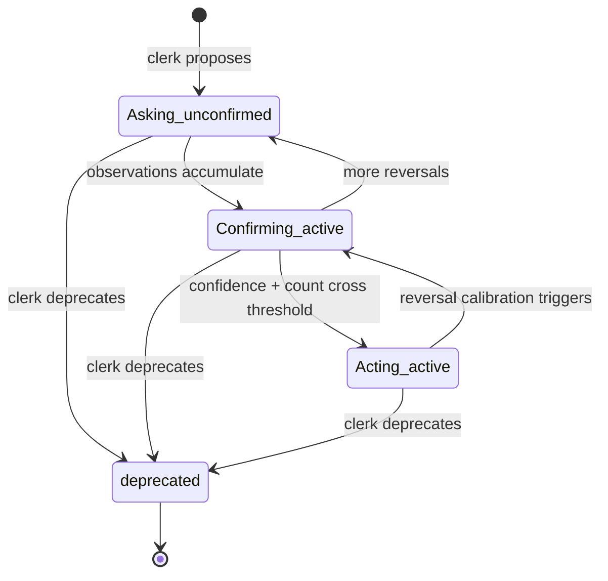

Alfred's day-to-day correctness depends on six small state machines. They look similar from a distance and are subtly different up close: different field names, different writers, different vocabularies. Confusion between them is the most common source of "I clicked the button and nothing happened" bugs.

This page documents what each machine looks like, who's allowed to transition it, and the gotchas worth memorising.

## 1. Matter

A **matter** is a long-running thread of work — a relationship, a project, a recurring obligation. It lives at `vault/matter/<slug>.md`, is principal-editable, and is the parent of zero-or-more tasks.

Matters have **two parallel state surfaces**:

- `status` — `active | dormant | completed | archived`. The principal-facing lifecycle, written by the Steward and `apply_state_change_v2` *(packages/learn/src/activities/state_mutator.py)*.
- `current_state` — a 2–4-sentence narrative paragraph plus an ISO `as_of` timestamp. Owned by `NightlyNarrativeWorkflow`, which runs daily at 02:00 UTC and rewrites the paragraph from the last 24 hours of signals and task transitions *(packages/learn/src/workflows/nightly_narrative.py)*.

There's also a **derived roll-up `state`** — `done | active | waiting` — computed at read time by `deriveMatterState` from the linked tasks *(packages/ctrl/src/api/routes/matters.ts:486-497)*. `done` = every task done or archived; `active` = at least one task in_progress; `waiting` = otherwise. This is read-only — never write to it directly.

**Transitions** all go through `state_mutator.apply_state_change_v2`. Every transition writes an `audit` row in `state.db` plus a frontmatter patch on the vault file. The mutation is mode-gated: `state_mutator_mode = shadow` writes only the audit row; `live` (the default) writes both *(state_mutator.py:211)*.

## 2. Task

A **task** is one concrete step toward a matter's resolution, at `vault/task/<slug>.md`. Tasks have **three fields that all look like state** — this is the single biggest gotcha in the system.

| Field | Vocabulary | Who reads it |
|---|---|---|
| **`status`** | `active \| blocked \| cancelled \| done \| todo` | The `alfred-vault` Python daemon validator |
| **`state`** | `pending \| in_progress \| done \| archived` | The matters aggregator (`normalizeTaskState`, *packages/ctrl/src/api/routes/matters.ts:454*) |
| `current_state` + `as_of` | narrative paragraph | The Brief composer, the dashboard detail view |

**Writers must set both `status` and `state`.** The validator-compatible default for a fresh task is `status: todo, state: pending`. Any other value (notably `status: queued`) is rejected by the validator with HTTP 500.

(State pairs read as `status_state`.)

Required linkage fields, set by every writer *(packages/learn/src/activities/task_creation.py:45-75)*:

- `parent_matter: matter/<slug>.md` — the matters aggregator reads this
- `matter_ref: matter/<slug>.md` — alias different readers use; set both
- `signal_sources: []` — list of `{source_event_path, source_signal_path, source_type}` for provenance
- `closure_predicate: null` — the auto-close watcher's check, see below

### Closure paths

A task closes through one of three paths:

1. **Principal click on Desk** → mints a `decision/<ts>.md` with `intent=done` → DecisionRouter flips the task's `status`/`state`.
2. **TaskClosureWatcherWorkflow** (every 5 min) matches inbound signals against open tasks' `closure_predicate`. Two predicate styles: **deterministic** (`gmail_thread_reply`, `gmail_from_subject`, `calendar_event_accepted`, `payment_to_merchant`) and **LLM** (`assess_closure`, auto-closes if confidence ≥ 0.80).
3. **`archival_sweep`** moves terminal-archived tasks aside on a recurring schedule.

Auto-create from signals is gated by `auto_task_create_mode` (default `"live"`). Onboarding's `_build_rich_errand_content` writes the full rich shape with a 4-tier `parent_matter` resolver (exact slug → fuzzy related_matter → fuzzy task name → `matter/inbox.md` fallback) *(packages/learn/src/activities/packs_opus.py:93-248)*.

## 3. Decision

A **decision** is the audit record of a principal click (or autonomous agent fire). Stored at `vault/decision/<ts>-<sha8>.md`. State vocabulary: `open | executing | completed | reversed`.

**Three write paths**, all of which mint `state=open` so DecisionRouter runs `extract_observation_from_decision` (the learning-loop closer):

1. **`POST /api/v1/decisions`** (the modern Desk path). Synchronously flips the source card and sets `side_effects.synchronous_flip: true`.
2. **`POST /api/v1/admin/needs-attention/:id/{done,dispatch,skip}`** (the secondary admin surface). Performs the flip plus the `needs_attention_action` audit, and mints a mirror decision via `mintDecisionMirror` *unless* the body carries `decision_origin` (which only DecisionRouter sets — preventing recursion).
3. **Signal-router autonomous fire** with `principal: alfred` and `decision_origin: instinct_fire`.

Delegate has a fourth concern: DecisionRouter calls `dispatch_action_to_agent` directly when `intent=delegate`. Three idempotency layers — state guard, `dispatching` mark, `side_effects.agent_dispatched` — prevent double-firing.

## 4. Signal

A **signal** is the machine's interpretation of a stream event. Demoted to `state.db.signal` — never a vault record *(packages/ctrl/src/db/promotionContract.ts:83)*.

Status vocabulary: `unrouted | routed_human | routed_agent | routed_suppressed | dispatching | agent_responded`.

Only `unrouted` is fed into `SignalRouterWorkflow`'s working set. Once routed, signals are terminal from the router's perspective.

The `matched_instinct` column is stamped by `route_signal_action` when the matcher finds a hit — this powers the Decisions audit trail that shows *which* instinct fired *(packages/learn/src/matching/scorer.py)*.

## 5. Chore

A **chore** is a recurring piece of automation. It lives at `vault/chore/<slug>.md` with a matching Python workflow class at `/alfred-data/user-chores/<slug>.py`. The schedule lives in Temporal — one `chore-<slug>` Schedule per chore *(packages/learn/src/workflows/chore_promotion.py)*.

`workflow_class_name` in the chore frontmatter **must match the `@workflow.defn(name=...)` of the deployed `.py`**, exactly — capitalisation included. The dynamic loader resolves the class at worker boot.

First three runs are **quarantine dry-runs** (`quarantine: true, quarantine_remaining: 3`). After they pass, the chore goes live. Every run writes both the vault frontmatter (`last_run`, `last_result`, run-log line in the body) and an entry in `/alfred-data/chore-run-history.jsonl`.

Weekly `ChorePromotionReflectionWorkflow` runs Sunday at 03:00 UTC, drafts a GitHub PR for chores with 20+ live runs at ≥95% success, and saves the draft for review — caps at 5 drafts per week.

## 6. Instinct

An **instinct** is a learned routing pattern. Stored at `vault/instinct/<slug>.md`. Tiers: **`Asking → Confirming → Acting`**.

Tier promotion is **clerk-driven**, not principal-driven. `ReflectionWorkflow` (daily 02:00 UTC) feeds accumulated observations to Opus on the heavy profile, which proposes `apply_instinct_change` calls. **`apply_instinct_change` is the sole writer of `observation_count`, `confidence_score`, and `tier`** *(packages/learn/src/workflows/reflection.py)*. Don't write those fields from anywhere else.

Status is separate from tier: `unconfirmed | active | deprecated`. The signal-router instinct matcher accepts any non-deprecated status (`status ∉ {deprecated, disabled}`); filtering on `status = active` would starve the matcher because most instincts live in `unconfirmed` *(packages/learn/src/matching/instinct_match.py)*.

The **discretion threshold** is per-instinct, computed from `observation_count` by `matching/discretion.py`. ctrl-api's `live_observation_count` enrichment takes precedence over any snapshotted value on the instinct itself — so the router always uses the current count, not a stale frontmatter field.

## A note on dual vocabularies

Three of the six machines have a field literally named `status` and another field literally named `state`, and they don't always mean the same thing across machines. The summary worth pinning:

| Machine | `status` | `state` | Other |
|---|---|---|---|
| matter | active/dormant/completed/archived | — | `current_state` paragraph |
| task | active/blocked/cancelled/done/todo | pending/in_progress/done/archived | `current_state` paragraph |
| decision | — | open/executing/completed/reversed | `intent` separately |
| signal | unrouted/routed_*/dispatching | — | `effect`, `discretion` |
| chore | live/paused/failed/quarantine | — | `quarantine_remaining` counter |
| instinct | unconfirmed/active/deprecated | — | `tier` separately |

If you find yourself reading or writing `status` on a task without also setting `state` (or vice versa), stop. One of the readers will see stale state.
