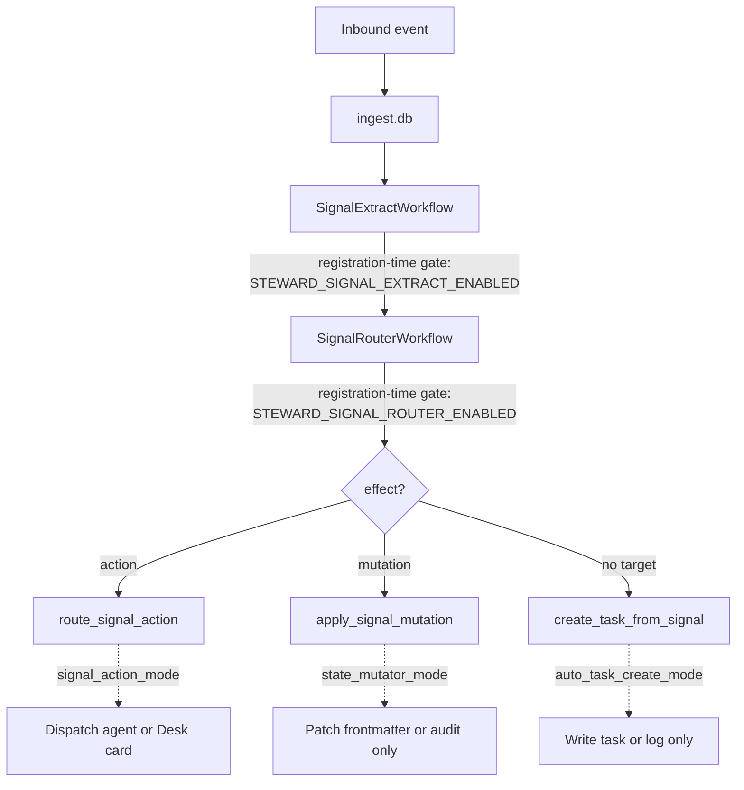

Three runtime flags control how aggressively Alfred *acts* on its own. All three default to `"live"` (do the thing), and each can be flipped to `"shadow"` to record what *would* have happened without making the change. They're flippable from the dashboard at runtime — no redeploy needed.

<Info>
The defaults were `"shadow"` in earlier builds. Each was flipped to `"live"` on 2026-05-24 (Sir-matter-task #3) once the corresponding pipeline was confirmed stable. The resolver source-of-truth comments record the history *(`packages/learn/src/activities/state_mutator.py:200-211`)*.
</Info>

---

## The three flags

| Flag | What it gates | Default | Env override |
|------|--------------|---------|--------------|
| `signal_action_mode` | Whether `SignalRouter` *dispatches* a matched signal to an autonomous agent (vs always routing it to the Desk as a HUMAN card) | `"live"` *(`packages/learn/src/activities/signal_actions.py:113`)* | `STEWARD_SIGNAL_ACTION_LIVE_MODE` *(`signal_actions.py:84`)* |
| `state_mutator_mode` | Whether `apply_state_change_v2` actually patches matter/task frontmatter (vs writing only the audit row) | `"live"` *(`packages/learn/src/activities/state_mutator.py:211`)* | `STEWARD_LIVE_MODE` *(`state_mutator.py:188`)* |
| `auto_task_create_mode` | Whether unresolved signals auto-create a `task/` record via `create_task_from_signal` | `"live"` *(`packages/learn/src/activities/task_creation.py:140`)* | `STEWARD_SIGNAL_AUTOCREATE_TASKS` *(`task_creation.py:129`)* |

Each flag accepts three values: `"live"`, `"shadow"`, and `"live_high_confidence_only"` *(`state_mutator.py:195`)*. The last only applies mutations whose proposal confidence exceeds the per-flag threshold (default 0.85).

<Warning>
Two **registration-time** gates also exist: `STEWARD_SIGNAL_EXTRACT_ENABLED` and `STEWARD_SIGNAL_ROUTER_ENABLED`. These are *not* the same as the three live-mode flags — they decide whether the corresponding Temporal schedule is created at worker boot. Flipping them post-boot has no effect; you must restart `alfred-learn`. See [.env reference](/configuration/env-reference#optional-features-and-integrations).
</Warning>

---

## Resolution precedence

Every flag resolves through the same three-step chain *(`state_mutator.py:214-279`, `task_creation.py:143-212`, `signal_actions.py:116-182`)*:

<Steps>
  <Step title="Env variable (override)">
    If the env var (`STEWARD_LIVE_MODE`, `STEWARD_SIGNAL_ACTION_LIVE_MODE`, `STEWARD_SIGNAL_AUTOCREATE_TASKS`) is set and is one of the valid mode strings, that value wins. Reserved for ops emergencies — bake into the compose file or push via `docker compose --env-file` to disable a runaway pipeline without going through the dashboard.
  </Step>
  <Step title="settings.json file">
    `/alfred-data/settings.json` is read; if it parses to a JSON object containing the matching key (`signal_action_mode`, `state_mutator_mode`, or `auto_task_create_mode`) with a valid string value, that wins.
  </Step>
  <Step title="Default">
    `"live"` for all three.
  </Step>
</Steps>

Unrecognised values (env or file) log a `WARNING` line and fall back to the next step *(`state_mutator.py:244-248`, `signal_actions.py:148-152`)*. A missing settings file is the steady state on a fresh tenant — the resolver intentionally does **not** warn in that case *(`state_mutator.py:232-234`)*.

---

## Flipping a flag at runtime

The dashboard `/settings` page exposes a toggle for each flag, calling `PUT /api/v1/settings/:key` on `ctrl-api` *(`packages/ctrl/src/api/routes/settings.ts`)*. The endpoint writes the new value to `/alfred-data/settings.json` atomically (temp file + rename) so a concurrent read never sees a torn write.

You can do the same from the host with curl:

```bash
curl -X PUT https://api.${DOMAIN}/api/v1/settings/state_mutator_mode \
  -H "Authorization: Bearer ${AAS_API_KEY}" \
  -H "Content-Type: application/json" \
  -d '{"mode": "shadow"}'
```

Inspect the resolved view (which mode wins right now, and from where) with:

```bash
curl https://api.${DOMAIN}/api/v1/settings \
  -H "Authorization: Bearer ${AAS_API_KEY}"
```

The response includes `{ mode, source, env_override_active }` per key so you can tell whether your dashboard toggle is being shadowed by an env override.

---

## Why you'd flip to shadow

Each flag in `"shadow"` writes the same audit trail it would in `"live"` (so observations still feed the learning loop) but skips the side effect:

- `signal_action_mode: "shadow"` — `SignalRouter` always lands signals as Desk cards instead of firing the agent, even when an instinct matches with high confidence. Useful when you're calibrating discretion thresholds and don't want autonomous dispatches.
- `state_mutator_mode: "shadow"` — `apply_state_change_v2` writes the `state_change` audit row but skips the vault frontmatter patch. Useful when validating a new propose-function before letting it touch live records.
- `auto_task_create_mode: "shadow"` — `create_task_from_signal` logs the would-be task but skips the vault write. Useful for tuning the orphan-signal task-spawning behaviour during onboarding.

Restart not required for any of the three — the resolver re-reads on every activity invocation.

---

## Where each flag fires



All three flags fire downstream of the signal pipeline, so flipping any of them to shadow does *not* stop inbound events from being recorded or signals from being extracted — only the action they would have triggered.
