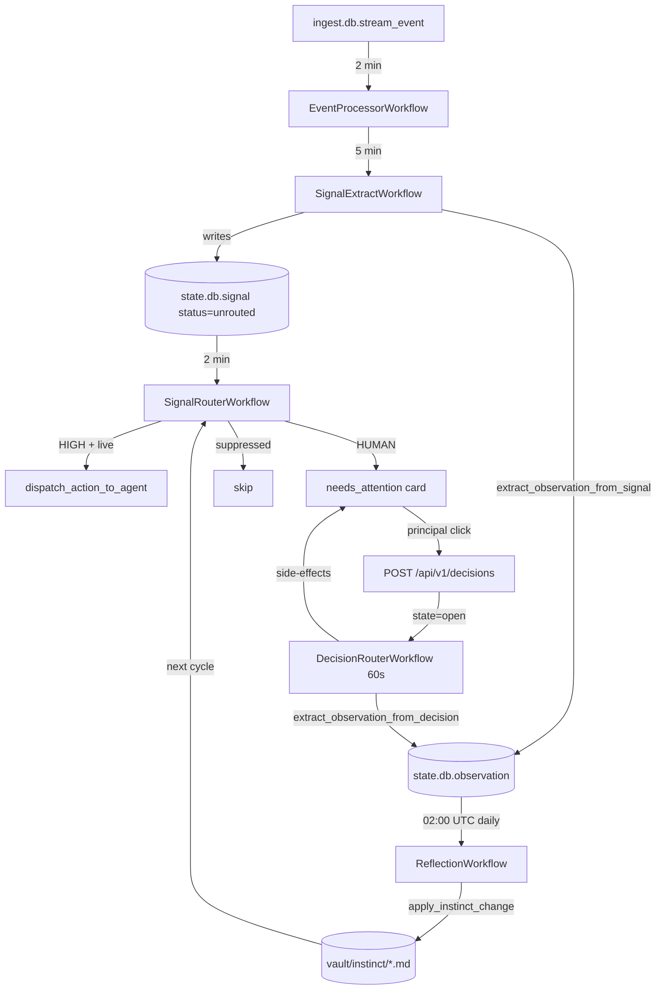

`packages/learn/` is the **intelligence layer** — a Python 3.12 Temporal
worker that turns inbound stream events into signals, signals into
decisions, decisions into observations, and observations into instinct
promotions. Every cron-scheduled side of Alfred runs through Temporal here.

## Layout

```
packages/learn/
├── pyproject.toml temporalio, httpx, pyyaml — minimal deps
├── CONTRACT.md provides / requires
├── SPEC.md full intelligence-layer specification
├── CLAUDE.md terminology & replay-safety rules
├── docs/
│ └── STATE-MUTATION.md the state_mutator contract (§0–17)
└── src/
 ├── worker.py boots the Temporal worker, registers all activities
 ├── config.py env vars (TEMPORAL_HOST, ALFRED_CTRL_URL, …)
 ├── workflows/ 30+ workflow definitions
 ├── activities/ 80+ activities (clerk, vault, state_mutator, …)
 ├── matching/ instinct scorer + discretion gate
 ├── parsers/, validators/ proposal validation
 ├── profiler/ Opus onboarding pipeline
 ├── integrations/ composio glue (Plane two-way sync lives under activities/)
 └── cli/ diagnostic CLI
```

## Boot sequence

`worker.py:run_worker()` connects to Temporal at `TEMPORAL_HOST` (default
`temporal:7233`), registers ~30 static workflows plus the dynamically loaded
user-chore template classes, and registers ~80 activities covering clerking,
streaming, vault I/O and orchestration *(packages/learn/src/worker.py:717-1175)*.
The default retry policy on each activity is three attempts with exponential
backoff *(packages/learn/src/workflows/briefing.py:84-89)*.

## The thirty workflows

The package ships about thirty workflow definitions
*(packages/learn/src/workflows/)*. The full enumeration with schedules and
gate flags lives on the [workflows & schedules reference](/reference/workflows).
The headline ones:

| Workflow | Cadence | What it does |
|---|---|---|
| `EventProcessorWorkflow` | every 2 min | Drains `ingest.db.stream_event` into the signal pipeline |
| `SignalExtractWorkflow` | every 5 min | Clerk-driven extraction of signals from raw events |
| `SignalRouterWorkflow` | every 2 min | Matches signals to instincts, dispatches HIGH-confidence actions, queues HUMAN cards |
| `DecisionRouterWorkflow` | every 60 s | Processes principal clicks on `/desk`; closes the loop with `extract_observation_from_decision` |
| `ReflectionWorkflow` | daily 02:00 UTC | Opus reads observations + learnings; proposes instinct changes |
| `NightlyNarrativeWorkflow` | daily 02:00 | Updates every active matter's `current_state` paragraph |
| `BriefingWorkflow` | 05:00 / 17:00 tenant-local | Composes the letterpress brief, writes `briefing/<date>-<slot>.md` |
| `TaskClosureWatcherWorkflow` | every 5 min | Matches new signals against open tasks' `closure_predicate` |
| `ChorePromotionReflectionWorkflow` | Sunday 03:00 | Opens GitHub PRs for chores with ≥20 runs and ≥95% success |
| `OnboardingPipelineWorkflow` | ad-hoc | The seven-stage personalization pipeline |

Some workflows are **registration-gated** — a flag controls whether the
schedule is registered at all, not how the workflow behaves at runtime.
`STEWARD_SIGNAL_EXTRACT_ENABLED` and `STEWARD_SIGNAL_ROUTER_ENABLED` are
both registration-time *(packages/learn/src/workflows/signals.py:6,
packages/learn/src/workflows/signal_router.py:6)*. Others gate at activity
invocation, so they can be toggled live.

## The signal pipeline



The loop closes at `extract_observation_from_decision`. This activity has
**no synchronous-flip guard** — every Desk click produces an observation,
regardless of whether the side-effect handlers ran. That is the only path
that feeds the reflection loop, so gating it would starve instinct learning
*(packages/learn/src/activities/decision_router.py:378-391)*.

## The state mutator

Every actor that changes matter or task state must call
`apply_state_change_v2`. The contract is a `ProposedMutation(fields, reason,
confidence, fan_out)` returned by an in-process **propose function** keyed
by name *(packages/learn/src/activities/state_mutator.py:40-97)*. The
mutator then performs three atomic writes:

1. Frontmatter patch on the target record (via ctrl-api vault PATCH).
2. A `state_change` audit row (via `POST /api/v1/state-changes`).
3. An optional Plane timeline entry, if the matter has a Plane backing.

This is the only path that touches `current_state` / `as_of` / `status` on
matters and tasks. Manual edits through the dashboard route through the
same endpoint with `?via=manual` to bypass the warning. The full §0–17
specification lives in `packages/learn/docs/STATE-MUTATION.md`.

## The instinct matcher

The scorer combines five weighted dimensions —
`0.30 domain + 0.30 keywords + 0.15 input_type + 0.15 attachment + 0.10 tags`
*(packages/learn/src/matching/scorer.py)*. The match threshold is `0.05`,
deliberately low: a single domain hit alone scores 0.30, so the threshold
exists only to filter zero-overlap noise. The real safety belt is the
**discretion gate** at `signal_actions.py` — a per-instinct threshold
(default 0.95) gates HIGH-confidence autonomous dispatch.

## Terminology — strict

The package CLAUDE.md enforces seven terms with no synonyms allowed
anywhere in the package *(packages/learn/CLAUDE.md)*:

| Term | Meaning | What it is *not* |
|---|---|---|
| **observation** | A datum the system has noticed | not "cognition" |
| **instinct** | A learned routing pattern | not "skill" |
| **intuition** | The full graph of instincts | not "skill graph" |
| **reflection** | The nightly Opus call that proposes instinct changes | not "synthesis" |
| **judgment** | A specific routing call made by the system | not "router" |
| **discretion** | The per-instinct confidence threshold | not "confidence gate" |
| **clerk** | The LLM-call wrapper (`clerk.py`) | not "subken", not "Anthropic" |

These constraints exist because Temporal's replay determinism is unforgiving:
renaming an activity without a backwards-compat shim breaks every in-flight
workflow on re-deploy *(packages/learn/CLAUDE.md)*. Cross-package callers
(the dashboard, the MCP bundle) use the same vocabulary so the meanings
don't drift across the wire.

## Build, run, test

<Tabs>
 <Tab title="Build">
 ```sh
 cd packages/learn
 pip install -e .[temporal,surveyor]
 ```

 There is no compile step — `worker.py` runs the Temporal Python SDK
 directly. CI builds `ssdavidai00/alfred-learn:latest` (a ~25 minute
 pole, the longest in the matrix) by copying the source into a Python
 3.12 base image.
 </Tab>
 <Tab title="Run">
 ```sh
 TEMPORAL_HOST=temporal:7233 \
 TASK_QUEUE=alfred-learn \
 ALFRED_CTRL_URL=http://ctrl-api:3100 \
 OPENCLAW_GATEWAY_URL=http://hermes:18789 \
 OPENCLAW_WORKERS_GATEWAY_URL=http://hermes:18790 \
 HERMES_HEAVY_GATEWAY_URL=http://hermes:18791 \
 OPENCLAW_GATEWAY_TOKEN_FILE=/alfred-data/.gateway-token \
 VAULT_PATH=/vault \
 python -m alfred_learn.worker
 ```

 Schedules are registered separately via `scripts/register_schedules.py`
 — registration is gated by env flags so a tenant with
 `STEWARD_SIGNAL_EXTRACT_ENABLED` unset never gets the schedule at all.
 </Tab>
 <Tab title="Test">
 ```sh
 pytest packages/learn/tests
 ```

 The suite covers activity contracts, propose-function registration,
 discretion-gate behaviour, the four-tier matter resolver, and the
 state-mutator three-artefact write. CI runs `pytest` plus
 `docker compose config` as a regression gate *(packages/learn/CLAUDE.md)*.
 </Tab>
</Tabs>

## Where to look next

- Full workflow + schedule reference: [Workflows & schedules](/reference/workflows)
- The state contract: `packages/learn/docs/STATE-MUTATION.md`
- Frozen contracts learn participates in: `docs/FIX-CONTRACTS.md`
- Terminology & replay-safety rules: `packages/learn/CLAUDE.md`
