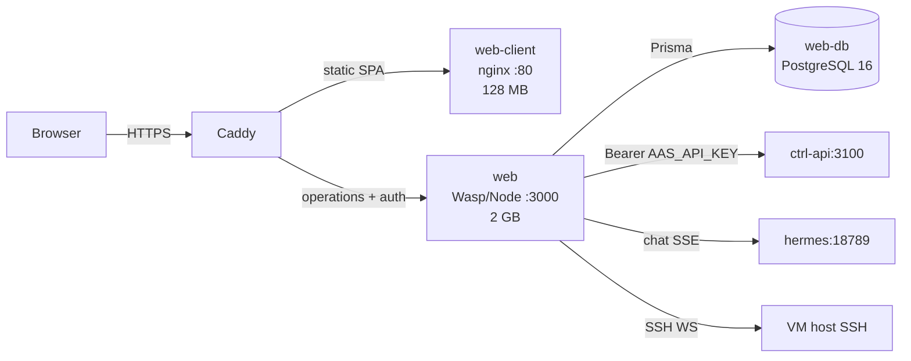

`packages/web/` is the **dashboard** — a [Wasp](https://wasp.sh) framework
app that renders the fourteen principal pages, handles authentication,
proxies the Hermes chat and SSH terminal, and forwards every other request
to ctrl-api with a Bearer token.

## Layout

```
packages/web/
├── main.wasp the single config root — routes, queries, actions, jobs, entities
├── package.json
├── schema.prisma User, ApiKey, OAuthCredential, ComposioConnection, Stream, StreamEvent
├── tsconfig.json
├── vite.config.ts
├── tailwind.config.js
├── Dockerfile.client the static-SPA nginx image
├── nginx-spa.conf client-side routing + cache headers
├── web-client-entrypoint.sh runtime substitution of WASP_SERVER_URL
├── migrations/ Prisma migration history
├── public/ static assets
└── src/
 ├── auth/ signup/login hooks (Mailgun, Google OAuth via Arctic)
 ├── client/ React components, theme, the 14 page components
 ├── server/ serverSetup, tenantProxy, chat proxy, terminal proxy
 └── ...
```

## `main.wasp` is the config root

Everything declarative — routes, queries, actions, jobs, entities, auth
config, custom HTTP routes — lives in `main.wasp` *(packages/web/main.wasp:1-1531)*.
Wasp's compiler reads this file at build time and emits a Node.js Express
server plus a Vite-built React SPA. Source files under `src/` are referenced
from the manifest by their import paths.

Key sections of the manifest:

| Section | What it declares |
|---|---|
| `app` block | Email + password auth with verification (Mailgun), Google OAuth via Arctic 1.x, PostgreSQL backing |
| `route` / `page` | The fourteen principal URLs (`/desk`, `/brief`, `/vault`, …) plus the legacy redirects |
| `query` / `action` | The dashboard's operations — each one maps to a TS function under `src/server/operations/` |
| `entity` | Prisma models: User, ApiKey, OAuthCredential, ComposioConnection, Stream, StreamEvent |
| `job` | Background jobs (e.g. `reconcileComposioAutoConfig` every minute) |
| `apiNamespace` | Custom HTTP routes (the v1 API proxy, the chat proxy, the terminal WebSocket) |

The `serverSetup` hook wires up the four custom HTTP integrations on top of
Wasp's generated Express server *(packages/web/src/server/setup.ts:9-35)*.

## The fourteen pages

| URL | Component | Purpose |
|---|---|---|
| `/desk` | `DeskPage.tsx` | Today's decision queue, backstage tray, record ledger |
| `/brief` | `BriefPage.tsx` | The most-recent letterpress brief |
| `/vault` | `VaultPage.tsx` | Three-pane Obsidian view of the vault |
| `/matters`, `/matters/:id` | `MattersPage.tsx`, `MatterDetailPage.tsx` | The matters aggregator, with living-narrative detail |
| `/instincts` | `InstinctsPage.tsx` | Asking / Confirming / Acting tier view |
| `/decisions` | `DecisionsPage.tsx` | Audit feed with 30-day chart, HANDLED/HELD/ASKED filters |
| `/chores`, `/chores/:slug` | `ChoresPage.tsx`, `ChoreDetailPage2.tsx` | Recurring workflows + Python source + run history |
| `/connections` | `ConnectionsPage.tsx` | Composio catalogue + custom inbound webhooks |
| `/channels` | `ChannelsPage.tsx` | Email, phone, SMS, voice, Telegram, Slack, OMI, Vexa, Terminal |
| `/tools` | `ToolsPage2.tsx` | Hermes allowlist viewer |
| `/claude` | `ClaudeRedirect.tsx` | Thin redirect to `/settings#agent` |
| `/settings` | `StudyPage.tsx` | Agent config, workspace files, API keys, audit feed, theme |
| `/household` | `HouseholdPage.tsx` | RULES.md editor + chores |

<Note>
 The legacy URL `/study` redirects to `/settings`; `/dashboard`, `/back-office`,
 and `/triage` similarly redirect. The CLAUDE.md still uses `/study` in some
 sections — the live URL is `/settings`.
</Note>

The onboarding ritual is **sequential**, not a single page:
`/awaken → /reading-the-room → /verify → /soul → /composing → /preparing →
/first-brief → /household → /desk`. Each step is its own component under
`src/client/onboarding/`.

## The proxy to ctrl-api

Almost everything the dashboard does is a proxy to `ctrl-api:3100`. The
proxy lives in `src/server/tenantProxy.ts` *(packages/web/src/server/tenantProxy.ts:1-80)*:

| Property | Value |
|---|---|
| Target | `CTRL_API_URL` env (default `http://ctrl-api:3100`, same compose network) |
| Auth | `Authorization: Bearer ${AAS_API_KEY}` injected on every call |
| Timeout | **60 seconds** — vault scans can synchronously walk thousands of files |
| Error sanitization | Non-2xx mapped to generic messages (`404 → "Resource not found"`, `5xx → "Internal ctrl-api error"`) so server stack traces never leak to the browser |

Eighteen dashboard queries proxy `/api/v1/*` endpoints directly:
`getDashboardData`, `getInstalledApps`, `getInboxItems`, `getVaultRecords`,
`getMattersIndex`, `getMatterDetail`, `getChoreDetail2`, `getVaultGraph`,
`getActivityFeed`, `getAuditFeed`, plus the integration & credentials
surfaces *(packages/web/main.wasp:486-631)*. Each one is a tiny TS file
that calls `tenantProxy.get(url)` and returns the JSON.

State-field edits on matters and tasks route through a separate operation
(`applyManualStateChange`) that calls `POST /api/v1/state-changes` instead
of the vault PATCH. This keeps the principal's manual edits inside the
audit ledger — the same place autonomous mutations land
*(packages/web/main.wasp:1114-1117)*.

## The two-container split

The dashboard ships as **two images**, not one. UI changes need *both*
redeployed plus a hard browser refresh.



**`web`** — Node.js Wasp server, port 3000, 2 GB limit. Image
`ssdavidai00/alfred-web:latest`. Runs `prisma migrate deploy` at startup;
exposes Wasp-generated auth + every declared `query` / `action`
*(docker-compose.yaml:80-114)*. Env vars: `DATABASE_URL`, `JWT_SECRET`,
`CTRL_API_URL`, `AAS_API_KEY`, `COLUMN_ENCRYPTION_KEY`.

**`web-client`** — nginx 1.27-alpine, port 80, 128 MB limit. Image
`ssdavidai00/alfred-web-client:latest`. Source: the static `web-app-build/`
directory CI stages from `wasp build` output. Vite inlines a placeholder
URL (`https://alfred-api-url.placeholder.invalid`); the entrypoint script
substitutes the real `WASP_SERVER_URL` into the served JS at container
start *(packages/web/Dockerfile.client:11-14)*.

CI runs the native Wasp CLI (`wasp build`) on the runner, which emits both
artefacts in one pass. The server image layers the Node output; the client
image layers only the static bundle.

## Build, run, test

<Tabs>
 <Tab title="Build">
 ```sh
 cd packages/web
 npm install
 wasp build # → .wasp/build/ (server) + web-app/build/ (SPA)
 ```

 The Wasp CLI generates a Node Express server into `.wasp/` from
 `main.wasp` + `src/server/`, and runs Vite over `src/client/` to emit
 the SPA bundle. Neither artefact is checked into git.
 </Tab>
 <Tab title="Run">
 ```sh
 docker compose up -d web web-client web-db
 ```

 For local dev: `wasp start` runs the server on port 3000 and Vite's
 dev server on 3001. Point the dev server at a local ctrl-api with
 `CTRL_API_URL=http://localhost:3100`.
 </Tab>
 <Tab title="Test">
 Wasp does not ship a test runner of its own; tests live under
 `src/server/__tests__/` and run via Jest. The lane gate runs
 `tsc --noEmit` as VERIFY *(scripts/hooks/check_lane.py)*.
 </Tab>
</Tabs>

## Where to look next

- The principal-facing surface reference: [Principal surfaces](/surfaces)
- Frozen contracts web participates in: `docs/FIX-CONTRACTS.md`
- The `main.wasp` schema: [Wasp docs](https://wasp.sh/docs)
