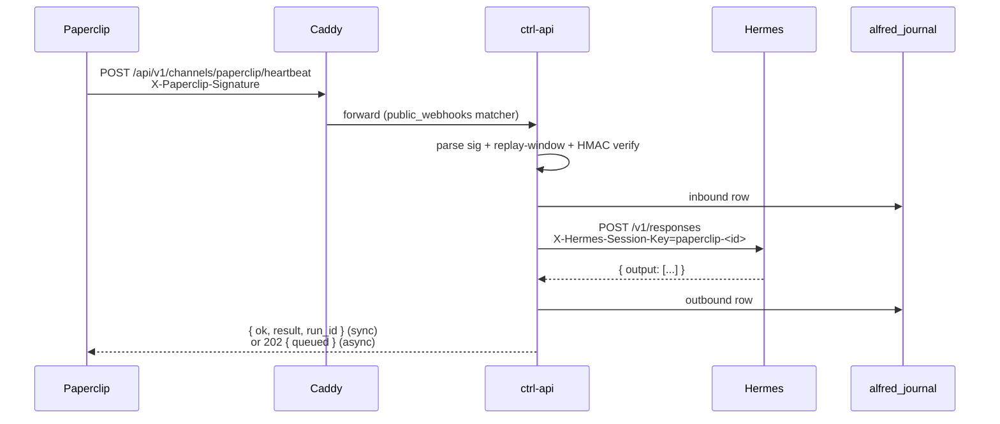
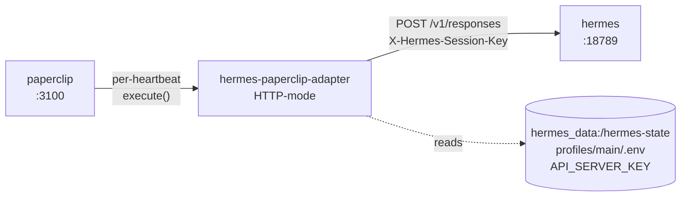

[Paperclip](https://paperclip.ing) is the AI-agent orchestration plane Alfred ships as its "company" sidecar — if Hermes is an employee, Paperclip is the company chart, ticket queue, board, and approval gate around it. The UI lives at `paperclip.{$DOMAIN}`; the data lives in `paperclip_data`; the MCP surface is the upstream `@paperclipai/mcp-server` package baked into the Hermes image *(packages/hermes/Dockerfile:212–235)*; the inbound channel is an HMAC-signed heartbeat at `/api/v1/channels/paperclip/heartbeat` *(packages/ctrl/src/api/routes/channels_paperclip.ts)*.

Two relationships matter:

- **Principal-driven** — the principal browses Paperclip the same way they browse Plane, and Alfred operates it through MCP tools on their behalf.
- **Paperclip-driven** — Alfred itself is registered as a "managed employee" inside a Paperclip company. When Paperclip assigns Alfred-the-employee a task, the assignment lands as an inbound heartbeat on ctrl-api, which spawns a Hermes turn that comments and updates the issue back through the MCP surface.

## The two containers

Unlike Sure and Plane, Paperclip ships its own embedded Postgres inside the same container — there is **no** separate `paperclip-db` sidecar. The full footprint is two services *(docker-compose.yaml:1336–1451)*:

| Service | Image | Purpose |
|---|---|---|
| `paperclip` | `ssdavidai00/alfred-black-paperclip:latest` | Paperclip web + REST API + embedded Postgres on `:3100` |
| `paperclip-init` | `ssdavidai00/alfred-init:latest` | One-shot full-seed (CEO invite + company + agent + runtime token) |

The container name is `alfred-black-paperclip-1`. The embedded Postgres binds inside the container at `127.0.0.1:54329` (user/password/database all `paperclip`); state is persisted to the `paperclip_data` volume mounted at `/paperclip` *(docker-compose.yaml:1365)*. Memory budget is 1 GB.

The image is an in-house overlay on `ghcr.io/paperclipai/paperclip` *(packages/paperclip/dockerfiles/paperclip.Dockerfile)*: the upstream base is pinned by digest and asserted to ship `hermes-paperclip-adapter@0.2.0` at build time, then the patched HTTP-mode adapter (see below) is copied over the upstream `dist/`. Drift in the upstream package layout fails the build with a tripwire rather than silently swapping the adapter out from under us *(paperclip.Dockerfile:42–53)*.

`paperclip-init` runs once at first boot after the `paperclip` container reports healthy *(docker-compose.yaml:1403–1451)*. It mounts `/var/run/docker.sock` read-only so it can `docker exec` into the paperclip container as uid 1000 (`node`), and mounts `hermes_data:/hermes-state` read-write so it can persist the board API key into each Hermes profile's `.env`. Idempotent — re-runs short-circuit once `PAPERCLIP_AGENT_TOKEN` is set in `/opt/alfred/.env`.

## The Caddy route

```caddyfile
paperclip.{$DOMAIN} {
    encode zstd gzip
    reverse_proxy paperclip:3100
}
```

*(caddy/Caddyfile:115–118)*. The apex `@public_webhooks` matcher *(caddy/Caddyfile:57)* additionally exposes `/api/v1/channels/paperclip/*` on the main hostname so Paperclip's HTTP adapter can POST heartbeats back to ctrl-api without an extra subdomain.

## The `paperclip` MCP app — 48 tools, board key auth

Hermes loads Paperclip as its **7th** MCP server *(packages/hermes/hermes-config.yaml.njk:457–493)*. This is a deliberate divergence from the five-app stdio bundle Alfred maintains in `packages/mcp-server` (which exposes `alfred`, `sure`, `plane`, `vaultwarden`, `execute`): for Paperclip we use the upstream `@paperclipai/mcp-server` npm package directly — pinned by `PAPERCLIP_MCP_REF` in the Hermes Dockerfile, currently `2026.525.0` — because reimplementing 48 tools per Paperclip release would be duplicative *(packages/hermes/Dockerfile:211–235)*.

| Family | Approx tools | What they do |
|---|---|---|
| Companies | 4 | list, get, create, update |
| Employees (agents) | 5 | list, get, create, update, disable — both humans and AI agents |
| Issues / tasks | ~7 | list, get, create, update, checkout, suggestTasks, controlIssueWorkspaceServices |
| Comments | 4 | list, add, update, delete — the agent's primary report-back channel |
| Documents | 2 | upsertIssueDocument, get |
| Approvals | 3 | createApproval, listApprovals, decide — governance gates |
| Routines | 3 | list, get, trigger — scheduled / webhook-triggered jobs |
| Activity events | 2 | list, get — immutable audit log |
| Files & secrets | ~10 | per-company artifact + secret CRUD |
| `paperclipApiRequest` | 1 | generic REST passthrough escape hatch |

Tools route through `http://paperclip:3100/api`; the MCP server reads `PAPERCLIP_API_KEY`, `PAPERCLIP_COMPANY_ID`, and `PAPERCLIP_AGENT_ID` from its process env at stdio startup *(packages/hermes/hermes-config.yaml.njk:474–491)*. The full enumeration is available at runtime via `tools/list`; the operator's framing lives at `packages/hermes/workspace-template/skills/alfred-paperclip-operations/SKILL.md`.

<Warning>
The `PAPERCLIP_API_KEY` Hermes uses is a **board API key** (`pcp_board_…`), not the per-agent runtime token. 39 of the 48 tools call company-scoped routes that 403 with `"Board access required"` on an agent-scoped token. The headless seed mints a board key via Paperclip's cli-auth challenge flow and writes it into each Hermes profile's `.env` so the MCP server starts with the right shape. Tenants that were seeded before the seed shipped get the same key minted by `packages/hermes/init/migrate-paperclip-board-key.sh`.
</Warning>

## The inbound heartbeat channel

Paperclip's HTTP adapter pings ctrl-api every time an employee needs to take a turn. The wire shape *(packages/ctrl/src/api/routes/channels_paperclip.ts:1–52)*:

```http
POST /api/v1/channels/paperclip/heartbeat
X-Paperclip-Signature: t=<unix-seconds>,v1=<hex-hmac-sha256>
Content-Type: application/json

{ "message": "...", "agentId": "...", "deliver": true,
  "paperclip": { "runId": "...", "paperclipAgentId": "...", "taskId": "..." } }
```

The signed bytes are `<unix-ts>.<raw-body>` — same construction Stripe and Slack v1 use. ctrl-api requires:

- `PAPERCLIP_HEARTBEAT_SECRET` set in env (otherwise 503 — refusing to validate without a secret is the right loud-failure) *(channels_paperclip.ts:1053–1063)*,
- `|now − t| ≤ 300 seconds` (replay window, matches Paperclip's default `replayWindowSec`) *(channels_paperclip.ts:1086–1094)*,
- constant-time HMAC compare via `crypto.timingSafeEqual` *(channels_paperclip.ts:150–170)*.

A verified heartbeat translates into one `POST http://hermes:18789/v1/responses` with `X-Hermes-Session-Key=paperclip-<paperclipAgentId>` — one persistent Hermes session per Paperclip employee so continuity across heartbeats is intact *(channels_paperclip.ts:332–389, 467)*. `deliver: true` waits for the Hermes reply and returns it in `result`; `deliver: false` returns 202 immediately and continues the Hermes call in the background. Each direction appends one row to `alfred_journal` keyed by `paperclip` / `paperclip-<id>` so the cross-channel continuity layer (the *One Alfred* plugin, see the [2026-05-25 changelog entry](/appendices/changelog)) flows Paperclip context into Telegram and Slack replies as well.



The companion `/status` route drives the `/channels` Paperclip card; `/test` synthesises a signed heartbeat against `127.0.0.1:AAS_PORT` so an operator can prove the validator + translator + Hermes are all reachable in one click. The bypass header `X-Paperclip-Test: 1` lets the test path skip the journal write so it doesn't churn the audit log *(channels_paperclip.ts:1128–1216)*.

## The HTTP-mode adapter

Upstream Paperclip's `hermes_local` adapter spawns the `hermes` CLI as a child process per heartbeat — that binary is absent from the Hermes image and would be the wrong shape if it weren't. The alfred-black overlay replaces `execute()` with one `POST http://hermes:18789/v1/responses` call *(packages/paperclip/adapter/src/server/execute.ts, packages/paperclip/DESIGN.md)*. The adapter type stays `hermes_local` so Paperclip's adapter registry resolves it through the same slot *(packages/paperclip/adapter/src/shared/constants.ts:9)*.



Routing rule: agents whose `name` matches `CODEX_BUILDER_AGENT_NAMES` (currently the singleton `codex-feature-builder`) route to the sealed codex-builder profile on `:18793`; every other agent goes to main on `:18789` *(packages/paperclip/adapter/src/server/execute.ts:65–88, shared/constants.ts:22–38)*. Operator override via `agent.adapterConfig.hermesGatewayUrl` is honoured but always pinned to the `main` profile's auth (the override targets the network layer, not the auth split).

The adapter resolves its session key as `paperclip-<agentId>` — the same value the inbound heartbeat translator uses — so calls from either direction land on the same Hermes session and share its message history *(execute.ts:103–110)*.

## Auto-bootstrap

Tenants are expected to land on the `/desk` with Paperclip already populated: company "Alfred", CEO agent "hermes", board API key minted, runtime token persisted into `/opt/alfred/.env`, zero CLI, zero wizard. That's what `paperclip-init` delivers *(packages/hermes/init/bootstrap-paperclip.sh)*.

The 11-step flow:

1. Wait for the `paperclip` container to report healthy (belt-and-braces; compose already gates on `service_healthy`).
2. Bail out idempotently if `/opt/alfred/.env` already has `PAPERCLIP_AGENT_TOKEN` — that is the authoritative "fully seeded" marker.
3. `pnpm paperclipai onboard -y --bind lan` as uid 1000 (`node`) inside the paperclip container. Running as root creates a uid-0 ownership trap on the `paperclip_data` volume; the `--user node` flag sidesteps it entirely.
4. `pnpm paperclipai auth bootstrap-ceo --force` (also as `node`). `--force` revokes any stale invites and mints a fresh one. The "Invite URL: …" line is parsed out of stdout.
5. Write the invite URL to `/alfred-data/paperclip-ceo-invite.txt`. This is the **fallback artifact** the `/channels` card surfaces as a click-through if the headless redeem fails partway.
6. `POST /api/auth/sign-up/email` with the system identity (`alfred@${DOMAIN}` by default) and a freshly generated 24-char password. `Origin` header is required or Better-Auth refuses to issue `Set-Cookie`.
7. `POST /api/invites/<token>/accept {"requestType":"human"}` with the cookie jar + `Origin`. Origin required or 403.
8. `POST /api/companies/ {"name":"Alfred", …}` → company id.
9. `POST /api/companies/<id>/agents {name:"hermes", role:"ceo", adapterType:"hermes_local", …}` → agent id.
10. `POST /api/agents/<id>/keys {name:"hermes-runtime"}` → long-lived token (`pcp_…`).
11. Persist the seed credentials:
    - **11a.** `/alfred-data/paperclip-seed-credentials.json` (mode 0600) — email, password, token, ids. Backs the `/channels` "Reveal seed credentials" button.
    - **11b.** Append `PAPERCLIP_AGENT_TOKEN`, `PAPERCLIP_AGENT_ID`, `PAPERCLIP_COMPANY_ID` to `/opt/alfred/.env`.
12. Mint the board API key (`pcp_board_…`) via Paperclip's cli-auth challenge flow and write `PAPERCLIP_API_KEY` into each Hermes profile's `.env` under `/hermes-state/profiles/<profile>/.env`. This is the seam that survives `docker compose pull` — `PAPERCLIP_` is in `render_hermes.py`'s `_RUNTIME_KEY_PREFIXES` so future init re-renders preserve it *(packages/hermes/init/paperclip_board_key.py)*.

When the seed succeeds, ctrl-api reports `setup_state: "ready"` on the `/channels` card and the principal sees "Open Paperclip →" with the company / agent labels inline *(channels_paperclip.ts:727–753)*. When it fails partway, the card falls back to `needs_admin_signup` and surfaces the invite URL as a click-through link.

## Configuration

`.env` *(.env.example:220–251)*:

| Variable | Source | Purpose |
|---|---|---|
| `PAPERCLIP_API_KEY` | board key, minted by paperclip-init step 12 (or `migrate-paperclip-board-key.sh`) | Auth for the MCP server's company-scoped routes |
| `PAPERCLIP_BETTER_AUTH_SECRET` | `scripts/bootstrap.sh` (auto-generated) | Paperclip's better-auth session / token signing |
| `PAPERCLIP_HEARTBEAT_SECRET` | `scripts/bootstrap.sh` (auto-generated) | HMAC secret for inbound heartbeats |
| `PAPERCLIP_AGENT_TOKEN` | paperclip-init step 11b | Per-agent runtime token (authoritative "ready" marker) |
| `PAPERCLIP_AGENT_ID` | paperclip-init step 11b | Default agent UUID for MCP tool calls |
| `PAPERCLIP_COMPANY_ID` | paperclip-init step 11b | Default company UUID for MCP tool calls |
| `PAPERCLIP_SEED_EMAIL` | operator override (default `alfred@${DOMAIN}`) | System identity for the headless seed |
| `PAPERCLIP_SEED_NAME` | operator override (default `Alfred`) | Display name for the system identity |
| `PAPERCLIP_SEED_COMPANY` | operator override (default `Alfred`) | Company name for the headless seed |
| `OWNER_EMAIL` | `.env` | Required for the principal-vs-agent split inside Paperclip |

The paperclip container reads `BETTER_AUTH_SECRET`, `PAPERCLIP_PUBLIC_URL`, `ANTHROPIC_API_KEY`, `OPENAI_API_KEY`, `HERMES_GATEWAY_URL` (compose-network default `http://hermes:18789`), and `HERMES_CONFIG_DIR` (default `/hermes-state/profiles`) at boot *(docker-compose.yaml:1347–1363)*.

## Known gotchas

- **Invite file is the source of truth.** ctrl-api's `/status` probe cannot reliably introspect Paperclip's live "has an admin signed up yet?" state — Paperclip's `/sign-in` is a React SPA whose `Instance setup required` sentinel is rendered client-side and never lands in the SSR HTML. ctrl-api falls back to `/alfred-data/paperclip-ceo-invite.txt` as the proxy: it exists iff `paperclip-init` has run *(channels_paperclip.ts:830–851)*. If the file is stale and the principal has signed up, the card offers both affordances on `needs_admin_signup` (click-through link + paste-API-key panel) so either path lands at `configured`.

- **Board key has a 30-day TTL.** Paperclip's board-key minting is short-lived by design; rotation is a TODO. When MCP tools start returning 401, re-run `packages/hermes/init/paperclip_board_key.py` (the bootstrap script's step 12 in isolation) to mint a fresh key.

- **Hermes profile `.env` perms must be 0o644, not 0o600.** Paperclip's node server runs as uid 1000 (`gosu node` in the upstream entrypoint); the HTTP-mode adapter reads `API_SERVER_KEY` out of `/hermes-state/profiles/main/.env` at call time. The init renderer chmods the file 0o644 so uid 1000 can read it — without that, the adapter silently returns no `Authorization` header and every heartbeat 401s *(packages/hermes/init/render_hermes.py)*. The diagnostic red herring is that `docker exec cat …` reads as root and looks fine while `/proc/<hermes-pid>/environ` shows empty because Hermes loads the .env post-fork.

- **Bootstrap retries on OOM.** The headless redeem (steps 6–11) is OOM-prone on the smallest VM tier because Paperclip's better-auth bcrypt round and the company-creation transaction land back-to-back. The script wraps the redeem in a retry loop and treats an early `exit 1` from `bootstrap-ceo` as success when the invite URL was nevertheless captured.

- **Comments are public to the whole company.** When Alfred is acting as the employee, don't post secrets or private principal context as comments — they're visible to every employee in the Paperclip company and reflected in the immutable activity log forever. The `alfred-paperclip-operations` skill calls this out explicitly for the runtime.

## Disabling Paperclip

Paperclip stays on by default. To stop it without disturbing the rest of the stack:

```sh
docker compose stop paperclip paperclip-init
```

The `paperclip.{$DOMAIN}` subdomain will return a 502 from Caddy and the MCP `paperclip` connector tool calls will fail with a connection error until you restart. Inbound heartbeats land in `recent_runs` with `status: "hermes_unreachable"` so a stuck Paperclip is visible from the `/channels` card.
