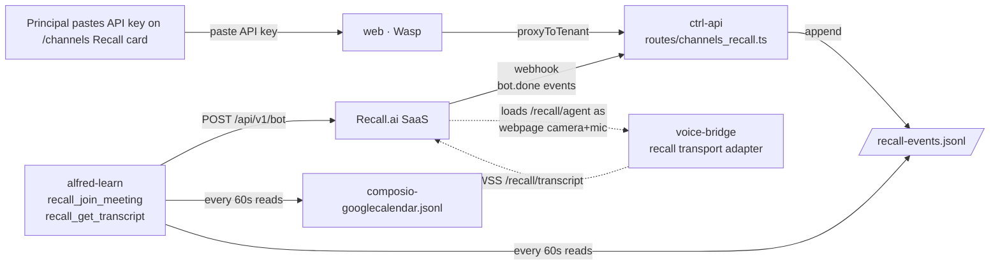

[Recall.ai](https://recall.ai) is the hosted SaaS that replaced the
nine-container self-hosted Vexa stack as Alfred Black's meeting bot. The
trade-off: a monthly recurring cost (~$0.50/hour of bot time + ~$0.15/hour
transcription) and a third-party data-residency surface, in exchange for
deleting ~3 GB of resident memory, four named volumes, and a
docker-socket-mounting `runtime-api` container from every tenant.

A second, deliberate trade: Recall lets us **push audio into the
meeting** via the Output Media webpage feature, so a fully wired Alfred
can speak as the bot — not just transcribe what others said. The
silent-transcript-only path landed first (PR5); on-mention live voice
ships in PR6 of the migration.

<Note>
The principal does **not** need to visit `recall.ai` for anything. Every
control — API key, region, bot name, auto-join policy, cost cap, wake
word, active-bots panel, webhook test — lives on the `/channels` Recall
card. See [Recall card UX](#the-channels-recall-card).
</Note>

## What Vexa was, why it's gone

Vexa was a nine-container `profiles: ["vexa"]` stack: `vexa-redis`,
`vexa-postgres`, `vexa-minio`, `vexa-minio-init`, `vexa-admin-api`,
`vexa-runtime-api`, `vexa-meeting-api`, `vexa-api-gateway`,
`vexa-dashboard`. The 0522 fleet audit found the profile had not been up
on a single live tenant since the single-VM cutover — `docker ps -a`
returned zero matches fleet-wide. Root causes:

1. **Broken auto-join toggle.** `POST /api/v1/admin/vexa/auto-join`
   synchronously read `/srv/alfred-black/.env`, a host path the ctrl-api
   container had no mount for → hard 500 → "Internal ctrl-api error" in
   the dashboard for ~9 months post-cutover. No tenant successfully
   toggled it.
2. **Two-mechanism disagreement.** `register_schedules.py` create-or-deletes
   the two Temporal schedules from `VEXA_ENABLED`; `routes/vexa.ts` tried
   to pause/unpause them. On disable the schedules were *gone*; an
   unpause-on-enable would `NOT_FOUND`.
3. **No transcript corpus.** Zero historical transcripts on any tenant —
   no migration target.

PR #126 retired the stack: nine services + four volumes + 244 LoC from
compose, two ctrl-api routes stubbed to `410 Gone`, two SaaS Wasp actions
removed, the ChannelsPage card flipped to a placeholder, four template
files deleted. The Vexa docs page redirects here.

## The Recall replacement, in one diagram

Five lanes touched the migration: **ctrl** (channel routes + DB +
webhook), **learn** (workflows + activities), **voice-bridge** (Recall
transport adapter), **web** (the card), **compose + caddy** (volume,
matcher).

## The `/channels` Recall card

The principal sees four subviews on the Recall card *(packages/web/src/dashboard/RecallCard.tsx)*:

| State | What you see | Backend |
|---|---|---|
| `disabled` | API-key paste form (two-step: validate, then persist) | No row in `recall_config` |
| `configured` | dial form (region / bot name / auto-join / cadence / cost cap / wake word / cost-alert thresholds) + month-to-date usage + recent-bots table + Test Webhook | API key in Vaultwarden; policy in `recall_config` |
| `error` | verbatim `last_error` + Retry | A probe failed |
| `connecting` | "Validating…" / "Saving + restarting…" toast chain | Validate hit Recall; persist + restart in flight |

### Key paste flow

The card pastes via a `type="password"` input. Two-step on submit:

1. `validateRecallApiKey` — ctrl-api proxies a `GET /v2/health` against
   Recall to confirm the key is live.
2. On success → `setRecallApiKey` — persists into Vaultwarden, writes
   the compose `.env`, restarts ctrl-api + alfred-learn so the
   activities pick up the new client.

The card UI then shows `key_first6 + [Rotate]` — only six characters of
the key ever live in the React tree post-submit.

### What the card configures

| Field | Meaning |
|---|---|
| **Region** | `us-west-2` / `eu-central-1` / etc. — controls Recall's bot region for data-residency |
| **Bot name** | the display name attendees see (`Alfred — David's note-taker`) |
| **Auto-join policy** | `off` / `owner-attended` / `cal-tagged-meetings` / `all` |
| **Per-meeting cap** | hours-per-meeting ceiling — bot ejects past it |
| **Monthly cost ceiling** | total hours/month — at 100 % the card auto-flips policy to `off` |
| **Wake word** | for on-mention live voice (PR6) |
| **Announce on join** | enforces ToS — Alfred announces himself when joining |
| **Eject on objection** | if any attendee says "please leave", bot exits |
| **Cost-alert thresholds** | notify principal at 50 % / 80 % / 100 % of monthly ceiling |

### Active bots panel

Once the card is `configured` and a bot is in a meeting, the card
shows a live panel: meeting title, attendees, elapsed time, accumulated
cost, and a **Terminate** button (calls Recall's `DELETE /bot/:id`
synchronously).

## How meetings get discovered

Composio's Google Calendar stream
(`/alfred-data/streams/composio-googlecalendar.jsonl`) is still how
Alfred finds meetings — `find_upcoming_meet_events` reads it, filters on
`is_sir_attendee` (`ALFRED_OWNER_EMAIL` match), and extracts
`meet_native_id`. Recall replaces only the bot half; the gcal stream
stays.

Every 60 s, `MeetingCaptureWorkflow` polls the stream for events in the
next 5 minutes that pass the policy gate, then calls Recall's
`POST /api/v1/bot/` with the meeting URL + the output-media webpage
config so Recall loads `voice-bridge` as the bot's "camera and mic".

## How transcripts come back

Recall webhooks are Svix-signed. The `/api/v1/webhooks/recall` route
verifies the Svix signature and appends each event verbatim to
`/alfred-data/streams/recall-events.jsonl`.

Every 60 s, `TranscriptIntakeWorkflow` reads `bot.done` events from that
stream, calls Recall's `GET /bot/:id/transcript`, runs
`extract_actions_from_transcript`, and fans extracted actions into
Steward signals — same downstream pipeline the old Vexa path used.

## Live in-meeting voice (PR6)

Recall's Output Media webpage feature lets us specify a webpage URL the
bot loads as its camera + microphone source. Alfred uses
`voice-bridge` for this:

- `GET /recall/agent?bot_id=…&token=…` — the page Recall renders inside
  the bot's headless browser. Runs Web Audio API ↔ OpenAI Realtime.
- `WSS /recall/transcript` — Recall posts the realtime transcript +
  speech-on/off events to this socket.

The wake-word detector listens on the transcript stream. On a match, the
realtime turn loop kicks in — same `gpt-realtime-2` + `server_vad` +
barge-in-clear discipline `voice-bridge` already uses for Twilio phone
calls. The instinct catalog is the curated 22-tool slice (`alfred`
read/write + `hermes` scheduling + `execute` list-connections) plus
`self` and `composio_execute` as catch-alls.

`voice-bridge` reuses 100 % of the OpenAI Realtime client, the
instructions, the MCP catalog, the tool dispatcher — only the I/O
adapter is per-transport.

## ctrl-api surface

| Verb | Path | Purpose |
|---|---|---|
| `POST` | `/api/v1/channels/recall/api-key` | validate + persist |
| `POST` | `/api/v1/channels/recall/api-key/validate` | dry-run validation |
| `GET` | `/api/v1/channels/recall/status` | card state |
| `POST` | `/api/v1/channels/recall/test` | dispatch a test bot |
| `PATCH` | `/api/v1/channels/recall/policy` | dial form save |
| `POST` | `/api/v1/channels/recall/confirm-webhook` | wire the webhook into Recall |
| `GET` | `/api/v1/channels/recall/bots/active` | live panel |
| `DELETE` | `/api/v1/channels/recall/bots/:id` | terminate mid-meeting |
| `DELETE` | `/api/v1/channels/recall/api-key` | disconnect |
| `POST` | `/api/v1/webhooks/recall` | Svix-signed inbound |

All under `packages/ctrl/src/api/routes/channels_recall.ts`,
`webhooks/recall.ts`. The Caddyfile's `@public_webhooks` matcher exposes
`/api/v1/webhooks/recall` on the apex hostname.

## state.db tables (migration 0007)

| Table | Purpose |
|---|---|
| `recall_config` | One row — region, policy, caps, wake word, thresholds |
| `recall_bot` | Active and historical bots — `bot_id`, meeting URL, attendees, cost-to-date, status |
| `recall_event` | Append-only mirror of `recall-events.jsonl` for analytical queries |

API key + webhook secret live in Vaultwarden, never in this table.

## Cost discipline

Two safety nets:

- **Per-meeting cap** — Recall's API supports it natively; the cap is
  passed at bot creation.
- **Monthly hours ceiling** — `alfred-learn` runs a cost watcher every
  10 minutes that sums `recall_bot.elapsed_seconds` for the calendar
  month. At 50 % / 80 % / 100 % it fires a notification through
  `alfred__notify_principal`. At 100 % it `PATCH`es the policy to `off`,
  the principal is notified, and no new bots dispatch until the next
  month boundary or a manual override.

## Privacy posture

- **Announce on join** — defaulted on. Alfred speaks an introduction
  when joining: *"Hello — I'm Alfred, David's note-taker. I'll be
  listening and taking notes; the recording stays in David's
  personal vault. If you'd prefer I leave, just say so."*
- **Eject on objection** — defaulted on. A transcript line matching
  the eject pattern triggers `DELETE /bot/:id`.
- **Silent-skip keywords** — configurable list (e.g.
  `therapist, lawyer, off the record`) that auto-stop transcript
  ingestion for the rest of the meeting.

## Related pages

- [Channels](/surfaces/channels) — the Recall card on `/channels`
- [Voice bridge sidecar](/architecture/sidecars#voice-bridge-twilio-openai-realtime)
  — the recall transport adapter
- [Composio](/integrations/composio) — the gcal source that finds the meetings
