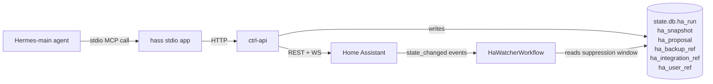

The `hass` MCP server is the 7th stdio app Hermes-main loads
*(packages/hermes/hermes-config.yaml.njk)*. It bridges Hermes to the
principal's Home Assistant install through ctrl-api's
`/api/v1/channels/ha/*` surface. Every call routes through ctrl-api
rather than direct to HA so the loop-guard, audit trail, and
auto-snapshot pre-flights live in one place.

For the user-facing setup story, see [Home Assistant](/integrations/home-assistant).

## The catalogue — 85 tools

The catalogue ships across seven `#115` PR waves on top of the
original `#110` reads + writes. Sir locked Tier 4 autonomy on
2026-05-29; the eight PR waves landed the same day.

| Group | Tools | Source |
|---|--:|---|
| `#110` PR2 — reads | 11 | PR [#128](https://github.com/ssdavidai/alfred/pull/128) |
| `#110` PR4 — writes (loop-guarded) | 5 | PR [#143](https://github.com/ssdavidai/alfred/pull/143) |
| `#115` PR3 — automations / scenes / scripts CRUD | 10 | PR [#161](https://github.com/ssdavidai/alfred/pull/161) |
| `#115` PR4 — integrations (config_flow) | 7 | PR [#165](https://github.com/ssdavidai/alfred/pull/165) |
| `#115` PR5 — HACS | 8 | PR [#166](https://github.com/ssdavidai/alfred/pull/166) |
| `#115` PR6 — Supervisor addons | 10 | PR [#162](https://github.com/ssdavidai/alfred/pull/162) |
| `#115` PR7 — core lifecycle + backups | 10 | PR [#164](https://github.com/ssdavidai/alfred/pull/164) |
| `#115` PR8 — users + LLATs | 8 | PR [#167](https://github.com/ssdavidai/alfred/pull/167) |
| `#115` PR2 — area / device / entity / label CRUD | 16 | PR [#168](https://github.com/ssdavidai/alfred/pull/168) |

The locked defaults Sir signed off on (see
[`docs/specs/issue-115-ha-tier4-autonomy.md`](https://github.com/ssdavidai/alfred/blob/main/docs/specs/issue-115-ha-tier4-autonomy.md)):

- **Approval gates.** Any verb whose effect a non-technical principal
  couldn't reverse in <2 minutes through HA's own UI is gated by
  `decision_ref`. Renaming the kitchen light is free; installing an
  addon isn't.
- **Auto-snapshots.** `addon_install` / `addon_uninstall` / `addon_update`
  / `core_restart` / `core_update` / `integration_configure` (per step) /
  `integration_remove` / `hacs_install` / `hacs_remove` take an HA snapshot
  first. The success envelope carries `backup_ref_id` so the agent can
  say "snapshot taken" in its reply.
- **Daybook entries.** Cheap reversible writes are silent; everything
  else lands in the principal's daybook (`vault/daybook/<date>.md`,
  `## HA writes`).

## Reads — 11 tools (`#110` PR2)

### ha__connection_status

Probe ctrl-api for the current connection state. Returns
`{state, ha_url, ha_version, last_test_at, last_test_ok, last_test_error,
last_discovery_at, entity_count, area_count, automation_count}`.
`state` is one of `unconfigured` / `connecting` / `connected` / `error`.

Cheap, idempotent, side-effect-free. Call before a multi-step HA flow so
you can fail fast with a clear message if state is `error` or
`unconfigured`.

### ha__list_entities

List entities from the cached `ha_registry` (refreshed on every connect +
every 6 h by `HaBootstrapWorkflow` Phase A). Filter by `domain`
(`light` / `switch` / `sensor` / `binary_sensor` / `climate` / `cover` /
`media_player`) or `area` (matches area id OR area name).

Call before any `ha__get_state` or `ha__call_service` where you need
to resolve an `entity_id`.

### ha__get_state

Live state pull for one entity via `GET /api/states/<entity_id>`. Returns
`{entity_id, state, attributes, last_changed, last_updated}`. Always
resolve the `entity_id` via `ha__list_entities` or `ha__resolve_entity`
first — never invent.

### ha__get_history

Historical state series via `GET /api/history/period`. `hours` defaults
to 24, max 168 (one week). For long-range trends, summarise the series in
your reply rather than dumping every datapoint.

### ha__get_logbook

HA's narrative ledger via `GET /api/logbook`. Without `entity_id`
returns ALL events in the window (chatty — prefer scoped). `hours`
defaults to 24, max 168.

### ha__list_areas

Cached rooms. Returns `{area_id, name, entity_ids[], device_ids[]}` per
area. The bootstrap workflow keeps this up to date.

### ha__list_devices

Physical devices from the cached registry. One device can own multiple
entities (a multi-sensor reports temp + humidity + motion as three
entities but is one device). Optionally filter by area.

### ha__list_automations

Lightweight automation index — `{automation_id, alias, description,
mode, state, last_triggered}`. Call before `ha__update_automation` or
`ha__delete_automation`.

### ha__list_scripts

Script index. Less common than automations.

### ha__get_calendars

HA's connected calendars (read-only views automations can trigger
from). Rarely needed — for Sir's actual scheduling, use the `alfred`
MCP's vault/chore tools.

### ha__resolve_entity

Fuzzy-match a friendly phrase to an `entity_id` from the cached
registry. E.g. "kitchen light" → `light.kitchen_main`. Returns
`{candidates: [{entity_id, friendly_name, area, score}], ...}` sorted
best-first. If multiple high-score candidates exist, ask Sir to clarify
rather than guessing.

## Writes — 5 tools, loop-guarded (`#110` PR4)

### The loop-guard contract

Every write takes a `decision_ref` (vault path or ulid) and ctrl-api
persists an `ha_run` row keyed `(entity_id, created_at, decision_ref)`
BEFORE issuing the upstream HA request. `HaWatcherWorkflow` (alfred-learn)
uses the partial index `idx_ha_run_entity_recent` from migration `0005` to
SUPPRESS `state_changed` events that fall inside a 30 s window of an
Alfred-originated write.

A second write to the **same** `entity_id` with the **same**
`decision_ref` within `HA_LOOP_GUARD_COOLDOWN_MS` (default 60 s) returns
`409 LOOP_GUARD`. A different `decision_ref` always passes — that means
the agent re-derived a decision from a NEW signal.

### ha__call_service

Call any HA service via `POST /api/services/:domain/:service` — lights,
thermostat, locks, media. REQUIRES `decision_ref`. Loop-guarded.

### ha__propose_automation

Enqueue a draft automation pack + one-line summary into `ha_proposal`
for principal approval. Does NOT apply anything — surfaces on the
Desk/Brief approval card. Returns `{proposal_id, status: 'pending'}`.

### ha__apply_proposal

Apply an approved `ha_proposal`. Installs the automation YAML against
HA's `automation/config/<id>` endpoint, captures a snapshot of the prior
YAML first (for rollback), persists an `ha_run` row. Returns
`{proposal_id, snapshot_id, run_id}`.

### ha__rollback_snapshot

Roll back to a previously-captured `ha_snapshot`'s YAML. Snapshot is
consumed (the row gets `restored_at` set) — rolling back twice returns
`409 CONFLICT`.

### ha__subscribe_events

Open a long-lived HA WS event subscription. Returns
`{subscription_id, filter, started_at}`. The `HaWatcherWorkflow` already
runs a household-wide watcher — this tool is for narrow, agent-driven
follow-up subscriptions ("watch this door for the next 5 minutes").

## Automations / scenes / scripts CRUD — 10 tools (`#115` PR3)

Not loop-guarded — the targets (config objects) don't echo through the
event stream as `state_changed`. Create / update run free; deletes are
gated.

### ha__list_automations_full

The full automation config — alias / trigger / condition / action /
mode — NOT the slim index `ha__list_automations` returns. Call before
`ha__update_automation` (HA's REST does a full-replace, not a patch —
you need the current config to merge into) or before authoring a new
automation that might overlap an existing one.

### ha__create_automation

`POST /api/v1/channels/ha/automations`. No approval gate (create is
reversible — Sir disables it in HA UI in 5 seconds). New automation is
OFF by default unless you set `initial_state: 'on'`.

```json
{
  "alias": "Lights off at sunrise",
  "trigger": { "platform": "sun", "event": "sunrise" },
  "action": {
    "service": "light.turn_off",
    "target": { "area_id": "living_room" }
  }
}
```

### ha__update_automation

`PUT /api/v1/channels/ha/automations/:id`. Full-replace — read current
config via `ha__list_automations_full`, merge your edits, ship the whole
config.

### ha__delete_automation

`DELETE /api/v1/channels/ha/automations/:id`. **GATED** by
`decision_ref` — deletion has no undo in HA's UI. ctrl-api writes a
daybook entry + an `ha_run` ledger row BEFORE the upstream delete.

### ha__create_scene, ha__update_scene, ha__delete_scene

Scenes are entity-state snapshots the principal re-enters with one tap
or voice command.

```json
{
  "name": "Bedtime",
  "entities": {
    "light.bedroom_main": { "state": "on", "brightness_pct": 15 },
    "light.living_room_lamp": { "state": "off" },
    "climate.bedroom": { "temperature": 19 }
  }
}
```

No gates — scenes are cheap.

### ha__create_script, ha__update_script, ha__delete_script

Scripts are reusable, parameterised action sequences (narrower than an
automation; broader than a scene).

```json
{
  "alias": "Goodnight",
  "sequence": [
    { "service": "scene.turn_on", "target": { "entity_id": "scene.bedtime" } },
    { "delay": "00:05:00" },
    { "service": "lock.lock", "target": { "entity_id": "lock.front_door" } }
  ]
}
```

## Integrations — 7 tools (`#115` PR4)

HA `config_entry` CRUD over the WS `config_entries/*` surface. The
multi-step `config_flow` shape is honoured 1:1: the agent calls
`ha__integration_discover(domain)` to get a `flow_id`, then advances the
flow with `ha__integration_configure(flow_id, data, decision_ref)` once
per step until `step.type === 'create_entry'`.

| Tool | `decision_ref` | Auto-snapshot |
|---|---|---|
| `ha__list_integrations` | no | no |
| `ha__list_available_integrations` | no | no |
| `ha__integration_info` | no | no |
| `ha__integration_discover` | no | no |
| `ha__integration_configure` | **required** | **yes (per step)** |
| `ha__integration_reload` | no | no |
| `ha__integration_remove` | **required** | **yes** |

### ha__list_integrations

Every installed `config_entry`. Each entry carries an `alfred` audit
block — `{installed_by: 'alfred'|'sir', decision_ref, installed_at,
removed_at}` — so the agent can tell what Alfred installed vs what the
principal added directly through HA's UI.

### ha__list_available_integrations

Every integration *domain* HA can install — the `handlers` array from
`config_entries/get_handlers`. Call before `ha__integration_discover` to
resolve a user-friendly name like "Hue" to the domain `hue`.

### ha__integration_info

Full info on one installed `config_entry` — title, state, source,
options — plus the `alfred` audit block.

### ha__integration_discover

Initialise an HA `config_flow` for a given domain. Returns
`{flow_id, domain, step}`. The `flow_id` is the handle for every
subsequent `ha__integration_configure` call. The `step` carries HA's
first descriptor (`form` / `external_step` / `progress`); read
`step.data_schema` to know what to ask Sir for next.

### ha__integration_configure

Advance the `config_flow` by one step. **GATED + auto-snapshots per
step.** Pass `data` matching the current step's `data_schema`. The
response's `step.type` tells you what happened: `form` → another form,
`progress` → wait and re-call with `{}`, `external_step` → surface
`step.url` to Sir, `create_entry` → DONE, `abort` → flow failed.

### ha__integration_reload

Re-init an installed `config_entry` without re-running the flow. No
gate (reload either succeeds or leaves the entry in `failed_setup`,
both fixable).

### ha__integration_remove

Uninstall an integration. **GATED + auto-snapshot.** On success the
matching `ha_integration_ref` row is soft-deleted (`removed_at`
stamped) so the audit trail survives.

## HACS — 8 tools (`#115` PR5)

Home Assistant Community Store CRUD over `hacs/*` WS commands.

| Tool | `decision_ref` | Auto-snapshot |
|---|---|---|
| `ha__hacs_info` | no | no |
| `ha__hacs_search` | no | no |
| `ha__hacs_repo_info` | no | no |
| `ha__hacs_add_custom_repo` | no | no |
| `ha__hacs_install` | **required** | **yes** |
| `ha__hacs_remove` | **required** | **yes** |
| `ha__hacs_refresh` | no | no |
| `ha__hacs_pending_updates` | no | no |

### ha__hacs_info

Probe HACS — `{categories, country, debug, dev, disabled_reason,
has_pending_tasks, lovelace_mode, stage}`. Call BEFORE any HACS write
to confirm `stage === 'running'` and `disabled_reason === null`.

### ha__hacs_search

Search the HACS catalogue. Use `category` to scope
(`integration` / `plugin` / `theme` / `appdaemon` / `netdaemon`), `query`
for substring match against name + description + topics, `installed:
true` for only installed repos. `limit` clamps to 500 (default 50).

### ha__hacs_repo_info

Detailed state for one HACS repository + list view in one round-trip.
Call BEFORE an install so you can show Sir the version + description
in your confirmation message.

### ha__hacs_add_custom_repo

Register a custom HACS repository URL. **No gate** — adding to HACS's
catalogue is reversible and doesn't install anything. The actual
install (`ha__hacs_install`) is the gated step.

### ha__hacs_install

Install (download) a HACS repository. **GATED + auto-snapshot.** On
success a `ha_integration_ref` row lands with `installed_by='alfred',
decision_ref=<id>`. Pass `version` to pin a tag.

### ha__hacs_remove

Uninstall a HACS repository. **GATED + auto-snapshot.** The original
`ha_integration_ref` row stays in place with the install metadata so
the audit trail isn't lost. For `integration`-category removes, the
principal may still need to delete the related `config_entry` from HA's
own UI; this only handles HACS's catalogue side.

### ha__hacs_refresh

Force HACS to refetch metadata for one repository. Cheap, reversible,
no gate. Use when Sir reports a release is out but HACS hasn't surfaced
it yet.

### ha__hacs_pending_updates

List HACS-installed repositories with a pending update. Wraps
`ha__hacs_search` with the `pending=1` filter on the ctrl-api side so
the model doesn't have to scroll the full ~3k catalogue.

## Supervisor addons — 10 tools (`#115` PR6)

**HAOS-ONLY.** On Container HA / Core HA / Supervised installations
every addon tool returns `501 supervisor_not_available` with an
`installation_type` field — read it and explain to Sir rather than
retrying.

| Tool | `decision_ref` | Auto-snapshot |
|---|---|---|
| `ha__list_addons` | no | no |
| `ha__addon_info` | no | no |
| `ha__addon_install` | **required** | **yes** |
| `ha__addon_uninstall` | **required** | **yes** |
| `ha__addon_configure` | **required** | no |
| `ha__addon_start` | no | no |
| `ha__addon_stop` | no | no |
| `ha__addon_restart` | no | no |
| `ha__addon_update` | **required** | **yes** |
| `ha__addon_logs` | no | no |

### ha__list_addons

Every Supervisor addon (installed + available in the store). Returns
`{addons: [{slug, name, version, version_latest, state, repository, ...}],
suggestions?: [...]}`.

### ha__addon_info

Full info for one addon — version, options schema, network ports,
hostname, state. Call BEFORE `ha__addon_configure` (so you know the
options schema) or `ha__addon_update` (to read the version delta).

### ha__addon_install

Install a Supervisor addon. **GATED + auto-snapshot.** Pulls + starts a
Docker container; can introduce new network surface, takes 30–300 s.

### ha__addon_uninstall

Uninstall an addon — stops + removes the container, drops its `/data`
volume. **GATED + auto-snapshot.**

### ha__addon_configure

Update an addon's `options.json`. **GATED + no snapshot** (options
swap is reversible by re-running configure with the prior values).
Read current options via `ha__addon_info` first; never blind-write.

### ha__addon_start, ha__addon_stop, ha__addon_restart

Lifecycle verbs. No gates (cheap, reversible). `restart` after
`ha__addon_configure` to apply new options.

### ha__addon_update

Update an addon to the latest version. **GATED + auto-snapshot.** Read
the version delta via `ha__addon_info` first — `version` vs
`version_latest`.

### ha__addon_logs

Last N lines of an addon's stdout/stderr. No gate. Default tail = 200
lines, max 2000.

## Core lifecycle + backups — 10 tools (`#115` PR7)

| Tool | `decision_ref` | Auto-snapshot |
|---|---|---|
| `ha__core_version` | no | no |
| `ha__core_check_config` | no | no |
| `ha__core_reload_yaml` | no | no |
| `ha__core_restart` | **required** | **yes** |
| `ha__core_update` | **required** | **yes** |
| `ha__list_backups` | no | no |
| `ha__backup_info` | no | no |
| `ha__create_backup` | no | n/a (this IS a backup) |
| `ha__delete_backup` | **required** | no |
| `ha__restore_backup` | **required** | no (restoring IS the recovery) |

### ha__core_version

Read HA's `/api/config` — `{ha_version, installation_type,
location_name, data}`. Call before `ha__core_update` (to read current
vs latest), or as a cheap connectivity probe.

### ha__core_check_config

Run HA's config check via `POST /api/services/homeassistant/check_config`.
**Always** call before `ha__core_restart` so a malformed yaml doesn't
take HA down.

### ha__core_reload_yaml

Reload every HA YAML-defined domain (automations / scripts / scenes /
helpers / templates / customise) without restarting HA. Not a restart —
entities stay alive.

### ha__core_restart

Restart HA's core process. **DESTRUCTIVE — HA is OFFLINE for 30–120 s.**
**GATED + auto-snapshot.** ctrl-api triggers a real HA backup via
`backup/generate` BEFORE the restart and records it in `ha_backup_ref`.

### ha__core_update

Update HA Core to a newer version via Supervisor's OTA path. **HAOS /
Supervised ONLY.** **DESTRUCTIVE — HA is OFFLINE for 3–10 min during the
update.** **GATED + auto-snapshot.** Rollback path is
`ha__restore_backup({backup_id: ha_backup_id, …})`.

### ha__list_backups

Every backup HA knows about — both Alfred-triggered (recorded in
`ha_backup_ref`) and HA's own strategy / auto / user-initiated ones.

### ha__backup_info

Full details for one backup — date, size, addons included, folders
included, password-protected y/n, compatible HA version. Call before
`ha__restore_backup`.

### ha__create_backup

Generate a fresh HA backup. **No gate** — explicit user-requested
backups are always fine, and ctrl-api records the result in
`ha_backup_ref` with `triggered_by='user'`. Pass `{}` for the default
backup; optional `password` encrypts the archive.

### ha__delete_backup

Delete an HA backup. **DESTRUCTIVE + IRREVERSIBLE** — backups are how
Alfred rolls back; once a backup is gone, that point-in-time is gone.
**GATED.**

### ha__restore_backup

Restore HA from a backup. **DESTRUCTIVE — STOPS HA FOR SEVERAL MINUTES.**
Anything changed since the backup is LOST. **GATED + no auto-snapshot**
(restoring IS the recovery; backing up the broken state we're about to
overwrite would be backwards). The MCP envelope returns when the restore
is QUEUED — follow up with `ha__core_version` after a minute to confirm
HA came back.

## Users + LLATs — 8 tools (`#115` PR8)

User CRUD + per-user long-lived access token mint, with the token value
landing in Vaultwarden — **never** in the MCP response.

| Tool | `decision_ref` | Auto-snapshot |
|---|---|---|
| `ha__list_users` | no | no |
| `ha__user_info` | no | no |
| `ha__create_user` | **required** | no |
| `ha__update_user` | **required** | no |
| `ha__delete_user` | **required** | no |
| `ha__list_user_llats` | no | no |
| `ha__mint_llat` | **required** | no |
| `ha__revoke_llat` | **required** | no |

### ha__list_users

All HA users. Returns `{ok, users: [{id, name, is_active,
system_generated, system, group_ids, ...}]}`. NEVER contains tokens.
`system_generated` / `system` users (owner, supervisor, etc.) are
protected — don't try to update or delete them.

### ha__user_info

One HA user by id. Returns `{ok, user, ledger}` where `ledger` is the
local `ha_user_ref` row for users Alfred provisioned (carries
`llat_vw_id` — the Vaultwarden item id holding any token Alfred minted
for this user).

### ha__create_user

Create a new HA user via `config/auth/create`. **GATED.** Body:
`{name, group_ids?, password?, decision_ref}`. After create, mint a
token via `ha__mint_llat` so the user can actually log in via the API.

### ha__update_user

Update an existing HA user via `config/auth/update`. **GATED.** Common
moves: demote (`group_ids: ['system-read-only']`), deactivate
(`is_active: false` — preferred over `ha__delete_user` for a reversible
action), or rename.

### ha__delete_user

Delete an HA user via `config/auth/delete`. **GATED + DESTRUCTIVE** but
no auto-snapshot (HA does not roll user-delete into its backup format).
Also drops the Vaultwarden item Alfred minted for this user (if any)
and removes the `ha_user_ref` row.

### ha__list_user_llats

List long-lived access tokens (metadata only) for an HA user via
`auth/refresh_tokens/list`. **Never contains the token value.**

### ha__mint_llat

Mint an LLAT for an HA user. **GATED.** **Stores the minted token in
Vaultwarden** under a Login item named `HA — <username>` in the `Home
Assistant` folder. The MCP response NEVER contains the raw token value —
only `{ok, user_id, decision_ref, llat_vw_id, ha_token_id, expiry_at,
redacted: true, note}`. Sir reads the value via the Vaultwarden UI or
the `vaultwarden__get_vault_item` tool. **NEVER include the minted LLAT
value in any user-facing response** — refer to it by `llat_vw_id`.

### ha__revoke_llat

Revoke an LLAT via `auth/refresh_tokens/delete`. **GATED.** Also drops
the per-user Vaultwarden item Alfred minted (if it points at this
user's most recent mint). After revoke, mint a fresh token via
`ha__mint_llat` if Sir wants continued access.

## Area / device / entity / label CRUD — 16 tools (`#115` PR2)

Registry CRUD over the WS `config/{area,device,entity,label}_registry/*`
surface. Per Sir's locked defaults, NONE of these are gated and NONE
auto-snapshot — every verb here is reversible in <2 minutes through HA's
own UI.

Always resolve ids first — `ha__list_areas` / `ha__list_devices` /
`ha__list_entities` — and never invent ids.

### Areas — ha__area_create, ha__area_update, ha__area_delete

Create / rename / move / delete a room. HA mints `area_id` as a slug
of the create-time name. On delete, HA detaches every entity / device
in the area to "no area" (the underlying things stay; only the binding
is gone).

```json
{ "name": "Master Bedroom", "icon": "mdi:bed", "floor_id": "upstairs" }
```

### Devices — ha__device_set_area, ha__device_set_name, ha__device_disable, ha__device_label

- `set_area` — move a device to an area or pass `area_id: null` to
  unassign.
- `set_name` — set `name_by_user` (overlays the integration's `name`;
  pass `null` to restore the original).
- `disable` — `disabled_by: 'user'` hides every entity the device owns;
  `null` re-enables.
- `label` — **FULL REPLACE** of the labels array. To APPEND, read
  current labels via `ha__list_devices` first.

### Entities — ha__entity_rename, ha__entity_set_area, ha__entity_hide, ha__entity_disable, ha__entity_label

- `rename` — set `name` (and optionally `icon`); `null` restores the
  original.
- `set_area` — override the area HA inferred from the parent device;
  `null` clears the override.
- `hide` — hidden entities still exist for automations + the
  conversation agent, just don't clutter dashboards.
- `disable` — disabled entities don't poll, don't fire `state_changed`,
  and aren't usable by automations.
- `label` — same FULL REPLACE semantic as `device_label`.

### Labels — ha__label_create, ha__label_update, ha__label_delete, ha__label_apply

Labels are HA's free-form tagging surface — `bedtime`, `critical`,
`security` — applicable to areas / devices / entities. `label_apply` is a
convenience wrapper that REPLACES the target's label set with
`[label_id]`; for APPEND, use `ha__area_update` / `ha__device_label` /
`ha__entity_label` with the merged array.

```json
{ "name": "Bedtime", "color": "indigo", "icon": "mdi:weather-night" }
```

## Where calls flow



## Related pages

- [Home Assistant integration](/integrations/home-assistant) — the user-facing setup story
- [The Hermes runtime](/architecture/hermes-runtime) — where the 7th MCP server fits
- [issue-115-ha-tier4-autonomy.md](https://github.com/ssdavidai/alfred/blob/main/docs/specs/issue-115-ha-tier4-autonomy.md) — the eight-PR Tier 4 spec
