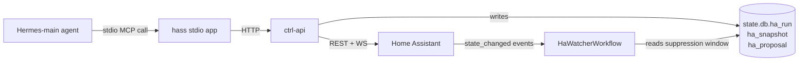

The `hass` MCP server is the 7th stdio app Hermes-main loads
*(packages/hermes/hermes-config.yaml.njk)*. It bridges Hermes to the
principal's Home Assistant install through ctrl-api's
`/api/v1/channels/ha/*` surface. Every call routes through ctrl-api
rather than direct to HA so the loop-guard and audit trail live in one
place.

For the user-facing setup story, see [Home Assistant](/integrations/home-assistant).

## The catalogue — 26 tools

The catalogue ships in three tiers:

| Tier | Tools | Source |
|---|---|---|
| 1. Read | 11 | PR #128 (PR2 of #110) |
| 2. Write | 5 | PR #143 (PR4 of #110) |
| 3. CRUD | 10 | PR #161 (PR3 of #115) |

Eight more tools (integrations, HACS, addons, core, backups, users) are
designed in [`docs/specs/issue-115-ha-tier4-autonomy.md`](https://github.com/ssdavidai/alfred/blob/main/docs/specs/issue-115-ha-tier4-autonomy.md)
and ship across PR4–PR8.

## Tier 1 — reads (11 tools)

### ha__connection_status

Probe ctrl-api for the current connection state. Returns
`{state, ha_url, ha_version, last_test_at, last_test_ok, last_test_error,
last_discovery_at, entity_count, area_count, automation_count}`.
`state` is one of `unconfigured` / `connecting` / `connected` / `error`.

Cheap, idempotent, side-effect-free. Call before a multi-step HA flow so
you can fail fast with a clear message if state is `error` or
`unconfigured`.

### ha__list_entities

List entities from the cached `ha_registry` (refreshed on every connect +
every 6 h by `HaBootstrapWorkflow` Phase A). Filter by `domain`
(`light` / `switch` / `sensor` / `binary_sensor` / `climate` / `cover` /
`media_player`) or `area` (matches area id OR area name).

Call before any `ha__get_state` or `ha__call_service` where you need
to resolve an `entity_id`.

### ha__get_state

Live state pull for one entity via `GET /api/states/<entity_id>`. Returns
`{entity_id, state, attributes, last_changed, last_updated}`. Always
resolve the `entity_id` via `ha__list_entities` or `ha__resolve_entity`
first — never invent.

### ha__get_history

Historical state series via `GET /api/history/period`. `hours` defaults
to 24, max 168 (one week). For long-range trends, summarise the series in
your reply rather than dumping every datapoint.

### ha__get_logbook

HA's narrative ledger via `GET /api/logbook`. Without `entity_id`
returns ALL events in the window (chatty — prefer scoped). `hours`
defaults to 24, max 168.

### ha__list_areas

Cached rooms. Returns `{area_id, name, entity_ids[], device_ids[]}` per
area. The bootstrap workflow keeps this up to date.

### ha__list_devices

Physical devices from the cached registry. One device can own multiple
entities (a multi-sensor reports temp + humidity + motion as three
entities but is one device). Optionally filter by area.

### ha__list_automations

Lightweight automation index — `{automation_id, alias, description,
mode, state, last_triggered}`. Call before `ha__update_automation` or
`ha__delete_automation`.

### ha__list_scripts

Script index. Less common than automations.

### ha__get_calendars

HA's connected calendars (read-only views automations can trigger
from). Rarely needed — for Sir's actual scheduling, use the `alfred`
MCP's vault/chore tools.

### ha__resolve_entity

Fuzzy-match a friendly phrase to an `entity_id` from the cached
registry. E.g. "kitchen light" → `light.kitchen_main`. Returns
`{candidates: [{entity_id, friendly_name, area, score}], ...}` sorted
best-first. If multiple high-score candidates exist, ask Sir to clarify
rather than guessing.

## Tier 2 — writes (5 tools, loop-guarded)

### The loop-guard contract

Every Tier 2 write takes a `decision_ref` (vault path or ulid) and ctrl-api
persists an `ha_run` row keyed `(entity_id, created_at, decision_ref)`
BEFORE issuing the upstream HA request. `HaWatcherWorkflow` (alfred-learn)
uses the partial index `idx_ha_run_entity_recent` from migration `0005` to
SUPPRESS `state_changed` events that fall inside a 30 s window of an
Alfred-originated write.

A second write to the **same** `entity_id` with the **same**
`decision_ref` within `HA_LOOP_GUARD_COOLDOWN_MS` (default 60 s) returns
`409 LOOP_GUARD`. A different `decision_ref` always passes — that means
the agent re-derived a decision from a NEW signal.

### ha__call_service

Call any HA service via `POST /api/services/:domain/:service` — lights,
thermostat, locks, media. REQUIRES `decision_ref`. Loop-guarded.

### ha__propose_automation

Enqueue a draft automation pack + one-line summary into `ha_proposal`
for principal approval. Does NOT apply anything — surfaces on the
Desk/Brief approval card. Returns `{proposal_id, status: 'pending'}`.

### ha__apply_proposal

Apply an approved `ha_proposal`. Installs the automation YAML against
HA's `automation/config/<id>` endpoint, captures a snapshot of the prior
YAML first (for rollback), persists an `ha_run` row. Returns
`{proposal_id, snapshot_id, run_id}`.

### ha__rollback_snapshot

Roll back to a previously-captured `ha_snapshot`'s YAML. Snapshot is
consumed (the row gets `restored_at` set) — rolling back twice returns
`409 CONFLICT`.

### ha__subscribe_events

Open a long-lived HA WS event subscription. Returns
`{subscription_id, filter, started_at}`. The `HaWatcherWorkflow` already
runs a household-wide watcher — this tool is for narrow, agent-driven
follow-up subscriptions ("watch this door for the next 5 minutes").

## Tier 3 — CRUD (10 tools)

The CRUD tier is **NOT loop-guarded** because the targets (automations,
scenes, scripts) aren't entity states the watcher cares about; mutating
their config doesn't echo through the event stream as `state_changed`.
Create/update run free; deletes are gated by `decision_ref`.

### ha__list_automations_full

The full automation config — alias / trigger / condition / action /
mode — NOT the slim index `ha__list_automations` returns. Call before
`ha__update_automation` (HA's REST does a full-replace, not a patch —
you need the current config to merge into) or before authoring a new
automation that might overlap an existing one.

### ha__create_automation

`POST /api/v1/channels/ha/automations`. No approval gate (create is
reversible — Sir disables it in HA UI in 5 seconds). New automation is
OFF by default unless you set `initial_state: 'on'`.

```json
{
  "alias": "Lights off at sunrise",
  "trigger": { "platform": "sun", "event": "sunrise" },
  "action": {
    "service": "light.turn_off",
    "target": { "area_id": "living_room" }
  }
}
```

### ha__update_automation

`PUT /api/v1/channels/ha/automations/:id`. Full-replace — read current
config via `ha__list_automations_full`, merge your edits, ship the whole
config.

### ha__delete_automation

`DELETE /api/v1/channels/ha/automations/:id`. **GATED** by
`decision_ref` — deletion has no undo in HA's UI. ctrl-api writes a
daybook entry + an `ha_run` ledger row BEFORE the upstream delete.

### ha__create_scene, ha__update_scene, ha__delete_scene

Scenes are entity-state snapshots the principal re-enters with one tap
or voice command.

```json
{
  "name": "Bedtime",
  "entities": {
    "light.bedroom_main": { "state": "on", "brightness_pct": 15 },
    "light.living_room_lamp": { "state": "off" },
    "climate.bedroom": { "temperature": 19 }
  }
}
```

No gates — scenes are cheap.

### ha__create_script, ha__update_script, ha__delete_script

Scripts are reusable, parameterised action sequences (narrower than an
automation; broader than a scene).

```json
{
  "alias": "Goodnight",
  "sequence": [
    { "service": "scene.turn_on", "target": { "entity_id": "scene.bedtime" } },
    { "delay": "00:05:00" },
    { "service": "lock.lock", "target": { "entity_id": "lock.front_door" } }
  ]
}
```

## Where calls flow



## Related pages

- [Home Assistant integration](/integrations/home-assistant) — the user-facing setup story
- [The Hermes runtime](/architecture/hermes-runtime) — where the 7th MCP server fits
- [issue-115-ha-tier4-autonomy.md](https://github.com/ssdavidai/alfred/blob/main/docs/specs/issue-115-ha-tier4-autonomy.md) — the eight-PR Tier 4 spec
