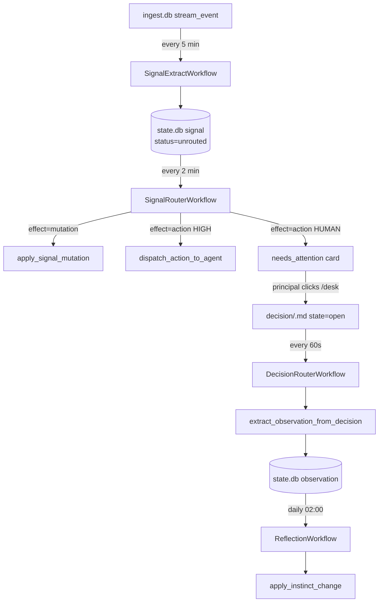

`alfred-learn` is Alfred's **intelligence layer** *(packages/learn/src/worker.py)*. It runs as a single Temporal worker on task queue `alfred-learn` *(packages/learn/src/config.py:13)*, hosts every scheduled workflow that turns inbound streams into Desk cards and observations into instinct upgrades, and coordinates onboarding, briefing, and Plane two-way sync.

There are **36 workflow classes** registered at boot *(packages/learn/src/worker.py)* and ~70 activity modules under `packages/learn/src/activities/`. Schedules are created by `scripts/register_schedules.py` on container first boot.

<Note>The package's `SPEC.md` and CLAUDE.md describe six canonical workflows (event processor, session tracker, briefing, learning, reflection, judgment). The live worker registers 36 — those six plus the signal pipeline, decision routing, narrative composition, Plane two-way sync, Recall.ai meeting dispatch, Omi audio, chore promotion, decay watcher, reversal calibration, stream sweep, and more.</Note>

## Schedule taxonomy

Schedules are declared in three places *(packages/learn/scripts/register_schedules.py)*:

- **Interval schedules** — fire every N seconds/minutes/hours. Most live in `INTERVAL_SCHEDULES` *(packages/learn/scripts/register_schedules.py:165-287)*.
- **Calendar schedules** — fire at specific clock times (cron-equivalent). Live in `CALENDAR_SCHEDULES` *(packages/learn/scripts/register_schedules.py:289-372)*.
- **Conditionally registered** — Plane sync, the legacy `VEXA_ENABLED` meeting workflows (vestigial — see Domain 7), signal extract/router, reversal calibration are only registered if their gate env var is true.

| Workflow | Schedule id | Cadence | Gate flag |
|----------|-------------|---------|-----------|
| EventProcessorWorkflow | `al-event-processor` | 15 min | — |
| SessionTrackerWorkflow | `al-session-tracker` | 15 min | — |
| LearningWorkflow | `al-learning` | 15 min | — |
| JudgmentWorkflow | `al-judgment` | 15 min | — |
| TaskRunnerWorkflow | `al-task-runner` | 15 min | — |
| HourlyEnrichmentWorkflow | `al-hourly-enrichment` | 1 h | — |
| PatternDetectionWorkflow | `al-pattern-detection` | 1 h | — |
| OmiAudioProcessorWorkflow | `al-omi-processor` | 10 min | `GROQ_API_KEY` |
| ComposioReconnectCleanupWorkflow | `al-composio-reconnect-cleanup` | 15 min | — |
| DecisionRouterWorkflow | `al-decision-router` | 60 s | — |
| TaskClosureWatcherWorkflow | `al-task-closure-watcher` | 5 min | — |
| DeferResurfaceWorkflow | `al-defer-resurface` | 15 min | — |
| ScheduledDispatchWorkflow | `al-scheduled-dispatch` | 15 min | — |
| DecayWatcherWorkflow | `al-decay-watcher` | 6 h | — |
| ReflectionWorkflow | `al-reflection` | daily 02:00 local | — |
| NightlyMaintenanceWorkflow | `al-nightly-maintenance` | daily 03:00 local | — |
| ChorePromotionReflectionWorkflow | `al-chore-promotion` | weekly Sun 03:00 local | — |
| NightlyNarrativeWorkflow | `al-nightly-narrative` | daily 02:00 local | — |
| DecisionPatternsWorkflow | `al-decision-patterns` | daily 03:00 local | — |
| BriefingWorkflow (morning) | `al-briefing-morning` | daily 05:00 local | — |
| BriefingWorkflow (evening) | `al-briefing-evening` | daily 17:00 local | — |
| SignalExtractWorkflow | `al-signal-extract` | 5 min | `STEWARD_SIGNAL_EXTRACT_ENABLED` |
| SignalRouterWorkflow | `al-signal-router` | 2 min | `STEWARD_SIGNAL_ROUTER_ENABLED` |
| ReversalCalibrationWorkflow | `al-reversal-calibration` | 10 min | `STEWARD_REVERSAL_CALIBRATION_ENABLED` |
| StreamEventPurgeWorkflow | `al-stream-event-purge` | daily 03:00 UTC | `STEWARD_STREAM_EVENT_PURGE_ENABLED` |
| StreamSweepWorkflow | `al-stream-sweep` | 2 min | — |
| StewardSweepWorkflow | `al-steward-sweep` | 30 min | — |
| FleetAuditWorkflow | `al-fleet-audit` | daily 02:00 UTC | `FLEET_AUDIT_ENABLED` |
| RecallDispatcherWorkflow | `al-recall-dispatcher` | 5 min | — |
| MeetingCaptureWorkflow *(vestigial — Vexa-era)* | `al-meeting-capture` | 60 s | `VEXA_ENABLED` (default off; profile retired) |
| TranscriptIntakeWorkflow *(vestigial — Vexa-era)* | `al-transcript-intake` | 60 s | `VEXA_ENABLED` (default off; profile retired) |
| PlaneSyncWorkflow | `al-plane-sync` | 15 s, overlap=SKIP | `PLANE_SYNC_ENABLED` |
| PlaneReverseSyncWorkflow | `al-plane-reverse-sync` | 10 s, overlap=SKIP | `PLANE_SYNC_ENABLED` |
| PlaneReconciliationWorkflow | `al-plane-reconciliation` | 1 h | `PLANE_SYNC_ENABLED` |
| OnboardingPipelineWorkflow | — | ad-hoc (one per tenant signup) | — |
| MediaIngestionWorkflow | — | dispatched by EventProcessor | — |
| StreamPullerWorkflow | — | dispatched by StreamSweep | — |
| StewardWorkflow | — | per-matter (tombstone-registered for replay only) | — |

The four registration-time gates (`STEWARD_SIGNAL_EXTRACT_ENABLED`, `STEWARD_SIGNAL_ROUTER_ENABLED`, `STEWARD_REVERSAL_CALIBRATION_ENABLED`, `STEWARD_STREAM_EVENT_PURGE_ENABLED`) skip schedule creation entirely when false — the workflow never runs, no Temporal history accumulates *(packages/learn/scripts/register_schedules.py:117-157)*.

---

## Domain 1 — Signal pipeline

The end-to-end loop: stream events → signals → routed action or `needs_attention` card → principal decision on `/desk` → observation → instinct refinement.



<Accordion title="SignalExtractWorkflow">
**Schedule**: every 5 min (`al-signal-extract`, overlap=SKIP) *(packages/learn/scripts/register_schedules.py:122-124)*.

**Gate**: `STEWARD_SIGNAL_EXTRACT_ENABLED=true` at registration time *(packages/learn/src/workflows/signals.py:6)*. The workflow does not re-check the env var inside `@workflow.run` (Temporal determinism).

**Inputs**: none.

**Per-tick pipeline** *(packages/learn/src/workflows/signals.py)*:

1. `list_unprocessed_stream_events` — return up to 100 stream-event paths with `signal_extracted_at` null AND source_type in the Phase 6 allowlist.
2. For each event:
 - `extract_signal_from_event` — pre-filter noise (short body, blocklist domains, age >14d), LLM-extract `{target_path, effect, mutation_proposal}` via `clerk_extract`, resolve target.
 - If non-None: `write_signal_record` persists `signal/<ts>-<hash>.md`. Slug is deterministic on event path + raw quote so Temporal retries are idempotent.
 - `extract_observation_from_signal` (patched gate `signal_extract_obs_v1`) — match instinct via `instinct_match.best_instinct_path`, write observation.
 - `mark_stream_event_processed` — patch `signal_extracted_at = now`, including for noise events (so we don't re-LLM them).
 - When target=None AND effect ∈ {action, mutation} AND mode=live: `create_task_from_signal` *(packages/learn/src/activities/task_creation.py)*.

Per-event try/except — one bad event increments an error counter but doesn't sink the batch.
</Accordion>

<Accordion title="SignalRouterWorkflow">
**Schedule**: every 2 min (`al-signal-router`, overlap=SKIP) *(packages/learn/scripts/register_schedules.py:134-136)*.

**Gate**: `STEWARD_SIGNAL_ROUTER_ENABLED=true` at registration time *(packages/learn/src/workflows/signal_router.py:6)*.

**Per-tick** *(packages/learn/src/workflows/signal_router.py)*:

1. `list_unrouted_signals` — `signal/*` records with `status: unrouted`.
2. Per signal:
 - **effect=mutation** → `apply_signal_mutation` (via Steward's `apply_state_change`).
 - **effect=action** → `route_signal_action`: instinct matcher + per-instinct discretion gate (default 0.95). Combined confidence = `min(target_confidence, effect_confidence)`.
 - HIGH path (combined ≥ threshold + mode=live): `dispatch_action_to_agent` on workers profile (`:18790`); follow-up logged as a new signal `status=routed_agent` (terminal — won't be re-routed).
 - HUMAN path: `write_needs_attention_record` → card lands on `/desk`.
 - **effect=none** → `mark_signal_status(skipped)`.

Mode flags read by the activities (not the workflow): `STEWARD_SIGNAL_ACTION_LIVE_MODE` (default `live`), `STEWARD_SIGNAL_AUTOCREATE_TASKS` (default `live`).
</Accordion>

<Accordion title="DecisionRouterWorkflow">
**Schedule**: every 60 s (`al-decision-router`, overlap=SKIP) *(packages/learn/scripts/register_schedules.py:241-243)*.

**Per-tick** *(packages/learn/src/workflows/decision_router.py, packages/learn/src/activities/decision_router.py)*:

1. **Pass 1 — process open decisions**:
 - `list_decisions_by_state("open")` → for each: `route_decision(decision_dict)`.
 - `route_decision` runs side effects gated on **6 `synchronous_flip` guards**: `target_is_needs_attention`, `is_alive_needs_attention`, `source_signal_is_intact`, `source_signal_still_unrouted`, `target_task_still_open`, `matching_outcome_not_already_on_task`. If `body.decision_origin` set OR `side_effects.synchronous_flip=true`, the source-record flip already happened — skip it.
 - Intent=delegate: `dispatch_action_to_agent` directly (mark-before-dispatch idempotency via `state=dispatching` → `executing`).
 - Intent=done/defer/noise/take_mine: flip source `needs_attention.status`.
 - **`extract_observation_from_decision`** — fires **unconditionally** (no `synchronous_flip` guard) so every click feeds the learning loop. Writes `observation/<ts>.md` with instinct backreference.
2. **Pass 1.5** — `recover_stuck_dispatching`: sweep `state=dispatching` older than 10 min back to `executing` (if dispatched) or `open` (if not).
3. **Pass 2** — `list_decisions_by_state("reversed")` → `reverse_decision` per record (inverse side-effects).
4. **Pass 3** — `list_decisions_by_state("executing")` → `check_decision_outcomes` per record (poll source signal, PATCH to `completed` when matched).
</Accordion>

<Accordion title="ReversalCalibrationWorkflow">
**Schedule**: every 10 min (`al-reversal-calibration`) *(packages/learn/scripts/register_schedules.py:155-157)*.

**Gate**: `STEWARD_REVERSAL_CALIBRATION_ENABLED=true` at both registration time and activity-invocation time *(packages/learn/src/worker.py:554-555)*.

**Activity**: `process_reversals_for_calibration` — sweeps for `event/steward-action-reversed-*.md` and `signal-action-reversed-*.md`, applies a -0.1 confidence drop to each contributing source_type to negatively calibrate the instinct/signal scorer.
</Accordion>

<Accordion title="StreamEventPurgeWorkflow">
**Schedule**: daily at 03:00 UTC (`al-stream-event-purge`) *(packages/learn/scripts/register_schedules.py:144-145)*.

**Gate**: `STEWARD_STREAM_EVENT_PURGE_ENABLED=true` at registration time.

Deletes `stream_event/*` records older than 7 days whose `signal_extracted_at` is set. The signal's `raw_quote` field preserves the source content so the drop is non-lossy.
</Accordion>

---

## Domain 2 — Decision routing & desk lifecycle

How `/desk` clicks become observations and how deferred / scheduled / stuck decisions get unstuck.

<Accordion title="DeferResurfaceWorkflow">
**Schedule**: every 15 min (`al-defer-resurface`) *(packages/learn/scripts/register_schedules.py:263-265)*.

Scans skipped/deferred `needs_attention` cards whose `resurface_at` has fallen due and flips `status=pending` so they reappear on `/desk`. The "when" parsing happens inline in DecisionRouter when the defer click lands; this is just the sweep that re-surfaces.

**Activities**: `parse_resurface_time`, `resurface_due_needs_attention`.
</Accordion>

<Accordion title="ScheduledDispatchWorkflow">
**Schedule**: every 15 min (`al-scheduled-dispatch`) *(packages/learn/scripts/register_schedules.py:271-273)*.

Fires delegate-with-when decisions when their `execute_at` has fallen due. The clerk stamps `execute_at` when the principal says "delegate this, but tomorrow at 9"; this sweep picks it up at the right time and triggers the real dispatch.

**Activity**: `fire_due_scheduled_dispatches`.
</Accordion>

<Accordion title="DecayWatcherWorkflow">
**Schedule**: every 6 h (`al-decay-watcher`) *(packages/learn/scripts/register_schedules.py:283-285)*.

Scores every pending `needs_attention` card against a per-source half-life and stamps `decay_band ∈ {fresh, aging, stale}`. Cards below the auto-flip threshold (freshness < 0.05) are status-flipped to `stale` so the Desk doesn't silt up with origin-old residue. The Desk UI reads `decay_band` to group the queue into bands.

**Activities**: `watch_decay`, `list_active_matters_for_decay`, `adjust_matter_surface_class_v2`.
</Accordion>

<Accordion title="DecisionPatternsWorkflow">
**Schedule**: daily 03:00 local (`al-decision-patterns`) *(packages/learn/scripts/register_schedules.py:340-345)*.

Extracts recurring reasoning patterns from the principal's recent decisions. Writes proposed `decision_pattern` records the principal can promote from `/settings#decisions`.

**Activity**: `extract_decision_patterns`.
</Accordion>

<Accordion title="TaskClosureWatcherWorkflow">
**Schedule**: every 5 min (`al-task-closure-watcher`) *(packages/learn/scripts/register_schedules.py:252-254)*.

Backward arrow of the signal↔task loop. Scans the open task population against recent signals and auto-writes `decision(intent=done)` for high-confidence matches; the DecisionRouter then closes the task.

**Activities**: `list_open_tasks`, `list_recent_signals`, `assess_closure` (clerk call: returns `confidence` ∈ 0..1), `write_closure_decision`, `apply_task_closure_v2`.

Two predicate styles:
- **Deterministic** (`evaluate_predicate`): `gmail_thread_reply`, `gmail_from_subject`, `calendar_event_accepted`, `payment_to_merchant`.
- **LLM** (`assess_closure`): auto-close when `confidence ≥ 0.80`.
</Accordion>

---

## Domain 3 — Briefing & narrative

How the daily letterpress brief is written and how matter `current_state` paragraphs stay fresh.

<Accordion title="BriefingWorkflow">
**Schedule**: two slots, same workflow class, dispatched with a positional `slot` arg *(packages/learn/scripts/register_schedules.py:354-371)*:
- `al-briefing-morning` — daily 05:00 local, `slot="morning"`.
- `al-briefing-evening` — daily 17:00 local, `slot="evening"`.

**Per-tick** *(packages/learn/src/workflows/briefing.py)*:

1. `get_prior_briefing` — read the most recent brief snapshot (for continuity).
2. `list_active_matters_for_briefing` — every matter with `status=active`.
3. Per matter: `briefing_visit_matter` — runs state-mutator (`apply_state_change_v2`) to refresh `current_state`.
4. `compose_and_write_briefing` — Opus-class call composes the body from the freshly-written `current_state` paragraphs + signals + decisions in the window. Writes to `briefing/<YYYY-MM-DD>-<slot>.md`.
5. `record_chore_run` — log run-history line.
</Accordion>

<Accordion title="NightlyNarrativeWorkflow">
**Schedule**: daily 02:00 local (`al-nightly-narrative`) *(packages/learn/scripts/register_schedules.py:327-332)*.

The Living Narratives pass. Walks every active matter and asks the clerk to draft a fresh 2–4 sentence `current_state` paragraph from the last 24h of signals + task transitions, stamping `as_of: <ISO timestamp>`. Matters with zero activity in the window are skipped without invoking the clerk.

**Activities**: `list_active_matters_for_narrative`, `read_matter_summary`, `load_matter_signals_24h`, `load_task_transitions_24h`, `generate_matter_narrative` (clerk call), `patch_matter_narrative_v2`.
</Accordion>

<Accordion title="NightlyMaintenanceWorkflow">
**Schedule**: daily 03:00 local (`al-nightly-maintenance`) *(packages/learn/scripts/register_schedules.py:298-305)*.

Runs the vault daemon's three reflective passes — janitor (structural fixes), distiller (latent-knowledge extraction from completed tasks), surveyor (labeler/embedder refresh) — in sequence. Each calls into the alfred-worker container via the workers gateway.

**Activities**: `run_janitor`, `run_distiller`, `run_surveyor`, `archival_sweep`.
</Accordion>

---

## Domain 4 — Reflection & learning

The loop that closes from observations to instinct upgrades.

<Accordion title="ReflectionWorkflow">
**Schedule**: daily 02:00 local (`al-reflection`) *(packages/learn/scripts/register_schedules.py:291-296)*.

**Per-tick** *(packages/learn/src/workflows/reflection.py)*:

1. `fetch_unprocessed_observations` — records with `processed_at` null.
2. `fetch_active_instincts`, `fetch_distiller_learnings` (24h), `fetch_janitor_flags` (recent).
3. `clerk_reflect` — Opus-class call proposes new/edit/deprecate instincts.
4. `validate_proposals` — Python structural validation.
5. `apply_instinct_change` — write `intuition/instincts/<slug>.md` or patch an existing one. **Sole writer of `observation_count`, `confidence_score`, and `tier`**.
6. `mark_observations_processed` — patch `processed_at` so observations don't re-process.
7. `rebuild_intuition_index`.
8. `write_reflection_report`.
</Accordion>

<Accordion title="LearningWorkflow">
**Schedule**: every 15 min (`al-learning`) *(packages/learn/scripts/register_schedules.py:178-180)*.

Processes the observation queue and `alfred_instructions` (manual training nudges from the principal) into observation records.

**Activities**: `fetch_pending_observations`, `process_observation_queue`, `apply_alfred_instruction`.
</Accordion>

<Accordion title="JudgmentWorkflow">
**Schedule**: every 15 min (`al-judgment`) *(packages/learn/scripts/register_schedules.py:182-184)*.

Per-input routing decisions — when a new input arrives, decides whether it's noise, an observation candidate, or signal-worthy. Augments the deterministic signal extractor for novel input types where pattern-matching is too brittle.

**Activities**: `judge_input`, `assess_input_routing`.
</Accordion>

<Accordion title="PatternDetectionWorkflow">
**Schedule**: hourly (`al-pattern-detection`, overlap=SKIP) *(packages/learn/scripts/register_schedules.py:203-205)*.

Hourly deterministic scan of the unified observation pool. Clusters by `(sender, intent)` and writes `pattern_proposal` records for surviving clusters. Cheap (one ctrl-api list call + in-memory work).

**Activity**: `detect_pattern_proposals`.
</Accordion>

---

## Domain 5 — Ingest & stream pipeline

How inbound events from Composio, OMI wearables, webhooks, and meeting bots become stream events and then signals.

<Accordion title="EventProcessorWorkflow">
**Schedule**: every 15 min (`al-event-processor`) *(packages/learn/scripts/register_schedules.py:167-169)*.

Zero-LLM stream event routing. Reads pending events from `ingest.db`, dispatches:
- `stream_type == "media"` → child `MediaIngestionWorkflow`.
- Everything else → `drop_raw_event_to_inbox` (file under `vault/inbox/`).
- Mark processed regardless.

The curator (vault-curator agent) does the actual classification — `EventProcessorWorkflow` is just a dispatcher.

**Activities**: `fetch_unprocessed_events`, `drop_raw_event_to_inbox`, `mark_event_processed`.
</Accordion>

<Accordion title="StreamSweepWorkflow + StreamPullerWorkflow">
**Schedule**: `al-stream-sweep` every 2 min *(packages/learn/scripts/register_schedules.py:100-102)*. The sweep reads each stream's persisted `schedule_interval_seconds` / `last_pull_at` and dispatches `StreamPullerWorkflow` for any stream due.

A stream's effective cadence is `max(schedule_interval_seconds, 2 min)`.

**Activities**: `list_due_streams`, `pull_stream_chunk` (HTTP/Composio), `write_stream_event`, `mark_stream_pulled`.
</Accordion>

<Accordion title="MediaIngestionWorkflow">
**Schedule**: ad-hoc — dispatched as a child workflow by EventProcessor when `stream_type == "media"`.

Per-file processing for media uploads (audio, images, video). Decodes, extracts metadata, runs transcription if applicable, writes the result as a stream event.

**Activities**: `decode_media`, `extract_media_metadata`, `transcribe_media`.
</Accordion>

<Accordion title="OmiAudioProcessorWorkflow">
**Schedule**: every 10 min (`al-omi-processor`) *(packages/learn/scripts/register_schedules.py:208-210)*.

Scans `/alfred-data/omi-audio/` for ambient wearable audio captured by the OMI device. Groups chunks by recording session, transcribes via Groq Whisper (`GROQ_API_KEY`), and writes the transcripts as stream events. Without `GROQ_API_KEY` set, every audio group is discarded as "empty transcription" and OMI capture is effectively dead.

**Activities**: `scan_omi_buffer`, `group_audio_chunks`, `transcribe_groq`, `write_omi_transcript`.
</Accordion>

<Accordion title="HourlyEnrichmentWorkflow">
**Schedule**: every 1 h (`al-hourly-enrichment`) *(packages/learn/scripts/register_schedules.py:192-195)*.

Single batched LLM call to enrich stream events with derived fields (sender resolution, intent classification, urgency). Batching keeps cost low — one call per hour vs. one per event.

**Activities**: `list_unenriched_events`, `enrich_events_batch`, `mark_enriched`.
</Accordion>

<Accordion title="SessionTrackerWorkflow">
**Schedule**: every 15 min (`al-session-tracker`) *(packages/learn/scripts/register_schedules.py:172-174)*.

Rolling state machine for the principal's "sessions" — conversational threads that span multiple inputs. Promotes accumulated session content to vault notes when a session closes.

**Activities**: `list_active_sessions`, `assess_session_close`, `promote_session_to_note`.
</Accordion>

---

## Domain 6 — Plane two-way sync

Bidirectional mirror between the canonical vault matter/task records and the Plane project-management UI.

<Accordion title="PlaneSyncWorkflow (vault → Plane)">
**Schedule**: every 15 s with overlap=SKIP (`al-plane-sync`) *(packages/learn/scripts/register_schedules.py:445-451)*.

**Gate**: `PLANE_SYNC_ENABLED=true` at both registration AND runtime.

One-way vault → Plane sync. Reads the tenant's vault, projects matters as Plane projects and tasks as Plane issues. Per-batch cursor advancement; 5-minute execution timeout per run.

**Activities**: `fetch_changed_matters`, `fetch_changed_tasks`, `upsert_plane_project`, `upsert_plane_issue`.
</Accordion>

<Accordion title="PlaneReverseSyncWorkflow (Plane → vault)">
**Schedule**: every 10 s with overlap=SKIP (`al-plane-reverse-sync`) *(packages/learn/scripts/register_schedules.py)*.

**Gate**: `PLANE_SYNC_ENABLED=true`.

Consumes `stream_type: "plane"` webhook events and patches the corresponding vault matter/task. Webhook receiver lives in ctrl-api at `/api/v1/plane/webhook`.

**Activities**: `list_unprocessed_plane_events`, `apply_plane_change_to_vault`, `mark_plane_event_processed`.
</Accordion>

<Accordion title="PlaneReconciliationWorkflow">
**Schedule**: hourly (`al-plane-reconciliation`) *(packages/learn/scripts/register_schedules.py)*.

**Gate**: `PLANE_SYNC_ENABLED=true`.

Plane 1.3.0 emits `issue.deleted` webhooks only for UI-driven deletions. This sweep mirrors REST deletes (not webhooked) into vault archives.

**Activities**: `scan_plane_for_missing`, `archive_orphan_matter`, `archive_orphan_task`.
</Accordion>

---

## Domain 7 — Meeting capture (Recall.ai)

The hosted [Recall.ai](/integrations/recall) bot replaces the retired self-hosted Vexa profile. ctrl-api owns the API key + Svix-signed webhook; alfred-learn runs the dispatcher that decides which calendar events get a bot.

<Accordion title="RecallDispatcherWorkflow">
**Schedule**: every 5 min (`al-recall-dispatcher`) *(packages/learn/scripts/register_schedules.py)*.

Reads the existing `composio-googlecalendar.jsonl` stream — no second OAuth. Applies the `/channels` Recall card's auto-join policy + per-meeting cap + monthly hours ceiling, then dispatches a bot per matching event. The fan-out is per-event with per-event try/except so one bad meeting doesn't poison the rest.

**Activities**: see `packages/learn/src/activities/recall_dispatcher.py`.
</Accordion>

<Accordion title="MeetingCaptureWorkflow / TranscriptIntakeWorkflow (vestigial — Vexa-era)">
The two `VEXA_ENABLED`-gated workflows still exist in `packages/learn/src/workflows/{meeting_capture,transcript_intake}.py` and would be registered if `VEXA_ENABLED=true`, but the nine-container `profiles: ["vexa"]` stack they call was retired in PR #126 and is no longer present in `docker-compose.yaml`. There is nothing for the activities to reach; leave `VEXA_ENABLED` at its default `false`. The workflows will be deleted in a follow-up PR after the Recall.ai migration settles. See [Vexa (retired)](/integrations/vexa).
</Accordion>

---

## Domain 8 — Chore lifecycle

Chores are the principal's recurring work — registered as Temporal schedules at chore-create time (`chore-<slug>` schedule per chore). The chore-promotion workflow is the meta-step that decides when a generated chore is ready to graduate to the standard library.

<Accordion title="ChorePromotionReflectionWorkflow">
**Schedule**: weekly Sunday 03:00 local (`al-chore-promotion`) *(packages/learn/scripts/register_schedules.py:310-316)*.

**Inputs**: `PromotionReflectionInput(min_runs=20, min_success_rate=0.95)`.

**Per-tick** *(packages/learn/src/workflows/chore_promotion.py)*:

1. `scan_user_chores_directory` — enumerate `/alfred-data/user-chores/`.
2. `identify_promotion_candidates` — apply thresholds (default `min_runs=20`, `min_success_rate=0.95`).
3. `draft_promotion_proposal` — Opus drafts PR description per candidate.
4. `save_promotion_draft` — persist drafts to disk.
5. (Optional) `create_github_promotion_pr` — open PR for top drafts.

Cap of 5 drafts/tick limits Opus cost to ~$2–5/week.
</Accordion>

<Accordion title="TaskRunnerWorkflow">
**Schedule**: every 15 min (`al-task-runner`) *(packages/learn/scripts/register_schedules.py:186-189)*.

Picks up queued vault tasks (`task/<slug>.md` with `state: pending`, `runner_class: <python class>`), executes them in-process, writes results back to the task body. The runner registry is loaded at worker boot from `packages/learn/src/activities/task_runner.py`.

**Activities**: `list_queued_tasks`, `execute_task`, `record_task_outcome`.
</Accordion>

---

## Domain 9 — Onboarding pack

A one-shot pipeline that runs once per tenant signup to materialise the principal's vault from scratch.

<Accordion title="OnboardingPipelineWorkflow">
**Schedule**: ad-hoc (one invocation per signup). Started by ctrl-api when the principal completes the `/composing → /preparing` ritual.

**Pipeline** *(packages/learn/src/workflows/onboarding_pipeline.py)* — runs 4 direct Opus 4.6 calls in ~5 minutes:

1. **Composio pull** — `composio_pull` pulls ~100 days of email (chunked + paginated to stay under Temporal's 4MB gRPC limit).
2. **Facts extraction** — `extract_facts_opus` (chunked: threshold 500, size 400 to avoid Hermes' "max compression attempts" overflow).
3. **Pattern discovery** — `discover_patterns_opus` proposes instinct templates from the extracted facts.
4. **Personalization** — `personalize_opus` writes `vault/USER.md` (~1375 char cap; sentence-boundary truncate), `vault/SOUL.md`, `vault/RULES.md`, `hermes-state/memories/MEMORY.md` (~2200 chars), `hermes-state/memories/USER.md` (~1375 chars).
5. **Pack materialization** — three parallel Opus calls:
 - `generate_matter_pack_opus` — N matters with rich bodies.
 - `generate_errand_pack_opus` — N tasks linked via `_resolve_parent_matter_path` 4-tier fallback (exact slug → fuzzy related_matter → fuzzy task name → `matter/inbox.md` fallback).
 - `generate_instinct_pack_opus` — N intuition templates.
 - `materialize_matter_entities` — write org + person records referenced by matters.
6. **Briefing** — `write_brief_opus` composes the first brief.
7. **Chore assignment** — `assign_initial_chores` registers `chore-<slug>` Temporal schedules.
8. **Desk seeding** — `seed_day_one_desk_cards` picks time-anchored matters + activity_score for the principal's first `/desk` landing.

The principal can signal `corrections_received` mid-flow if they want to edit `USER.md` / `RULES.md` before pack generation.
</Accordion>

---

## Domain 10 — Steward sweep

The Steward perception-and-action loop runs as a single sweep across every active matter.

<Accordion title="StewardSweepWorkflow">
**Schedule**: every 30 min (`al-steward-sweep`) *(packages/learn/scripts/register_schedules.py:85)*.

Walks every active matter once per sweep, runs the Steward evaluation loop (gather signals → evaluate state → propose mutation → apply via state-mutator).

**Activities**: `list_active_matters`, `gather_signals_for_matter`, `evaluate_matter_state`, `apply_state_change_v2`.
</Accordion>

<Accordion title="StewardWorkflow">
A per-matter Steward workflow class registered as a tombstone so any in-flight runs can replay deterministically; new schedules are not created.
</Accordion>

---

## Domain 11 — Fleet hygiene

Cross-tenant audits and cleanup workflows.

<Accordion title="FleetAuditWorkflow">
**Schedule**: daily 02:00 UTC (`al-fleet-audit`) *(packages/learn/scripts/register_schedules.py:66-73)*.

**Gate**: `FLEET_AUDIT_ENABLED` (activity-invocation time, default true).

Daily wrong-tenant stream contamination check. Scans `composio-*.jsonl` for every Google-origin event with a `self: true` attendee and compares the attendee's email against the tenant owner. Mismatches indicate a Composio account leaked between tenants — get logged as `fleet_audit observation` records for review.

**Activities**: `audit_streams_for_owner_mismatch`, `write_fleet_audit_observation`.
</Accordion>

<Accordion title="ComposioReconnectCleanupWorkflow">
**Schedule**: every 15 min (`al-composio-reconnect-cleanup`) *(packages/learn/scripts/register_schedules.py:223-225)*.

Safety-net reaper for the persistent Composio reconnect ledger written by ctrl-api. Ctrl-api has an in-process `setTimeout` fast path; this Temporal schedule guarantees cleanup eventually fires even if ctrl-api restarts before the in-process timer (1h grace) elapses.

**Activity**: `reap_composio_reconnect_ledger`.
</Accordion>

---

## State mutator — the contract behind every mutation

Every matter/task field change goes through `apply_state_change_v2` *(packages/learn/src/activities/state_mutator.py)*. The contract:

```python
@dataclass(frozen=True)
class ProposedMutation:
 fields: dict[str, Any] # only declared state fields
 reason: str # why this mutation
 confidence: float # 0.0–1.0; 1.0 = deterministic
 fan_out: tuple[str, ...] = () # downstream effects

@dataclass(frozen=True)
class MutationResult:
 target_path: str
 source: str # writer identifier
 applied: bool
 mode: Literal["shadow", "live"]
 effective_mode: Literal["shadow", "live"]
 audit_record_path: str | None
 timeline_entry_id: str | None
 prior_as_of: str | None
 new_as_of: str | None
 pending_confirmation: bool
 retried_count: int
 fan_out_triggered: list[str]
```

**Three artefacts** per atomic write *(packages/learn/src/activities/state_mutator.py:11)*:

1. Vault frontmatter patch (YAML atomic via ctrl-api).
2. Audit record (`event/steward-action-<ts>-<hash>.md` or equivalent in `alfred-state.db.audit`).
3. Plane timeline entry (if the matter is linked).

**Mode gating** *(packages/learn/src/activities/state_mutator.py:183-220)*:
- `STEWARD_LIVE_MODE` env, or `state_mutator_mode` key in `/alfred-data/settings.json`.
- Default `"shadow"` — read-only audit emit, no mutation applied.
- `"live_high_confidence_only"` — gate to `confidence ≥ STEWARD_HIGH_CONFIDENCE_THRESHOLD` (default 0.85).

**Propose function registry** *(packages/learn/src/activities/state_mutator.py:147-180)*:
- Every writer registers via `@propose_fn("writer.propose_fn_name")`.
- Signature: `async def propose(*, target: dict, observed: ObservedWindow, args: dict) -> ProposedMutation | None`.
- Callables resolved in-process at activity invocation time (Temporal determinism: no callables as activity args).

---

## Activity index by module

A flat list of every activity module under `packages/learn/src/activities/` — see source for activity definitions.

| Module | Domain |
|--------|--------|
| `signals.py`, `signal_observations.py`, `signal_mutations.py`, `signal_actions.py`, `signal_gather.py` | Signal pipeline |
| `decision_router.py`, `decision_observations.py`, `decision_patterns.py` | Decision routing |
| `state_mutator.py` | The universal mutation primitive |
| `steward.py`, `defer_resurface.py`, `scheduled_dispatch.py`, `decay_watcher.py`, `calibration_reversal.py` | Steward / lifecycle |
| `task_creation.py`, `task_closure.py`, `task_backfill.py`, `tasks.py` | Task lifecycle |
| `briefing.py`, `nightly_narrative.py`, `desk_seed.py`, `first_brief_email.py`, `inbox_narration.py` | Briefing |
| `reflect.py`, `judge.py`, `observe.py`, `pattern_detection.py`, `noise.py`, `noise_patterns.py` | Reflection / learning |
| `streams.py`, `pull.py`, `stream_vault.py`, `stream_log.py`, `omi_audio.py`, `media.py` | Ingest |
| `classify.py`, `enrichment.py`, `tool_inference.py`, `clerk.py` | LLM utilities |
| `plane_sync.py`, `plane_reverse_sync.py`, `plane_reconciliation.py`, `plane_alfred_triggers.py` | Plane two-way sync |
| `transcript.py`, `assign_chores.py`, `chore_actions.py`, `chore_generation.py`, `chore_matching.py`, `chore_promotion.py`, `chore_static_analyzer.py` | Chores |
| `packs.py`, `packs_opus.py`, `onboarding.py`, `onboarding_v3.py`, `profiler.py`, `braindump.py` | Onboarding |
| `composio_reconnect.py`, `composio_tools.py`, `fleet_audit.py`, `maintenance.py`, `archival_sweep.py`, `session.py`, `vault.py`, `notify.py` | Misc |

---

## Cross-cutting notes

<Info>

- **Single task queue**: every workflow above runs on `alfred-learn` *(packages/learn/src/config.py:13)*. There is no fan-out across queues.
- **Default retry policy**: `RetryPolicy(maximum_attempts=3, initial_interval=2s, backoff_coefficient=2.0, maximum_interval=30s)` *(packages/learn/src/workflows/briefing.py:84-89)* — applied per activity, overridable per call.
- **Determinism**: no env reads inside `@workflow.run`. All gates check env at activity invocation OR at registration time, never inside the workflow body. New activity calls in existing workflows must be wrapped in `workflow.patched(<name>)` (see `packages/learn/CLAUDE.md` "Adding NEW activity calls").
- **No direct vault writes from Python**: every vault write goes through ctrl-api's HTTP routes via `vault_client.py`. Ctrl-api is the sole writer of `alfred-state.db` and `ingest.db`.
- **All LLM calls go through Hermes**: clerk calls hit `:18790` (workers profile), heavy/Opus-class calls hit `:18791` (heavy profile), never the Anthropic/OpenRouter API direct.

</Info>
